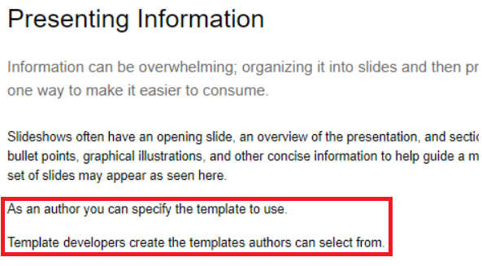
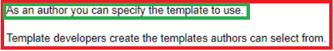
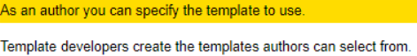
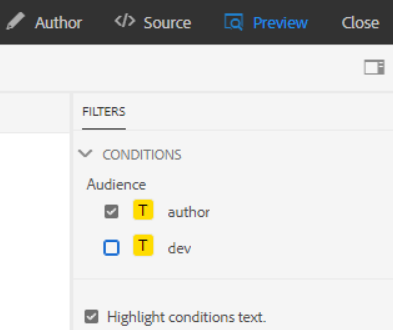
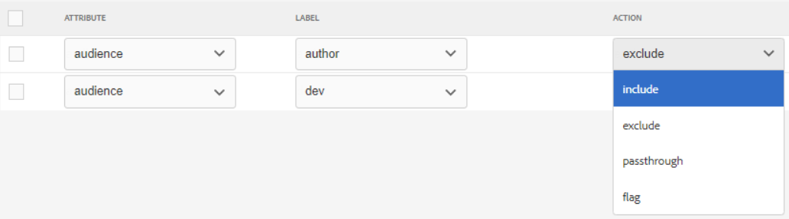
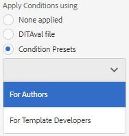
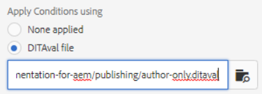

# Publishing with conditions

Conditional publishing allows one source of content to be written for one or more audience, product, or platform. This information can then be dynamically published and only specifically required content included in the output.

>[!VIDEO](https://video.tv.adobe.com/v/339041?quality=12&learn=on)

## Preparing for the exercise

You can download sample files for the exercise here.

[Exercise-Download](assets/exercises/publishing-with-conditions.zip)

## Marking up content with conditional attributes

1. Open the topic to modify.

1. Enter the text that is to become conditional. For example, one or more paragraphs, an entire table, a figure, or other content.

    
 
1. Select the specific content to assign a conditional attribute to. For example, a single paragraph within the source.

    
 
1. In the Right Rail ensure the Properties display.

1. Add an attribute for audience, product, or platform.

1. Assign a value to the attribute. The content display updates to show conditional markup has been applied.

    
 
## Previewing conditional content

1. Click **Preview**.

1. Under **Filters**, select or deselect the conditions to show or hide.

1. Select or deselect **Highlight conditions text**.

    
 
## Creating a condition preset

A condition preset is a collection of properties that define what is to be included or excluded, or otherwise marked up, during the generation of output.

1. From the Map Dashboard select the **Condition Presets** tab.

1. Click **Create**.

1. Select **Add** (or **Add All**).

1. Name the condition.

1. Select an attribute, label, and action combination.
 
    

1. Repeat as required.

1. Click **Save**.

## Generating conditional output

Once conditions have been applied to content it can be generated as output. This can use either a Condition Preset or a DITAval file.

## Generating conditional output using a condition preset

1. Select the **Output Presets** tab.

1. Select an output preset.

1. Click **Edit**.

1. Under **Apply Condition Using** select a Condition Preset.

    

1. Click **Done**.

1. Generate the output preset and review the content.

## Generating conditional output using a DITAval file

The DITAval file can be used to publish conditional content. This requires a file to be created or uploaded and then referenced at publishing.

1. Select the **Output Presets** tab.

1. Select an output preset.

1. Click **Edit**.

1. Under Apply Condition Using select a DITAval file.

    
 
1. Click **Done**.

1. Generate the output preset and review the content.
