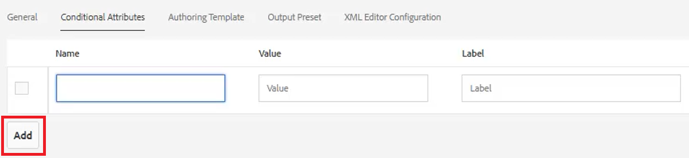
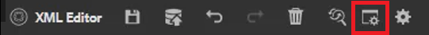
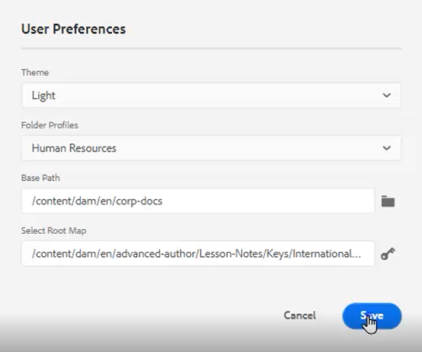
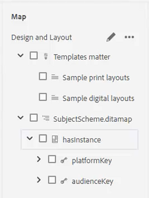
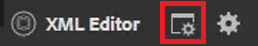
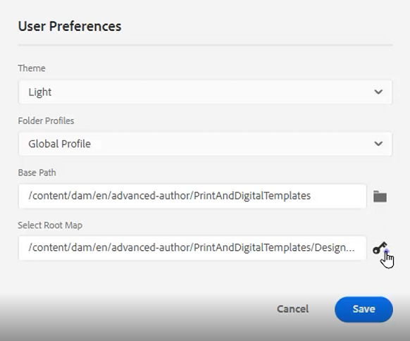

# Conditions

In DITA, conditions are often driven through attributes such as Product, Platform, and Audience. These can also have specific values assigned to them. Users can control all of this through Folder Profiles.

Sample files that you may opt to use for this lesson are provided in the file [conditions.zip](assets/conditions.zip).

>[!VIDEO](https://video.tv.adobe.com/v/342755)

## Assign conditions to a Folder Profile

1. Select the **Folder Profiles** tile.

2. Click [!UICONTROL **Conditional Attributes**].

3. Click [!UICONTROL **Edit**] in the top left corner of the profile.

4. Click [!UICONTROL **Add**].

    

5. Complete the required fields.

    - The Name should correspond to an attribute used for profiling.

    - The Value is the exact entry that will be used in the DITA code source.

    - The Label is the word that will be seen by the user who is entering attributes.

6. Click [!UICONTROL **Save**].

>[!NOTE]
>
>NOTE: configuring a Global Profile may be an early and efficient way to control use of attributes and values to follow a consistent style guide.

## Assign attributes to elements

If no custom Folder Profile has been assigned to a concept, you may wish to assign attributes to specific elements, such as paragraphs.

1. From the **Repository View**, click on the element you want to work with to select it.

2. In the **Content Properties** panel, click on the [!UICONTROL **Attribute**] dropdown.

3. Choose the attribute you wish to assign.

4. Add a **Value**.

The attribute and value pairing are now assigned to the selected element.

## Assign attribute and value pairings using conditions

The Conditions panel allows controlled assignment of Attribute and Value pairings.

1. Modify the **User Preferences**.

    a. Click the User Preferences icon.

    

     b. Complete the required fields in the **User Preferences** dialog. For example:

    

    c. Click [!UICONTROL **Save**].

2. From the conditions panel, expand the dropdowns for Audience and Platform. Note that the available conditions are Folder Profile-specific.

3. Drag and drop a condition onto the desired element to assign it.

## Assign a Subject Scheme

Subject Scheme maps are a specialized form of ditamap and are referenced by a map. Subject Schemes are used to define taxonomies. They provide control over the values available.

1. Navigate to the **Repository View**.

2. Select a map that references the Subject Scheme ditamap. This example uses the map called _Design and Layout_.

    

3. Configure User Preferences.

    a. Click the [!UICONTROL **User Preferences**] icon.

    

    b. Populate the fields in the **User Preferences** dialog. 

    c. Click the folder symbol next to the Base Path field to choose the path to the desired file.

    d. Click [!UICONTROL **Select**].

    e. Click the key symbol next to the **Root Map** field to enter a path.

    >[!IMPORTANT]
    >
    >Important: the selected Root Map must be the map that contains the Subject Scheme.

    

    f. Restrict the displayed assets by selecting the folder(s) you want to use.

    g. Click [!UICONTROL **Select**].

    h. Click [!UICONTROL **Save**].

The Subject Scheme has now been assigned.

## View the Subject Scheme from the Conditions panel

1. Navigate to **Editor Settings**.

2. Select the **Conditions** tab.

3. Check the box **Show subject scheme in the Conditions panel**
