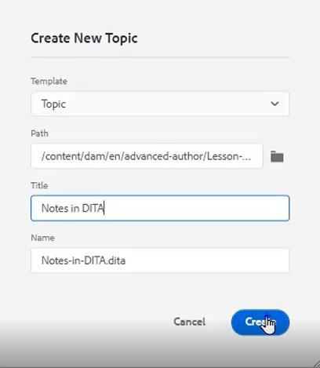
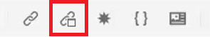
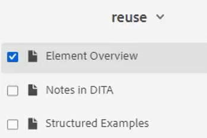
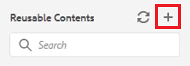

# Content Reuse

One of the main features of DITA is the ability to reuse content. It allows reuse of  content from small phrases up to entire topics or maps.  However, for content to be effectively reused, it must be well managed. Ensure that you have an effective Content Strategy when working with reusable information.

>[!VIDEO](https://video.tv.adobe.com/v/342757?quality=12&learn=on)

## Create a reusable topic

When a change is made to a reusable source topic, the information will update everywhere the content is used. 

1. Navigate to the **Repository**.

1. Click the **contextual menu** next to the reuse folder.

1. Choose **Create > Dita Topic**.

1. Populate the fields in the Create New Topic dialog. For example:

    

1. Click [!UICONTROL **Create**].

1. Add content to the topic as required.

## Add a new reusable element to a topic

There are several methods for adding reusable elements. Here, the first workflow is best when adding only one component. The second workflow is better for adding multiple reusable components.

### Workflow 1

1. Click in the topic at a valid location.

1. Select the **Insert Reusable Content** icon on the top toolbar.

    

1. In the Reuse Content dialog, click the [!UICONTROL **Folder**] icon.

1. Navigate to the required folder.

1. Choose a topic with reusable components.
For example:

    

1. Click [!UICONTROL **Select**].

1. Choose a specific component to reuse.

1. Click [!UICONTROL **Select**].

The reusable element has now been inserted into the topic.

### Workflow 2

1. Navigate to **Reusable Contents** on the left panel.

1. Click the [!UICONTROL **Add**] icon on the Reusable Contents panel.

    

1. Navigate to a folder.

1. Select a specific topic or topics.

1. Click [!UICONTROL **Add**].

1. From the Reusable Contents panel, expand **Element Overview**.

1. Drag and drop an element into the topic at a valid location.

The reusable element has now been inserted into the topic.

## Assign an ID and value to an element

The dlentry you just created is a reusable element. Therefore, it requires an ID and a value.

1. Click inside the dlentry. 

1. In the Content Properties panel, click the dropdown under Attribute.

1. Select **ID**.

1. Type a logical name for the Value.

1. Save or version the topic so the change reflects in the Repository.

The ID and value have been assigned to the element.
