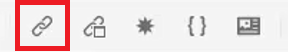
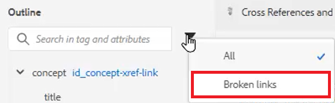

# Cross-references and Links

The XML Editor and DITA provide a powerful way to link between topics. It is important to effectively manage your Content References, and that includes working with unique ID values.

Sample files that you may opt to use for this lesson are provided in the file 
[crossreferencesandlinks.zip](assets/crossreferencesandlinks.zip)

>[!VIDEO](https://video.tv.adobe.com/v/342764?quality=12&learn=on)

## Create a cross-reference to an external topic

It is possible to create an external cross-reference by dragging and dropping a topic from the Repository into an open file. However, to avoid broken cross-references, an ID must first be defined to a value related to the parent element. This is one easy way to create a cross-reference while ensuring IDs are correctly assigned.

1. Open a file where you want to insert an external cross-reference.

1. Assign an ID to the element to be referenced.

    a. Click inside the element.

    b. On the Content Properties panel, choose **ID** from the Attribute dropdown.

    c. Type a logical name in the Value field.

    d. View the element and its value in **Outline View** if desired.

1. **Save** the topic to ensure the Repository has the updated ID.

1. Click the [!UICONTROL **Reference**] icon on the top toolbar.

    

1. From the **Content Reference** tab, select the ID and element pairing you want to insert as a cross-reference.

1. Click [!UICONTROL **Select**].

The cross-reference has been added to the topic.

## Link to a website

You can insert a link to a website within any topic. Refer to the AEM Guides Course 1 video on Linking to Websites for more information.

## View broken links

Some modifications can result in broken cross-references. These include deleting a topic, reorganizing a section that contains a cross-reference, or changing an ID after the cross-reference has been inserted. Note that a sample topic _crossreferencesandlinks.zip_ is provided with this lesson that will cause several of the bulleted cross-references to internal content to break.

1. Navigate to the **Outline View** on the left panel.

1. Click the [!UICONTROL **Filter**] icon.

1. Select **Broken links**.

    

Broken links display as clickable objects. You can identify them in red text in the topic.
