# XML Editor Configuration

If you work in a restrictive environment, you can choose which features your authors are able to see by customizing the Editor Configuration within a specific Folder Profile. Applying this Folder Profile can change the look and feel of the Editor itself, the CSS Templates, the Snippets available, and the Content Version Labels.

Sample files that you may opt to use for this lesson are provided in the file [xmleditorconfiguration.zip](assets/xmleditorconfiguration.zip).

>[!VIDEO](https://video.tv.adobe.com/v/342762?quality=12&learn=on)

## Customize the default Editor UI Configuration

You can always download the default UI configuration to your local system, make changes to it in the text editor of your choice, and upload it again.

1. From the Navigation screen, click the [!UICONTROL **Tools**] icon.

    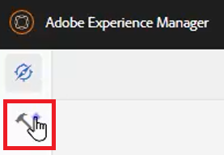

1. Select **Guides** on the left panel.

1. Click the [!UICONTROL **Folder Profiles**] tile.

    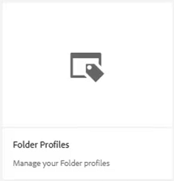

1. Select a Folder Profile.

1. Click the [!UICONTROL **XML Editor Configuration**] tab.

1. Click [!UICONTROL **Download**] Default.

    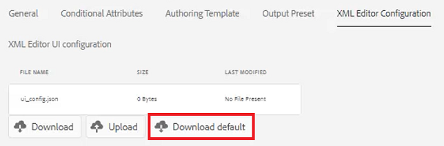

You can now open and modify the content in a text editor. The _AEM Guides Installation and Configuration_ Guide contains samples of how to remove, customize, or add functions to the UI configuration.

## Upload the modified XML Editor UI Configuration

After customizing the UI configuration, you can upload it. Note that a sample configuration file _ui-config-restricted-editor.json_ is provided with the set of supporting topics for this lesson.

1. Within the Folder Profile, click the [!UICONTROL **XML Editor Configuration**] tab.

1. Under XML Editor UI configuration, click [!UICONTROL **Upload**].

    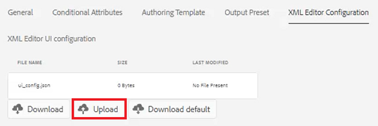

1. Double-click the file for your modified UI configuration, or as shown here, the provided sample file.
 
    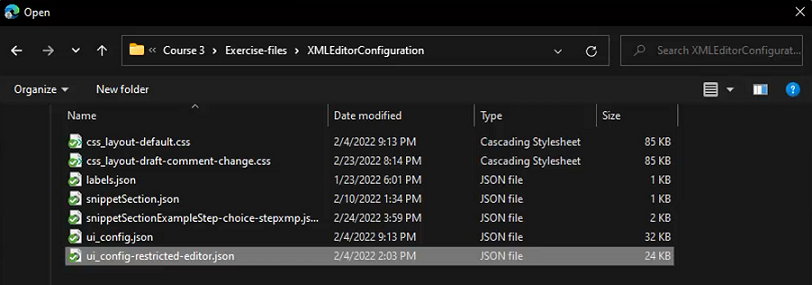

1. Click [!UICONTROL **Save**] in the top left corner of the screen.

You have successfully uploaded the modified UI configuration.

## Customize the CSS Template layout

As with the UI configuration, you can download the CSS template layout. You can open it in a text editor and make modifications to customize the look and feel of your topic before uploading. 

1. From the Navigation screen, click the [!UICONTROL **Tools**] icon.

    

1. Select **Guides** on the left panel.

1. Click the [!UICONTROL **Folder Profiles**] tile.

    

1. Select a Folder Profile.

1. Click the [!UICONTROL **XML Editor Configuration**] tab.

1. Under CSS Template layout, click [!UICONTROL **Download**].

    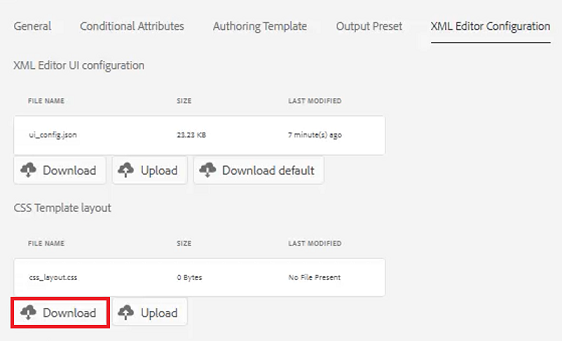
 
You can now modify and save the CSS content in a text editor. 

## Upload the modified CSS Template layout

After customizing the CSS Template layout, you can upload it. Note that a sample file _css-layout-ONLY-draft-comment-change.css_ is provided with the set of supporting topics for this lesson. This file contains only the Draft Comment Change, whereas _css-layout-draft-comment-change.css_ is the entire file, available to you for testing or review purposes only.

1. Within the Folder Profile, click the [!UICONTROL **XML Editor Configuration**] tab.

1. Under CSS Template layout, click [!UICONTROL **Upload**].

    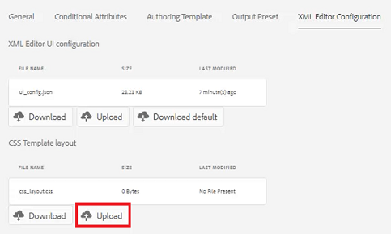

1. Double-click the file for either your own custom CSS layout or the provided sample file shown here.

    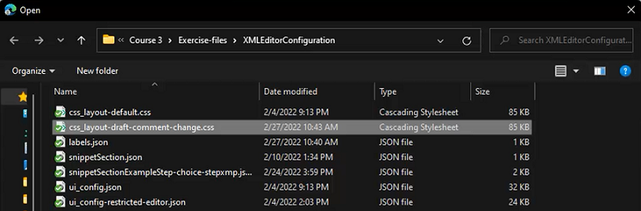

1. Click [!UICONTROL **Save**] in the top left corner of the screen.
You have successfully uploaded the customized CSS Template layout.

## Edit XML Editor Snippets

Snippets are reusable pieces of content that can be specific to a product or group. Note that sample Snippets are provided with the support files for this lesson.

1. From the Navigation screen, click the [!UICONTROL **Tools**] icon.

    

1. Select **Guides** on the left panel.

1. Click the [!UICONTROL **Folder Profiles**] tile.

    

1. Select a Folder Profile.

1. Click the [!UICONTROL **XML Editor Configuration**] tab.

1. Under XML Editor Snippets, click **Upload**.

    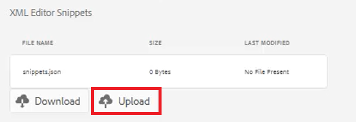

1. Choose your own Snippets or use the samples provided.

    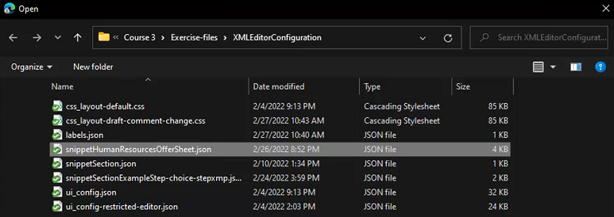

1. Click [!UICONTROL **Save**] in the top left corner of the screen.

You have successfully added new Snippets to the Editor.

## Customize XML Content Version Labels

By default, authors are allowed to create labels of their choice, and associate them with topic files. This may lead to different variations on the same label. To avoid inconsistent labeling, you can also choose from lists of predefined labels. 

1. From the Navigation screen, click the [!UICONTROL **Tools**] icon.

    

1. Select **Guides** on the left panel.

1. Click the [!UICONTROL **Folder Profiles**] tile.
 
    

1. Select a Folder Profile.

1. Click the [!UICONTROL **XML Editor Configuration**] tab.

1. Under XML Content Version Labels, click [!UICONTROL **Download**].

    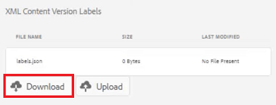

You are now ready to customize the labels as required.

## Upload XML Content Version Labels

Once you have downloaded and modified the labels, you can upload the XML Content Version Label topic. You may choose to use the sample file _labels.json_, provided with the set of supporting topics for this lesson.

1. Within the Folder Profile, click the [!UICONTROL **XML Editor Configuration**] tab.

1. Under XML Content Version Labels, click [!UICONTROL **Upload**].

    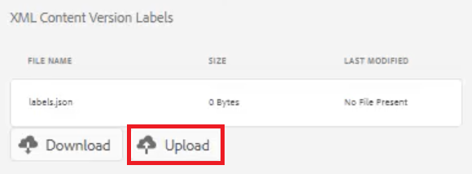

1. Double-click the file for either your own custom labels or the provided sample file shown here.

    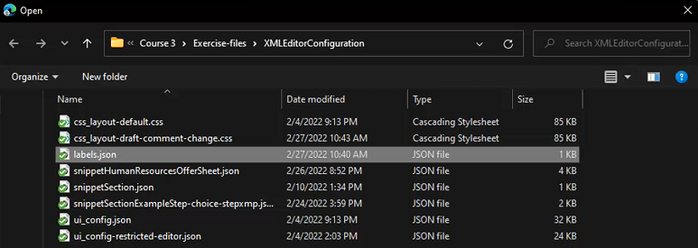

1. Click [!UICONTROL **Save**] in the top left corner of the screen.

You have successfully uploaded custom XML Content Version Labels.
