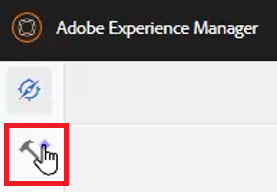
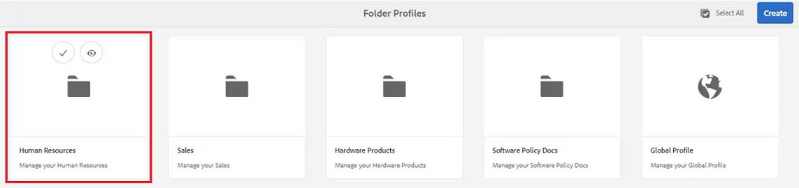

# Folder Profiles

AEM provides quick access to configuration tools. By customizing Folder Profiles, different departments or products can have unique templates, authoring environments, conditional attribute profiles, Snippets, or even Web Editor configurations. 

Sample files that you may opt to use for this lesson are provided in the file [folderprofiles.zip](assets/folderprofiles.zip).

>[!VIDEO](https://video.tv.adobe.com/v/342758?quality=12&learn=on)

## Access Folder Profiles

Configurations are managed through the Folder Profiles icon.

1. From the Navigation screen, click the [!UICONTROL **Tools**] icon.

    

2. Select **Guides** on the left panel.

3. Click the [!UICONTROL **Folder Profiles**] tile.

    

4. Select the desired profile. For example, choose **Global Profile**, which is the default profile.

    
 
## Edit Conditional Attributes in the Global Profile

Once you have accessed the Global Profile you can edit its configuration. The Global Profile settings are applied to all users unless otherwise specified.

1. In the Global Profile, select the **Conditional Attributes** tab.

2. Click [!UICONTROL **Edit**] in the top left corner of the screen.

    

3. Click [!UICONTROL **Add**].

4. Populate the **Name**, **Value**, and **Label** fields for the new condition.

    

5. Click [!UICONTROL **Save**] at the top left corner of the screen.
The new condition is now available to all users. You can select it in the Content Properties panel and apply it to content as required. 

## Build a new Folder Profile

In addition to the default Global Profile, you can create your own custom profiles.

1. From the Navigation screen, click the [!UICONTROL **Tools**] icon.

    

2. Select **Guides** on the left panel.

3. Click the [!UICONTROL **Folder Profiles**] tile.

    
 
4. Click [!UICONTROL **Create**].

5. In the Create Folder Profile dialog.

    a. Name the profile.

    b. Specify a path.

    c. Click [!UICONTROL **Create**].

    
 
A tile with the new profile name appears on the Folder Profiles page.

## Add administrative users from the General tab

Administrative users have rights to update the Conditional Attributes, Authoring Template, and Output Presets for the Folder Profile. 

1. Click on the tile to open the desired Folder Profile.

    

2. Select the **General** tab.

3. Click [!UICONTROL **Edit**] at the top left of the screen.

4. Under Admin Users, either select a user from the dropdown or type a user's name.

5. Click [!UICONTROL **Add**].

    You can add multiple Admin Users if required. 

    

6. Click [!UICONTROL **Save**] in the top right corner of the screen when all users have been added.

Administrative users are now assigned to this profile.

## Add a new audience from the Conditional Attributes tab

Once you have accessed the Global Profile you can edit its configuration. The Global Profile settings are applied to all users unless otherwise specified.

1. From within the desired Folder Profile, select the **Conditional Attributes** tab.

2. Click [!UICONTROL **Edit**] in the top left corner of the screen.

    

3. Click [!UICONTROL **Add**].

4. Populate the **Name**, **Value**, and **Label** fields for the new condition.

    Clicking the [!UICONTROL **Plus**] sign allows you to add additional Value and Label pairs for the named attribute.

    

5. Click [!UICONTROL **Save**] at the top left corner of the screen.

The new Conditional Attributes have been added to this profile.

## Choose a template and map from the Authoring Templates tab

AEM Guides comes with out-of-the-box authoring templates and maps. You can restrict them to specific authors. By default, the templates are stored in the Assets location within a DITA templates folder.

1. From within the desired Folder Profile, select the Authoring Templates tab.

2. Click Edit in the top left corner of the screen.

3. Add a Map Template.

    a. From the **Map Templates** dropdown, select an option from the available maps.

    b. Click [!UICONTROL **Add**].

    

4. Add a Topic Template.

    a. From the **Topic Templates** dropdown, select an option from the available templates.

    

5. Click [!UICONTROL **Add**].

6. Add additional Topic Templates as required.

7. When finished, click [!UICONTROL **Save**] at the top left of the screen.

The new Authoring Templates have been added to this profile.

## Delete nonessential presets from the Output Presets tab

You can configure each Output Preset based on the Folder Profile. Output Presets that are not needed should be removed.

1. From within the desired Folder Profile, select the **Output Presets** tab.

2. On the left panel, select the checkboxes of any presets that are not required.

    

3. Click [!UICONTROL **Delete Preset**] in the top left corner of the screen.

4. In the Delete Preset dialog, click [!UICONTROL **Delete**].

    
 
Now the only Output Presets showing are the ones that will be used.

## Upload a Snippet from the XML Editor Configuration tab

1. From within the desired Folder Profile, select the **XML Editor Configuration** tab.

2. Under XML Editor Snippets, click [!UICONTROL **Upload**].

    

3. Navigate to a previously created Snippet. 

4. Click [!UICONTROL **Open**].

5. Click [!UICONTROL **Save**] at the top left of the screen.

You have successfully modified the Editor Configuration to include Snippets.

## Specify the Folder Profile in the Repository

In the Editor, you can see the results of the modifications you made to the Folder Profiles.

1. Navigate to **Repository View**.

2. Click on the folder for the content you want to work with.

3. Click the [!UICONTROL **User Preferences**] icon on the top toolbar.

    

4. In the User Preferences dialog, select the desired Folder Profile from the dropdown.

    

5. Click [!UICONTROL **Save**].

You have applied the Folder Profile to your content. Now, when you create a new DITA topic, you will see a restricted list of topic types based on the Folder Profil. The Audience Condition contains the Global settings as well as those specific to the Folder Profile. The Snippets file you uploaded created a set of default Snippets to choose from. The Map Dashboard displays the restricted Output Presets.
