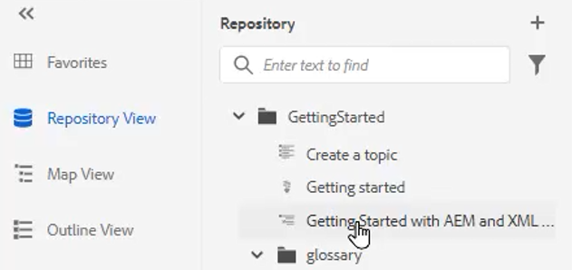
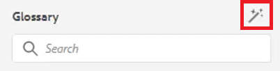

# Glossary

The Glossary panel allows a map to be parsed. You can create a Glossary topic file and include it in a common Glossary map. This map can then be added to other maps. Using the Glossary makes it easier to consistently phrase information and provide better clarity to the reader.

Sample files that you may opt to use for this lesson are provided in the file [glossary.zip](assets/glossary.zip).

>[!VIDEO](https://video.tv.adobe.com/v/342765)

## Add a glossary entry to a topic

1. Navigate to the **Glossary** panel.

2. Drag and drop the entry from the **Glossary** panel to the desired location in your topic.

If the map contains Glossary entries and is properly configured, topics can be automatically updated to contain abbreviated form.

## Specify a Root Map

The correct Root Map must be selected to properly work with a glossary. When a Root Map finds Glossary Entries, they are shown in the Glossary panel.

1. With a topic open, select **Glossary** from the left panel.

2. Click the [!UICONTROL **User Preferences**] icon on the top toolbar.

    

3. Click the key icon to specify the correct Root Map for working with the glossary.

4. Click [!UICONTROL **Select**].

5. Click [!UICONTROL **Save**].

The Glossary panel automatically updates.

## Work with the Glossary

1. Navigate to the **Repository View**.

2. Select the map that has been preconfigured to work with the glossary. 

    

3. Choose the [!UICONTROL **Map View**].

4. Verify that the Map View displays the required topics.

## Preview a Glossentry

Because it is possible to make bulk changes, it can be important to preview a glossentry.

1. Choose **Glossary** from the left panel.

2. Click the contextual menu next to a glossentry and select [!UICONTROL **Preview**].

The abbreviated form and the glossary definition both display.

## Review Hotspot Tool Settings

Use the Hotspot tool to create an entire collection of glossary entries from a single map. You can even search and convert specific text terms to linked Glossary abbreviations.

1. From the Glossary panel, select the [!UICONTROL **Hotspot icon**].

    

2. Click the [!UICONTROL **Glossary Keys**] dropdown and select only the Keys you wish to apply.

3. Click the [!UICONTROL **Topics**] dropdown to select the content that should be impacted.

4. Click the [!UICONTROL **Filter Topics by Status**] dropdown to review configured options.

5. Configure the remaining settings as required.

6. When finished, click [!UICONTROL **Convert**].

The Glossary panel now displays all updated topics and also topics with errors.
