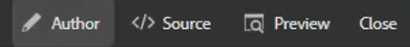

# Keys

Different sets of materials may contain similar information that needs to be customized in select places. Keys allow you to include variable information to when working with DITA.

Sample files that you may opt to use for this lesson are provided in the file [keys.zip](assets/keys.zip).

>[!VIDEO](https://video.tv.adobe.com/v/342756?quality=12&learn=on)

## Enable Keys

1. Upload the set of provided sample files.

    a. Load the zip file.

    b. Refresh the AEM environment.

    c. Select the file for extraction.

    

    d. Click [!UICONTROL **Extract Archive**] in the top toolbar.

    

    e. In the dialog, choose the specific location for files to be extracted, such as a folder called Keys.

    f. Click [!UICONTROL **Next**].

    g. Skip any conflicts as they will not exist for content that has never been uploaded before.

    h. Select [!UICONTROL **Extract**] at the top right of the screen.

1. When the extract is complete, click [!UICONTROL **Go to the target folder**].

    

## Resolve Keys to referenced values

To correctly use Keys, User Preferences must reference a specific map as the Root Map. Inside this map is a collection of Keys, grouped together inside a topicgroup. Opening the map and the topics resolves the Keys to the values that this map references.

1. Specify a Root Map.

    a. From the Keys screen, open a map.

    b. Configure User Preferences.

    c. Click the [!UICONTROL **User Preferences**] icon on the top toolbar.

    

    d. Click the key icon to specify a **Root Map** that will be used to resolve Keys.

    e. Select the checkboxes for any desired Assets.

    

    f. Click [!UICONTROL **Select**].

    g. **Save** the User Preferences.

1. Navigate to the **Map View**.

1. Open the specified map.

The Keys are resolved.

## Add a new keydef manually

1. Open a map with a specified Root Map.

1. Select a Key.

    

1. Insert a new keydef.

    a. Click in a valid location in the map.

    b. Select the **Keydef** icon on the top toolbar.

    

    c. In the Insert Keydef dialog, enter a unique value for Keys that makes sense for the definition you are creating.

    d. Click [!UICONTROL **Insert**].

1. Add topicmeta within the keydef.

    a. Click the [!UICONTROL **Insert Element**] icon on the top toolbar.

    

    b. In the Insert Element dialog, search and select "topicmeta".

1. Add keywords within the topicmeta.

    a. Click the [!UICONTROL **Insert Element**] icon on the top toolbar.

    

    b. In the Insert Element dialog, search and select "keywords".

1. Add a keyword within the topicmeta.

    a. Click the [!UICONTROL **Insert Element**] icon on the top toolbar.

    

    b. In the **Insert Element** dialog, search and select "keyword"

1. Type the value for the keydef into the keyword.

In the map, your keydef should now look something like this:

## Configure a keydef as a snippet

Snippets are small content fragments that can be reused across various topics in your documentation project. Instead of manually generating each keydef, you can configure a single keydef as a snippet.

1. Select a keydef element in the map.

1. In the contextual menu, click [!UICONTROL **Create Snippet**].

1. In the New Snippet dialog, add a Title and Description.
You may also wish to remove existing keys or keyword definitions from the Content.

1. Click [!UICONTROL **Create**].

1. On the left panel, select **Snippets**.

1. Drag and drop the snippet you just created from the Snippets panel to the map.

1. Update the keydef as needed using Content Properties.
When saved and refreshed, this set of Keys will be available for any user who has defined a map that contains the same Root Map.
