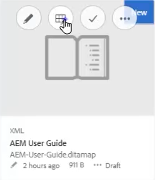
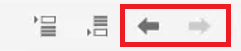
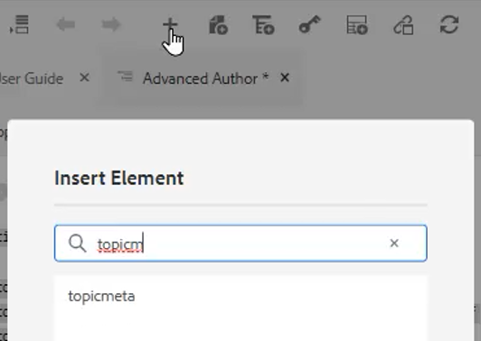
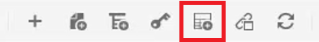
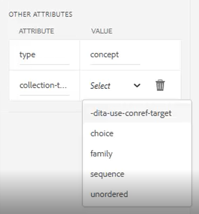

# Maps and Bookmaps

Adobe Experience Manager Guides' Map Editor allows you to create and edit map files. Using the Map Editor, you can edit two types of files — DITA map and bookmap. For our purposes, consider these to be largely interchangeable concepts. 
The Map Editor comes in two modes — the Basic Map Editor and the Advanced Map Editor.

>[!VIDEO](https://video.tv.adobe.com/v/342766?quality=12&learn=on)

## Create a map

AEM Guides provides two out-of-the-box map templates — DITA map and bookmap. You can also create your own map templates and share those with your authors to create map files.

Perform the following steps to create a map file.

1. In the Assets UI, navigate to the location where you want to create the map file.

2. Click [!UICONTROL **Create > DITA Map**].

3. On the Blueprint page, select the type of map templates you want to use and click [!UICONTROL **Next**].

4. On the Properties page, enter a **Title** and **Name** for the map.

5. Click [!UICONTROL **Create**].

## Opening a map with the Advanced Map Editor

1. In the **Assets UI**, select the map to be edited.

2. Click [!UICONTROL **Edit Topics**].

    

Or

1. Hover the mouse over the map icon.

2. Select **Edit Topics** from the **Action** menu.
 
 
## Adding content to a map or bookmap

1. Navigate to the **Repository View**.

2. Drag and drop content from the Repository View into valid locations in the map or bookmap.

Or

1. Click in a valid location within the map or bookmap.

2. Click the appropriate [!UICONTROL **Toolbar Icon**] to add chapters, topics, or topicrefs.

    

3. Choose one or more Assets you wish to add.

4. Click [!UICONTROL **Select**].

### Promote or demote elements in a map

Use **Toolbar Arrows** to promote or demote chapters and topicrefs in a map or bookmap.

1. Select an element in the map.

2. Click the [!UICONTROL **Left Arrow**] to promote a topicref to a chapter, or the [!UICONTROL **Right Arrow**] to demote a chapter to a topicref. 

    

3. Save and version the map if required.

Or

1. Drag and drop elements to reorganize them.

## Adding metadata to a map

1. From the **Map Toolbar**, insert a topicgroup.

    

2. Click the [!UICONTROL **Plus Icon**] to insert elements.

3. Choose elements to insert.

    

4. Click [!UICONTROL **Close**].

## Adding a reltable to a map

A reltable can be added after a map is structured.

1. Click in the map where you want to insert the reltable.

2. Use the **Toolbar Icon** to add the reltable to the map.

    

3. Configure the dialog.

4. Click [!UICONTROL **Insert**].

5. Drag and drop required topics from the **Repository** into the reltable.

6. Copy and paste required elements from the map into the reltable using standard keyboard shortcuts.

## Assign attributes to topicrefs in a map

1. Highlight a topicref or nested collection of topicrefs in the map.

2. Under Other Attributes in the Content Properties panel, choose an **Attribute** and its **Value.**

    
