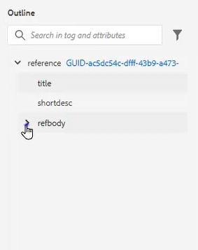
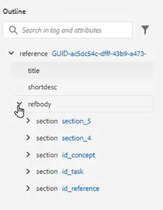
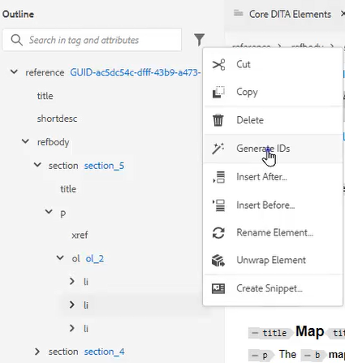
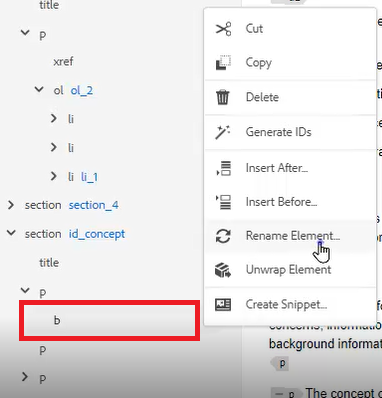
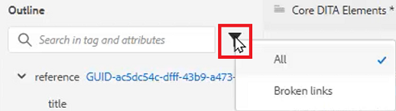
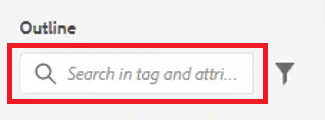

# Outline View

The Outline View provides a broad range of support when working with a structured document. Expand and collapse the view, navigate the structure, work with Attributes (for example to create a new ID), and reorganize, unwrap, and restructure elements at the click of a button.

>[!VIDEO](https://video.tv.adobe.com/v/342767?quality=12&learn=on)

## Expand and collapse the Outline View

Elements can be expanded to show child elements or collapsed as required.

1. Click on the appropriate icon to expand or collapse the Outline View.

    
    
    

The outline view toggles from expanded to collapsed.
   
## Navigate using the Outline View

1. Click on any element to jump to that location.

2. Click the [!UICONTROL **Ellipsis**] next to an element to access shortcut options.

    
 
## Assign an ID using the Outline View

A new ID can be automatically generated based on system configuration. Using the Content Properties, the ID and its Value can also be updated if required.

1. Click the [!UICONTROL **Ellipsis**] next to any element.

2. Choose **Generate IDs**.

    
 
The ID is assigned. The Content Properties updates and element and attribute information is displayed.

## Reorganize elements using drag and drop

Elements can be reordered within the Outline View.

1. Click and drag an element to another location in the Outline View. 
 
2. Drop the element on top of another element to replace it. This action is indicated by a square box around the element to be replaced.

    Or

    Drop the element in between two other elements to change its location. This action is indicated by a line between elements where the new element will be dropped.

## Rename an element

1. Select the element.

2. Click the [!UICONTROL **Ellipsis**].

3. Select **Rename Element**.

    

4. Double-click a new element name.

The element has now been renamed.

## Unwrap an element

1. Select the element you want to unwrap.

2. Click the [!UICONTROL **Ellipsis**].

3. Select [!UICONTROL **Unwrap element**].

The content remains but the structure has been removed.

## Filter content using the Outline View

1. Click the [!UICONTROL **Filter**] icon next to the search bar in the Outline View.

    

2. Choose either **All** to show all elements or **Broken links** to find and fix broken references.

## Search with Outline View

A search can be restricted and return results based on an element, attribute, or value.

1. Type the name of the element you want to find in the search bar.

    

2. Choose the result that is most relevant to your needs.
