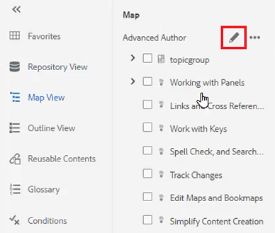

# Panels

The AEM Guides Web Editor is divided into multiple sections including a main toolbar, a secondary toolbar, a left panel, a content editing area, and a right panel.

>[!VIDEO](https://video.tv.adobe.com/v/342760?quality=12&learn=on)

## Resize the left panel

Persistent panels such as the left panel are adjustable in size.

1. Position the cursor on the panel border.

1. When the double-headed arrow appears, click and drag inward or outward as required.

## Expand or collapse the left panel sidebar

The expanded view displays the names and the icons which appear as Tool Tips in the collapsed view.

1. Click the [!UICONTROL **Sidebar**] icon to expand the panel.

    

1. Click the [!UICONTROL **Sidebar**] icon again to collapse the panel.

    
 
## Create a Favorites Collection

On the left panel, Favorites allows you to create a list of specific documents and add to it over time. You can create and manage a broad collection of Favorites.

1. Select **Favorites** on the left panel.

1. Click the [!UICONTROL **Plus**] icon.

    

1. In the New Collection dialog, enter a **Title** and a **Description**. 

    Note that selecting Public means other users can see this Favorite.

1. Click [!UICONTROL **Create**].

You have now created a Favorites Collection.

## Add a file to a Favorites Collection from the Repository

After creating a Collection, you can begin adding Favorites to it.

1. Select **Repository View** on the left panel.

1. Click the [!UICONTROL **Ellipsis**] located next to a topic to access contextual options.

1. Select **Add to** > **Favorites**.

1. In the Add to Favorites dialog, choose **New Collection** or **Existing Collection**. 

    Here, we will choose to add to an Existing Collection.
 
    

1. If required, select a collection from the dropdown.

1. Click [!UICONTROL **Add**].

The topic is added to the Favorites Collection you chose. You can view it in the Favorites menu.

## Add a file to a Favorites Collection from the Editor

Another way to add a topic to your Favorites is from an open topic in the Editor.

1. Navigate to the **Repository View**.

1. Double-click a topic to open it.

1. Right-click on the file's **Title tab** in the Editor to access contextual options.

1. Choose **Add to** > **Favorites**.

    

1. In the Add to Favorites dialog, choose **New Collection** or **Existing Collection**. 

    Here, we will choose to add to a New Collection.

1. In the New Collection dialog, enter a **Title** and a **Description**. 

    Note that selecting **Public** means other users can see this Favorite.

1. Click [!UICONTROL **Create**].

The new favorite has been created and grouped. You can view it in the Favorites menu.

## View and manage your Favorites

It is easy to view which topics you have already added to your Favorites Collections.

1. Select [!UICONTROL **Favorites**] on the left panel.

1. Under Favorites, click the [!UICONTROL **Arrow**] icon next to a collection to view its contents.

    

1. Click the [!UICONTROL **Ellipsis**] next to a topic to bring up contextual options, including the option to delete it from the Favorites list.

## Filter a search in Repository View

The enhanced filter in the Repository allows you to search for text with a wide variety of restrictions.

1. Navigate to **Repository View**.

1. Click the [!UICONTROL **Filter Search**] icon.

    

1. Type text in the selected path or choose a new path if required.

    The list of files updates as you type text into the filter.

1. Click the Arrow icon next to a search category to narrow the search further if required.

    
 
Searches can be narrowed to DITA Topics or DITA Maps. You can search non-DITA image files, multimedia, or other documents within the selected path. You can even restrict the search to DITA Elements or filter by file checkout.

## Explore the Map View

Several useful features are available in the Map View, including the ability to checkout and lock files, preview the map file, open the Map Dashboard, and view the map in the Assets UI. 

Refer to the lesson titled [Maps and Bookmaps](./maps-and-bookmaps.md) in this course for more information on the Map View and its functionality.

## Explore the Outline View

The Outline View provides a hierarchical view of the current document in the Outline. You can expand the Outline View to show multiple elements as well as any assigned IDs. 

Refer to the lesson titled [Outline View](./outline-view.md) in this course for more information on the Outline View and its functionality.

## Work with Reusable Contents

The core DITA feature is the ability to reuse content, from small phrases to entire topics or maps. The Editor provides a drag-and-drop interface for content reuse.

Refer to the lesson titled [Content Reuse](./content-reuse.md) in this course for more 
information on reusable content and how to manage it effectively.

## Work with Glossaries

Using the Glossary makes it easier to consistently phrase information and provide better clarity to the reader. The Editor provides a drag-and-drop interface for inserting glossary terms into a topic.

Refer to the lesson titled [Glossary](./glossary.md) in this course for more information on configuring and using glossaries. 

## Work with Conditions

In DITA, conditions are often driven through use of attributes such as Product, Platform, and Audience, which can each have specific values assigned to them. Conditions are managed through Folder Profiles.

Refer to the lesson titled [Conditions](./conditions.md) in this course for more information on configuring and using conditional attributes. 

## Create a Snippet

Snippets are small content fragments that can be reused as a starting point for content or structure. Using Snippets reduces the amount of time required to create content and improves the structural quality and consistency of the materials.

1. Open a topic in the Editor.

1. Select an element within the topic.

1. Click the secondary mouse button within the element.

1. In the resulting menu, choose Create [!UICONTROL **Snippet**].

    

1. In the New Snippet dialog, add a **Title** and a **Description**.

1. Edit the Snippet as required. 

    Note that a contextual check will visually notify you if you introduce an error into the content.

1. Click [!UICONTROL **Create**].

The Snippet is added to the list of available Snippets. It is ready to be dragged and dropped into a valid location in the topic.

## Work with Templates

Using the Templates panel, administrators can easily create and manage templates for authors to use. By default, templates are categorized as Map and Topic-type.

Refer to the lessons titled [Folder Profiles](./folder-profiles.md) and [Simple Content Creation Workflows](simple-content-creation-workflows.md) in this course for more information on configuring and applying templates. 

## Search files with Find and Replace

There are two Find and Replace options available in the Editor. The first allows Find and Replace functions within a specific open topic, much like a traditional word processor. The second is a Find and Replace panel that searches text in multiple files in the Repository.

Refer to the lesson titled [Spell Check and Find and Replace](./spell-check.md)  in this course for more information on the Find and Replace feature.

## Update Content Properties

Content Properties on the right panel includes specific information about the currently selected element, for example the Attribute ID and Value. 

1. Open a topic in **XML Editor**.

1. Select an **element**.

    Content Properties displays the element's current Type and Attributes.

1. Type a new **Value** for the element.

    
 
Content Properties dynamically updates as you make changes to elements.

## Add a topic to a map using File Properties

File Properties shows additional information about the entire open topic. Some of this information is controlled by Topic Properties. Modifications to other material, such as the Document State, may depend on permissions.

1. Open a topic in the Editor.

1. Click the [!UICONTROL  **File Properties**] icon on the right panel.

    

1. Set the **Document State** to **Edit**. Note that the References list is currently blank.
 
    

1. Close the topic.

1. Select [!UICONTROL **Repository View**] on the left panel.

1. Open a map.

    The view changes to Map View.

1. Click the [!UICONTROL **Edit**] icon.

    

1. Once the map is open for editing, switch back to **Repository View**.

1. Drag and drop the topic you are working with into the map.

1. Click the [!UICONTROL **Save**] icon on the top toolbar.

The topic is added to the map. Now when you open the topic and check the File Properties, you can see the References are updated to reflect that the topic is used in the specified map.

## Create a Review Task

The right panel contains a shortcut to kick off a review workflow.

1. Click the [!UICONTROL **Review**] icon on the right panel.
 
    

1. Click [!UICONTROL **Create Review**].
 
    

1. In the Create Review Task dialog, populate the fields as required.

1. Click [!UICONTROL **Next**].

The Review Task is created.

## Track Changes

The ability to track changes give you a great deal of control over what changes are retained in one version of a topic to the next. You can use the right panel to manage tracked changes.

Refer to the lesson titled [Track Changes](./track-changes.md) in this course for more information on change tracking functionality.
