# Simple Content Creation Workflows

The AEM Guides Editor has multiple shortcuts that simplify the content creation workflow. These shortcuts allow users to quickly add and modify images, work with multiple topics at once, correct errors, download topic PDFs, and work with versions and labels.

>[!VIDEO](https://video.tv.adobe.com/v/342770)

## Add an image

Images can be added directly from a local drive. 

1. Drag and drop the image directly into the topic. The **Upload Assets** dialog appears. 

    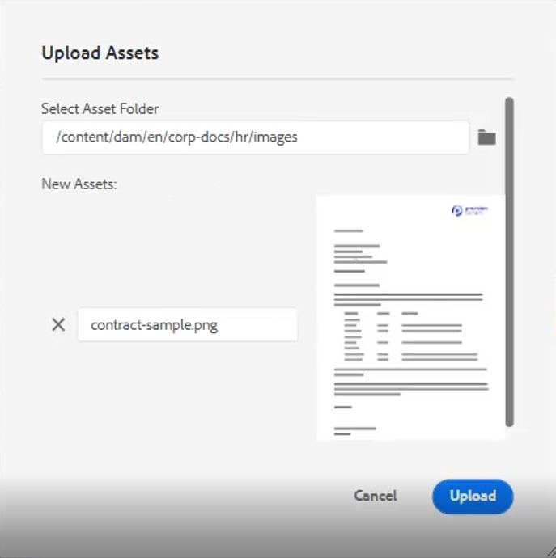

2. Modify the folder path to the desired image location.

3. Change the image name to something representative of its purpose.

4. Click [!UICONTROL **Upload**].

## Modify an image

1. Resize an image by dragging and dropping a corner.

2. Move an image to another location within the topic by dragging and dropping it.

3. Use **Content Properties** on the right side panel to modify an image’s

    • scale

    • position

    • alignment, or
    
    • other attributes.

    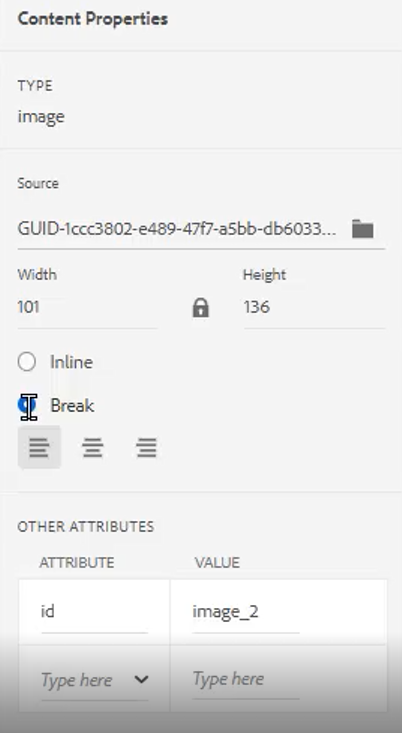 

## Work with multiple topics

Split View is helpful when comparing topics, copying and pasting between topics, or dragging and dropping content from one topic to another.

1. Open two or more related topics.

2. Click on one file’s Title Tab to open the contextual menu.

3. Select [!UICONTROL **Split**].

4. Choose **Right**.

    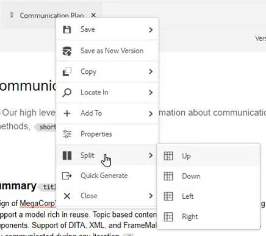
 
## Correct typographical errors

1. Locate the word or phrase containing the error.

2. Press and hold [!UICONTROL **Ctrl**].

3. Click the secondary mouse button on the error.

4. Select the correct spelling.

The error has been corrected in the topic text.

## Download a topic PDF

Users may want to download a PDF of the current topic to mark up or share with others.

1. Click [!UICONTROL **Preview**] at the top right of the screen.

2. Click the [!UICONTROL **PDF icon**] above the topic. A dialog appears.

    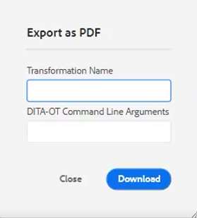
 
3. Fill in the information for either **Transformation Name** or **DITA-OT Command Line Arguments** if required. Note that a PDF still generates if all fields are left blank.

4. Click [!UICONTROL **Download**]. The PDF generates.

5. Use available icons to configure, download, or share the PDF topic.

## Locate a topic in the Repository or Map

1. Open the topic.

2. Click the secondary mouse button on the Title Tab.

3. Select **Locate In**.

4. Choose either **Repository** or **Map** to jump to the desired topic location.
 

## Version a topic

1. Make a change to a topic.

2. Save the topic.

3. Click the **Repository** icon on the top left menu.

    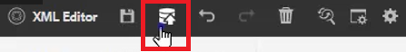
 
4. In the dialog, add **Comments for New Version**.

    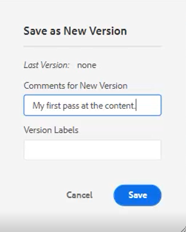
 
5. Click [!UICONTROL **Save**].

The version number updates.

## Load version labels

Trying to track a topic's state based on only the Version Number can be difficult. Labels make it easier to identify the exact state of a topic that has undergone multiple revisions.

1. Select a **Folder Profile**.

2. Within the Folder Profile, configure the XML Editor.

    a. Select Edit at the top left of the screen.

    b. Under XML Content Version Labels, either add a new topic or use an existing one.

    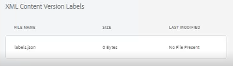
 
3. Select [!UICONTROL **Upload**].

4. Choose a file such as ReviewLabels.json or similar. Details on how to create such a file are covered in another video.

5. Click [!UICONTROL **Open**].

6. Click [!UICONTROL **Save**] at the top left of the Folder Profile screen.

7. Click [!UICONTROL **Close**] at the top right.

Version labels are now loaded.

## Assign version labels

1. Load version labels.

2. Click the [!UICONTROL **User Preferences**] icon at the top left of the current topic.

    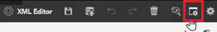
 
3. Select the same Folder Profile where version labels were previously loaded.

4. In the User Preferences dialog, ensure the Base Path references the same information the Folder Profile has been applied to.

    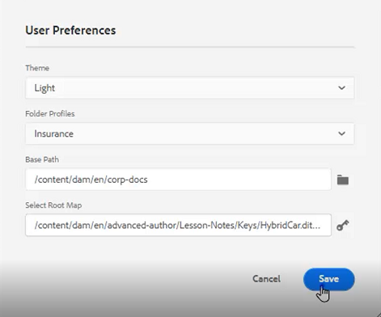
 
5. Click [!UICONTROL **Save**].

6. Version the topic. 

7. Add a comment and select a version label from the dropdown.

    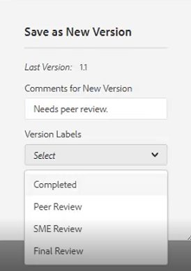

8. Click [!UICONTROL **Save**].

The version number updates.

## View version history and labels

1. From the left panel, locate the current topic title.

2. Click on the title to open the contextual menu.

3. Select [!UICONTROL **View in Assets UI**].

    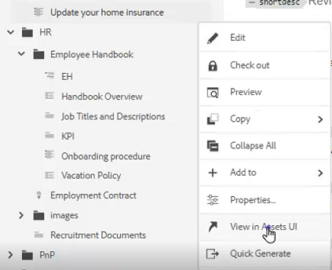
 
    - The version history with labels is displayed on the left.

    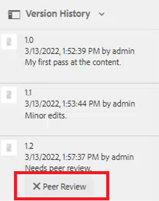
 
 
4. Click on a version to access options such as **Revert to this Version** and **Preview Version**.

## Create a new template

Templates exist for both topics and maps. Administrators can access Templates in the left panel.

1. Click [!UICONTROL **Templates**] in the left panel.

2. Select either Map or Topic to open the associated contextual menu.

3. Click to add the new template.

    

4. Populate the fields in the resulting dialog.
 
The shell template appears, containing sample content and a sample structure.
