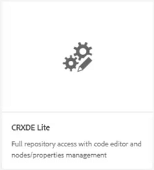
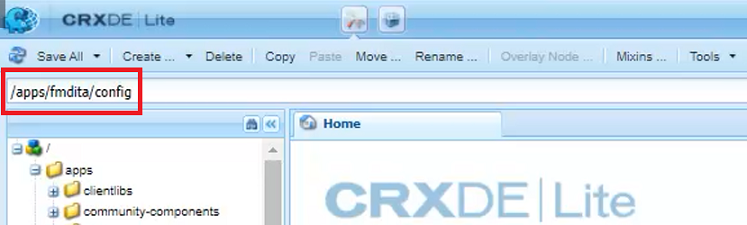
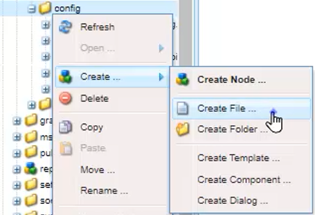
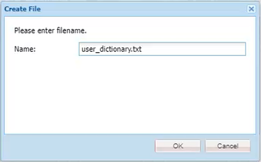
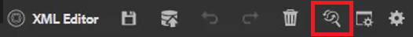
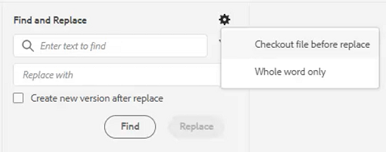
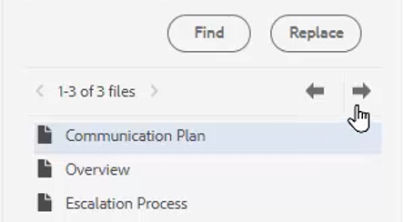

# Spell Check and Find/Replace

The AEM Guides Editor has powerful spell check and Find and Replace capabilities.

>[!VIDEO](https://video.tv.adobe.com/v/342768?quality=12&learn=on)

Correct a spelling error

1. Locate an error in an open topic, shown with a red underline.

1. Press and hold Ctrl + click the secondary mouse button within the word.

1. Choose the correct spelling from the suggestions.

If the correct spelling is not suggested, you can always manually edit the word. 

## Switch to AEM Spell Check

You may want to use a spell check tool other than the browser's default dictionary.

1. Navigate to **Editor Settings**.

1. Select the **General** settings tab. 

    

1. There are two options:

    - **Browser Spell Check** — the default setting where spell check uses the browser's built-in dictionary.

    - **AEM Spell Check** — use this to build a custom word list using AEM's custom dictionary. 

1. Choose **AEM Spell Check**.

1. Click [!UICONTROL **Save**].

Configure a custom dictionary

The Administrator can change the settings so that the AEM dictionary recognizes custom words such as company names.

1. Navigate to the **Tools** pane.

1. Log in to **CRXDE Lite**.

    

1. Navigate to the **_/apps/fmdita/config node_**.

    

1. Create a new file.

    a. Right-click on the config folder.

    b. Choose **Create > Create File**.

    

    c. Name the file _**user_dictionary.txt**_.

    

    d. Click [!UICONTROL **OK**].

1. Open the file.

1. Add a list of words you want to include in your custom dictionary.

1. Click [!UICONTROL **Save All**].

1. Close the file.

Authors may need to restart their Web Editor session to get the updated custom word list in the AEM Dictionary. 

## Find and Replace in a single file

1. Click the Find and Replace icon on the top toolbar.

    

1. In the bottom toolbar, type a word or phrase.

1. Click [!UICONTROL **Find**].

1. If required, type a word to replace the found word.

1. Click [!UICONTROL **Replace**].

## Find and Replace across the Repository

1. Navigate to the **Repository**.

1. Click the [!UICONTROL **Find and Replace**] icon at the bottom left of the screen.

1. Click the [!UICONTROL **Show Settings**] icon.

1. Choose either

    - **Checkout file before replace** — if enabled by an Administrator, the file will be checked out automatically before replacing search terms.

    - **Whole word only** — restricts the search to return only the exact word or phrase entered.

    

1. Click the [!UICONTROL **Apply Filter**] icon to select the path in the Repository where you want to perform the search.

1. Enter the terms to Find and Replace.

1. If required, select **Create new version after replace**.

1. Click [!UICONTROL **Find**].

1. Open the desired file and use the arrows to navigate from one found result to the next.

    
