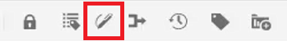
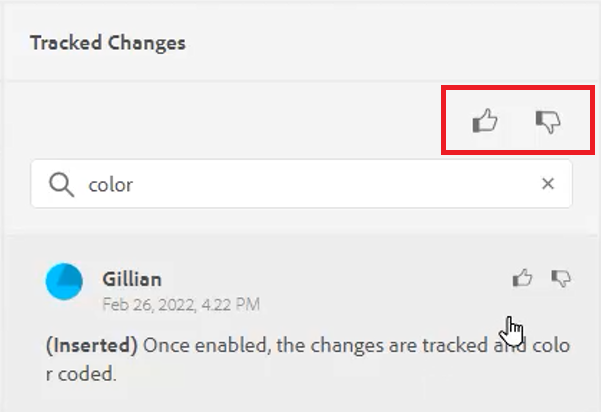
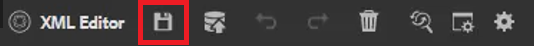
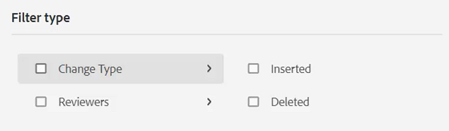
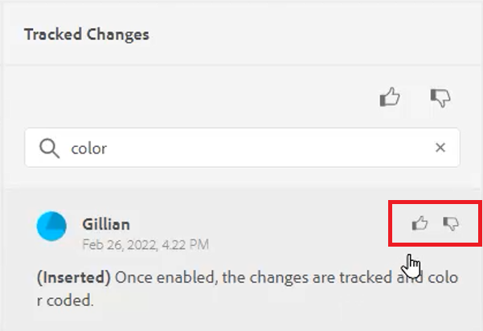
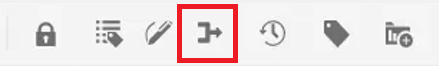

# Track Changes

You can keep track of all updates made on a document by enabling the Track Changes mode. This mode enables you and your team to capture all insertions and deletions during the document review process.

>[!VIDEO](https://video.tv.adobe.com/v/342763)

## Work with the Track Changes feature

1. Toggle the **Track Changes** toolbar icon to enable (or disable) the feature.

    

2. Make a change in the topic.

    Added content now displays in green with a change bar. Deleted content displays in red with a strikethrough.

3. Select the **Tracked Changes** icon on the right to access the Tracked Changes panel.

    

4. Click [!UICONTROL **Save**].

    

5. Close the topic.

Other users are now able to open the topic and view the existing tracked changes. They can accept or reject the changes and add their own.

## Search tracked changes

The search feature is helpful when there are many tracked changes, as scrolling through them can be time consuming.

1. Select the **Tracked Changes** icon on the right to access the Tracked Changes panel.

2. Type a word or phrase in the Search field.
The search returns any changes that match the search words.

## Filter tracked changes

Multiple tracked changes can also be filtered by insertion, deletion, or reviewer.

1. Click the [!UICONTROL **Filter**] icon at the bottom of the Tracked Changes panel.

2. Select the checkboxes for the desired filters.

    

3. Click [!UICONTROL **Apply**].

## Accept or reject tracked changes

Reviewers and Subject Matter Experts can accept or reject other users’ changes, either individually or all at once.

1. Click the [!UICONTROL **Tracked Changes**] icon on the right to access the Tracked Changes panel.

2. Select a specific change.

3. Click the [!UICONTROL **Thumbs Up**] or [!UICONTROL **Thumbs Down**] icon associated with the change to accept or reject it.
 
    

    Or

    Click the [!UICONTROL **Thumbs Up**] or [!UICONTROL **Thumbs Down**] icon above the Search bar to accept or reject all changes.

    

4. [!UICONTROL **Save**] the topic.

## Work with the Merge feature

When you work in a multi-author environment, it can be difficult to track what changes other authors have made in a topic or map. The Merge feature gives you more control over not only viewing the changes, but also what changes are retained in the latest version of the document.

1. Open a topic in the Web Editor.

2. Click the [!UICONTROL **Merge**] icon on the toolbar.

    

3. In the Merge dialog, select a version of the file with which you want to compare the current version of the file.

4. From the Options, choose:

    - **Track Changes From Selected Version**: This option shows all content updates in the form of tracked changes. You can then choose to accept or reject changes in the document one at a time or all at once.

    - **Revert to Selected Version**: This option reverts the current version of the document to the selected version. It does not give you any control over what content is accepted or rejected.

5. Click [!UICONTROL **Done**].

If you selected the **Track Changes From Selected Version option**, then all changes from the selected version appear in the Changes tab of the right panel.
