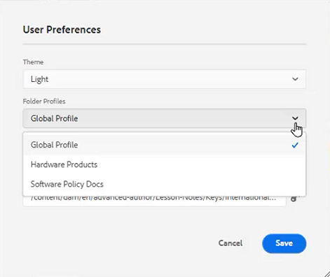

# User Preferences, Editor Settings, and Editor Toolbars

The Editor has a highly configurable interface. The mix of User Preferences, Editor Settings, and Folder Profiles means you can customize nearly every aspect to your specific work environment.

>[!VIDEO](https://video.tv.adobe.com/v/342769)

## Show or hide element tags

Tags are visual cues indicating an element's boundaries. An element boundary marks the beginning and end of an element. You can then use these boundaries as a visual cue to place the insertion point or select the text within a boundary.

1. Click the [!UICONTROL **Toggle Tags View**] icon on the secondary toolbar.

    

    Tags appear within the topic. With Tags View on you can:

    • Select an element’s content by clicking on the opening or closing tag.

    • Expand or collapse tags by clicking on the + or – sign in the tag.

    • Use the context menu to cut, copy, or past the selected element.

    • Drag and drop elements by selecting the tag and dropping the element in a valid location.

2. Click the [!UICONTROL **Toggle Tags View**] icon again to hide tags.

Tags disappear allowing you to focus on the text.

## Lock assets when in use

Locking (or checking out) a file gives the user exclusive write access on the file. When the file is Unlocked (or checked-in), the changes are saved in the current version of the file.

1. Click the [!UICONTROL **Lock**] icon on the secondary toolbar.

    

    The file has been checked out and a Lock icon appears beside the file name in the Repository.

2. Click the [!UICONTROL **Unlock**] icon.

    

The Repository updates to show that the file has been checked in.

## Insert special characters

1. Click the [!UICONTROL **Insert Special Characters**] icon on the secondary toolbar.

    

2. In the Insert Special Character dialog, type the name of the character in the search bar.

    Alternatively, use the Select Category dropdown to display all characters in a specific category.

3. Select the desired character.

4. Click [!UICONTROL **Insert**].

The special character is inserted into the text.

## Toggle between Author, Source, and Preview modes

The toolbar at the top right of the screen allows you to switch between views.

• Select **Author** to view the structure and content as you work with a topic.

• Select **Source** to display the underlying XML that makes up the topic.

• Select **Preview** to show how a topic will display when viewed by a user in their browser.

## Change the theme with User Preferences

You can choose from Light or Dark themes for the editor. Using the Light theme, the toolbars and panels use a light gray background. Using the Dark theme, the toolbars and panels use a black background. In both themes, the content editing area appears with a white background.

1. Click the [!UICONTROL **User Preferences**] icon on the top toolbar.

    

2. In the User Preferences dialog, click the [!UICONTROL **Theme**] dropdown.

3. Choose from the available options.

    

4. Click [!UICONTROL **Save**].

The Editor is updated to display your preferred theme.

## Update the Base Path with User Preferences

You can update the Base Path so that the Repository View shows you the content from a specific location as soon as you launch the Editor. This reduces the time to access working files.

1. Click the [!UICONTROL **User Preferences**] icon on the top toolbar.

    

2. In the User Preferences dialog, click the [!UICONTROL **Folder**] icon next to the Base Path.

    

3. In the Select Path dialog, click the checkbox next to a specific folder.

4. Click [!UICONTROL **Select**].

The next time you launch the Editor, the Repository will display the files that have been specified in the Base Path.

## Assign a new Folder Profile

The Global Profile is a system default. Administrators can create additional Folder Profiles to choose from.

1. Click the [!UICONTROL **User Preferences**] icon on the top toolbar.

    

2. In the User Preferences dialog, click the [!UICONTROL **Folder Profiles**] dropdown.

    

3. Choose a profile from the available options.

4. Click [!UICONTROL **Save**].

The new Folder Profile is now assigned. It has changed the toolbar options, view modes, and Conditions and Snippets in the left panel. It may also change the visual appearance of content in the Editor.

## Change the dictionary with Editor Settings

Editor settings are available to administrative users. These preferences allow you to configure a range of settings, one of which is the dictionary the Editor uses for spell check.

1. Click the [!UICONTROL **Editor Settings**] icon on the top toolbar.

    

2. In the Editor Settings dialog, click the [!UICONTROL **General**] tab.

3. Select the dictionary you want to work with.

4. Click [!UICONTROL **Save**].

The dictionary updates. Note that switching to AEM Spell Check allows you to use a custom word list.

## Show and hide panels with Editor Settings

One of the features you can customize with Editor Settings is Panels. More specifically, you can select which panels are shown or hidden in the Editor.

1. Click the [!UICONTROL **Editor Settings**] icon on the top toolbar.

    

2. In the Editor Settings dialog, click the [!UICONTROL **Panels**] tab.

3. Toggle the available Panels to Show or Hide as required.

    

4. Click [!UICONTROL **Save**].

The left panel is now configured to show only the panels toggled to Show.

## Name and label elements in Editor Settings

The Elements List allows you to name a specific element and assign it a more human-friendly label. The element name should be one of the DITA elements. The label can be any string.

1. Click the [!UICONTROL **Editor Settings**] icon on the top toolbar.

    

2. In the Editor Settings dialog, click the [!UICONTROL **Elements List**] tab.

3. Type an **Element name** and a **Label** in the respective fields.

4. Click the [!UICONTROL **Plus**] icon to add more elements to the list.

    

5. Click [!UICONTROL **Save**].

You can immediately see the change to the Elements List in the existing tags in the Editor. You can also see them in the options provided when you add a new element.

## Name and label attributes in Editor Settings

The Attributes List works similarly to the Elements List. From Editor Settings, you can control the List of Attributes and their display names.

1. Click the [!UICONTROL **Editor Settings**] icon on the top toolbar.

    

2. In the Editor Settings dialog, click the [!UICONTROL **Attributes List**] tab.

3. Type an **Attribute name** and a **Label** in the respective fields.

4. Click the [!UICONTROL **Plus**] icon to add more attributes to the list.

## Configure conditions in Editor Settings

The Condition tab allows you to configure several properties.

1. Click the [!UICONTROL **Editor Settings**] icon on the top toolbar.

    

2. In the Editor Settings dialog, click the [!UICONTROL **Condition**] tab.

3. Select the checkboxes of the conditions you want to apply.

    

4. Click [!UICONTROL **Save**].

## Create a publish profile in Editor Settings

Publish profiles can be used to publish the knowledge base. For example, Salesforce uses a configured app with a consumer key and consumer secret. This information can be used to create a Salesforce publish profile.

1. Click the [!UICONTROL **Editor Settings**] icon on the top toolbar.

    

2. In the Editor Settings dialog, click the [!UICONTROL **Profiles**] tab.

3. Click the [!UICONTROL **Plus**] icon next to Profiles.

4. Populate the fields as required.

5. Click [!UICONTROL **Save**].

A publish profile has been created.
