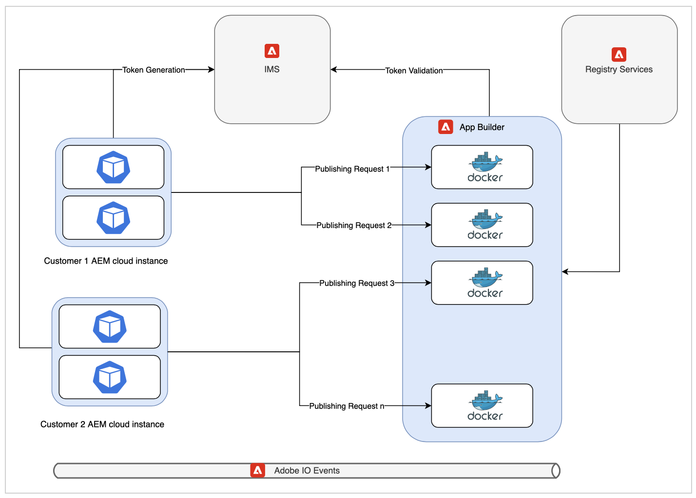

# Cloud Publishing Microservice Architecture and Performance Analysis

This article share the insights into the architecture and performance numbers of the new cloud publishing microservice.

>[!NOTE]
>
> Microservice-based publishing in AEM Guides supports PDF (both Native and DITA-OT based), HTML5, and CUSTOM types of output presets.

## Issues with existing publishing workflows on cloud

DITA Publishing is a resource-intensive process dependent mainly on available system memory and CPU. The need for these resources increases further if publishers are publishing large maps with many topics or if multiple parallel publishing requests are triggered.

If you are not using the new service, then all the publishing happens on the same Kubernetes(k8) pod which is also running the AEM cloud server. A typical k8 pod has a limit on the amount of memory and CPU that it can use. If AEM Guides users are publishing large or parallel workloads, this limit can breach fast. K8 restarts pods which are trying to use more resources than the configured limit which can have serious impact on the AEM cloud instance itself.

This resource constraint was the main motivation to come up with a dedicated service which can allow us to run multiple concurrent and large publishing workloads on cloud.

## Introduction to the new architecture

The service is using Adobe's cutting edge cloud solutions like App Builder, IO Eventing, IMS to create a serverless offering. These services are itself based on the widely accepted industry standards like Kubernetes and docker.

Each request to the new publishing microservice is executed in an isolated docker container which runs only one publishing request at a time. Multiple new containers are automatically created in case new publishing requests are received. This single container per request configuration allows the microservice to deliver the best performance to the customers without introducing any security risks. These containers are discarded once the publishing is over thus freeing up any unused resources.

All these communications are secured by Adobe IMS using JWT-based authentication and authorization and are executed over HTTPS.

>[!NOTE]
>
> Publishing process executes some content dependent parts of the request on the AEM server itself, like dependency list generation. However the most exhaustive parts of the publishing process like running DITA-OT or native engine have been offloaded to the new service.

## Performance Analysis

This section showcases the performance numbers of the microservice. It compares the performance of the microservice with AEM Guides on-prem offering since the old cloud architecture had issues in concurrent publishing or in publishing very large maps.

If you are publishing a large map on on-prem, then you might have to tweak the Java heap parameters or else you can encounter out-of-memory errors. On cloud, the microservice is already profiled and has optimum Java heap and other configurations out of the box.

### Running one publishing on cloud vs on-prem

* Cloud

    If you are executing a single publishing on cloud using the new service, then publishing can take a little more time when compared to single on-prem publishing. This slight elevated time is due to the distributed nature of the new cloud architecture.

    

* On-prem

    Results of single publishing are better on old cloud architecture or on on-prem as the complete publishing is happening on the same pod/machine where AEM is running.

    

### Running multiple publishing on cloud vs on-prem

* Cloud

    New publishing microservice shines in this scenario. As you can see from the image below, with the increase in the multiple concurrent publishing jobs, cloud is able to publish them without any significant increase in publishing time.

    

* On-prem

    Running concurrent publishing on an on-prem server results in severe performance degradation. This performance drop is more severe if publishers are publishing even more maps simultaneously.

    

## Additional Benefits

Some part of each publishing request must run on the AEM instance to fetch correct publishing content to be sent to the microservice. The new cloud architecture uses AEM jobs in place of AEM workflows as was the case in the old architecture. This change enables AEM Guides administrators to individually configure cloud publishing queue settings without impacting other AEM jobs or workflow configurations.

Details on how to configure the new publish microservice can be found here: [Configure Microservice](configure-microservices.md)
