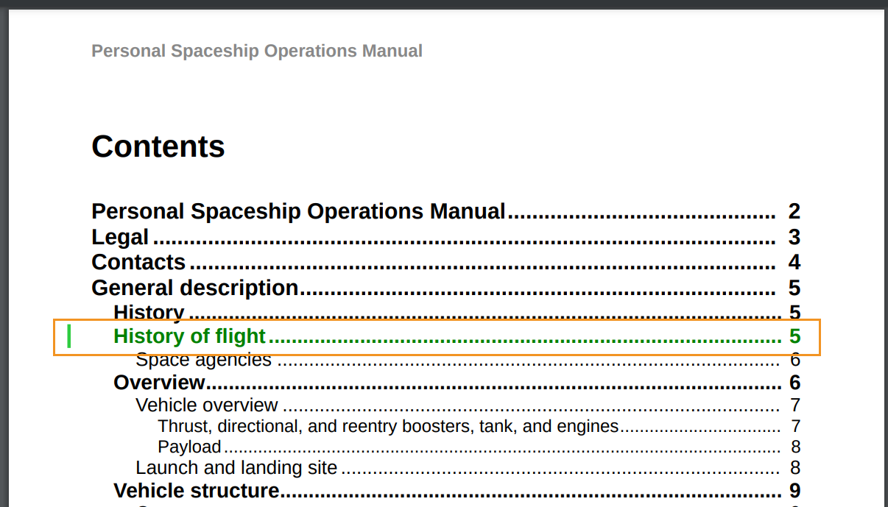

# Work with styles on change bars

A change bar is a vertical line that visually identifies new or revised content. AEM Guides allows you to show a change bar on the left of the changed content within the topics and also the changed topics in the TOC of the PDF output.  

For more details on showing the change bar, see *Create PDF with Change Bar between Published Versions* setting in
[Publish PDF Output](../web-editor/native-pdf-web-editor.md)

## Changed content within the topics

The change bar appears on the left of the content in the topics that has been inserted, changed, or deleted. 

You can modify the following styles to show the changed content and the change bar in the content within the topics. 


>[!NOTE]
>
>These styles are a part of `layout.css`  and you can edit them.

For example, you can use the color attribute in `.inserted-block` style to define the way your inserted content appears within your topics. 


```css
...
.inserted-block { 
  color: #2ECC40; 
  display: inline; 
  -ro-comment-content: " "; 
  -ro-comment-style: underline; 
  -ro-comment-title: "Inserted"; 
  -ro-comment-date: attr(data-time); 
  -ro-comment-dateformat: "yyyy/dd/MM HH:mm:ss"; 
} 
...
```

Similarly, you can use the `.deleted-block` style to define the way your deleted content appears within your topics. 

```css
...
.deleted-block { 
  display: inline; 
  color: #FF6961; 
  text-decoration: line-through; 
  -ro-comment-content: " "; 
  -ro-comment-style: strikeout; 
  -ro-comment-title: "Deleted"; 
  -ro-comment-date: attr(data-time); 
  -ro-comment-dateformat: "yyyy/dd/MM HH:mm:ss"; 
} 
...
```

You can use `.inserted-change-bar` and `.deleted-change-bar` style to modify the appearance of the change bars which appear on the left of the changed content.  

For example, you can use `-ro-change-bar-color` attribute in `.inserted-change-bar` style to show the inserted change bar in green color. You can also use `-ro-change-bar-color` attribute in `.deleted-change-bar` style to show the deleted change bar in red color. 

```css
...
.inserted-change-bar { 
  -ro-change-bar-color: #2ECC40; 
} 

.deleted-change-bar { 
  -ro-change-bar-color: #FF6961; 
  } 
...
```


## Changed Topic in the Table of Contents (TOC) 

You can also see a change bar on the left of the changed topics in the TOC of  PDF output. You can use `-ro-change-bar-color` attribute in `.changed-topic` style to add a change bar in the color of your choice for the changed topics in the TOC.  

For example, you can add a change bar of green color. 

```css
...
.changed-topic { 
 -ro-change-bar-color: #2ECC40; 
}  
...
```
 

This will show a green change bar against all topics in the TOC where some changes have been done. You can click on the changed topic in the TOC and view the detailed changes.


