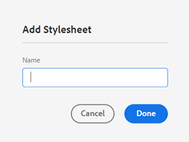
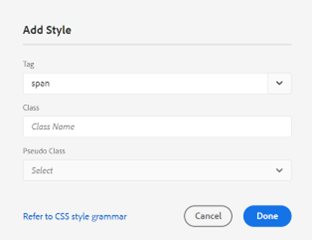
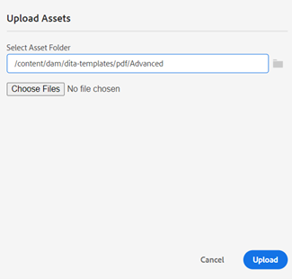
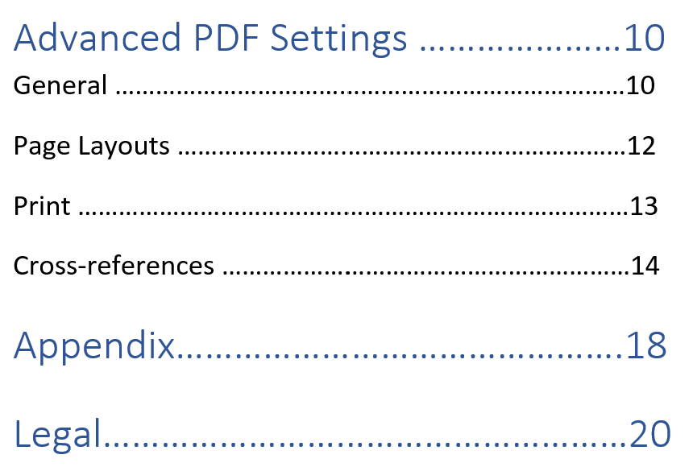

# Components of a PDF template {#components-pdf-template}

A PDF template has four components: Page Layouts, Stylesheets, Resources, and Settings. You can create a template by customizing these individual components and associating the template with an output preset while generating a PDF output. The following sections cover these components and their customization process in detail.

## Create and customize page layouts {#create-customize-page-layout}

Settings in the Page Layouts component allow you to design the structure of a page by defining the header, footer, and content area on a page. Using the WYSIWYG page layout editor, you can create a page layout for different sections in a PDF, such as the front and back cover pages, chapter, Table of
Contents (TOC), index, blank page, Front Matter Pages, Back Matter Pages, List of Figures (LOF), List of Tables (LOT), glossary, or create a layout for a custom page. In the PDF template Settings, you can assign a page layout with different sections within a PDF, which are then used to generate the PDF output.  

### Create a new page layout {#create-page-layout}

   >[!NOTE]
   >
   >There are sample page layouts that are shipped out of the box. You can customize these or create new page layouts.

1. In the Web Editor, go to the **Output** tab.
1. Expand the left sidebar and click **Templates**.
1. Open the template that you want to work with.

    >[!NOTE]
    >
    >You can open a template by double-clicking its name or clicking the > icon next to its name.

1. To create a new page layout, do one of the following:

   *  Hover over **Page Layouts** and click the (*Options* icon) **...** and choose **New Page Layout**.

   *  In the **Templates** panel, click the **+** icon next to **Templates** and choose **Page Layout** from the context menu.

      
      This opens the **Add Layout** dialog.
      
      

1. Specify a name for the new page layout.
    >[!NOTE]
    >
    >Avoid using any special characters when naming a page layout. A space in the name is replaced with an underscore "_".

1. Click **Done**.
   
   The new layout is created and added under Page Layouts.

### Duplicate a page layout {#duplicate-page-layout}

1. In the **Templates** section of the template that you want to duplicate, double-click  **Page Layouts** or click the **>** icon before **Page Layouts**.

   This displays the list of page layouts within the template.
   
1. Hover over the page layout that you want to duplicate and click the (*Options* icon) **...** and select **Duplicate** from the context menu.

1. In the _Duplicate Layout_ dialog, enter a name for the page layout.

1. Click **Done**.
   A copy of the selected page layout is created and added under Page Layouts.

### Customize a page layout {#customize-page-layout}

1. In the **Templates** section of the template that you want to edit, double-click **Page Layouts** or click the **>** icon before **Page Layouts**.

   This displays the list of page layouts within the template.
1. To customize any page layout, do one of the following:
   * Double-click any page layout.
   * Hover over any page layout and click the (*Options* icon) **...** and select **Edit** from the context menu.

   This opens the page layout editor for customization.
1. Once you have made the desired changes, click *Save All* (or `Crl+S`).

   For more information on defining individual layout elements like header, footer, page number, title, and more, see [Design a page layout](design-page-layout.md).

## Use Stylesheets to customize PDF {#stylesheet-customization}

Settings in the Stylesheets component allow you to style the page layout components and DITA content using the WYSIWYG editor or directly work with the CSS file. You can create your own styles or customize the default style properties. The WYSIWYG editor gives you the access to most of the properties that you would need to style your page layout or DITA content. For advanced customizations, you can work directly in the Source view.

### Create a new stylesheet {#create-stylesheet}

While CSS files are provided for content and layout, you can create a new stylesheet to apply multiple customizations to a specific style type that can then be applied to a target component. By default, sample CSS files are bundled within the product. These CSS files are meant to help you organize your styling information across content and layouts. You can choose to merge these styles in a single CSS file or multiple files. 

By default, whenever you create a new page layout, the `layout.css` file is included within the new page layout. If you want the page layout to contain styles from a different CSS file, then you can simply drag-and-drop the desired CSS file on the new page layout's content editing area. To validate if the CSS file has been embedded within the page layout, switch to the Source view and you will find a link to the CSS file in the `<head>` element.  

To create a stylesheet, follow the below steps:
1. In the **Templates** panel, do one of the following:
   * Hover over the **Stylesheets** tab and click the (*Options* icon) **...** and choose **New Stylesheet**.
   * Click the **+** icon next to **Templates** and choose **Stylesheet** from the context menu.
   
   This opens the Add Stylesheet dialog.
   
   
1. Specify a name for the new stylesheet.
1. Click **Done**.
   
   A new stylesheet is created and added under the Stylesheets section.

### Create a new style {#create-style}

By default, the CSS files provided with the template contain styles for heading, paragraph, character, hyperlink, image, table, div, page, and other styles. You can override the default styling format or create a new style. 

You can create a new style to use it in the page layout of the template or apply a custom style for any DITA element. To apply these custom styles to the DITA element, you must ensure that the style’s class name is the same as the DITA element’s name or the `outputclass` attribute.  For example, `
` in DITA is governed by the `.div {}` in CSS or its `outputclass` attribute. If you apply `
` in DITA, it's governed by the `.div {}` or `.my-div {}` in the CSS. 

To create a new style, follow the below steps:
1. Expand the left sidebar and double-click on the template in which you want to create the style.
1. Expand the **Stylesheets** section. It opens the **Styles** panel that contains all the styling options.
1. Select +  icon to add a new style.
   
      **Add Style** dialog box opens.

   
     
      
1. Specify a **Class** name. To apply a style to the DITA element, ensure that the style’s class name is the same as the DITA element’s name or the `outputclass` attribute.
1. In the **Tag** field (optional), choose a tag for which you want to create a new style.
   
    
1. Select a **Pseudo Class** to style an element. A pseudo-class helps you define a special state of the element. For example, use pseudo-class to style an element when you hover a mouse over it or when you focus over it. You can also select multiple pseudo-classes. For example, you can use pseudo-class `a::visited {color: blue;}` to style the visited links.  

1. Add the selector for the new style. The **Selector** field helps you to add custom selectors besides the Class, Tag, and Pseudo Class combination. For example, you can create `table a.link` style for all the hyperlinks inside a table.

   For more info regarding CSS tags, view [Refer to CSS style grammar](https://www.w3.org/TR/CSS21/syndata.html#characters).

1. Click **Done**.

   A new style is created and added to the style list.

### Customize a predefined or new style {#customize-style}

Once you have created a new CSS file with default styles or want to customize styles in an existing CSS file, you can use the styles editor to do so.

To customize a style, follow the below steps:
1. Double-click **Stylesheets** or click the **>** icon before **Stylesheets**.

   This displays the default (Content and Layout) and custom CSS files.
1. Open a stylesheet for editing.
   
   To open stylesheet for editing, do one of the following:
   * Double-click the stylesheet name.
   * Hover over the stylesheet name and click the (Options icon) ... and choose Edit.
   
   This opens the stylesheet for editing and displays the list of styles in the Styles panel.

   

1. To customize a style, select the style to view and customize it using the Styles editor.

### Properties of Styles

In the center panel, you can edit the properties, but it might be difficult to get a snapshot of what all values are present.  The **Properties** pane gives a quick view of all the attributes and values of the style. 

In the center panel, you can edit the commonly used properties but not all the properties that CSS supports. In the **Properties** pane, you can edit all the properties that CSS supports and preview them. You need not switch to the source view to edit any properties.

Learn more about using the style editor to [Work with the common content styles](stylesheet.md).

## Work with resources {#work-with-resources}

This is a container for all assets used to design a template. You can think of it as a folder, which contains assets such as background images, custom fonts, logos, and more. Whenever you add an asset in your template, it is upload or check in to the asset folder. You can then use these assets to customize or design your PDF templates.

To add an asset file to the Resources folder, follow the below steps:

1. Hover over the Resources folder tab and click the (Options icon) ... and choose Import.

   This opens the Upload Assets dialog.

   
   
   The path where the asset file will be uploaded is shown in the **Select Asset Folder** field.
    >[!NOTE]
    >
    >You cannot change the path for uploading assets. By default, all assets are stored under the `/content/dam/dita-templates/pdf/<PDF-template-name>` folder.

1. Click **Choose Files** to browse the asset file from your local machine

1. Click **Upload**.
The selected file is imported and listed under the Resources folder.

## Advanced PDF Settings {#advanced-pdf-settings}

Use the Settings section to configure the advanced settings for PDF's page layout, starting PDF from odd or even page, formats for the cross references, and enabling printing marks in the final PDF that's generated
using the template.

To configure, click **Settings** in the **Templates** panel to view the following options:

### General

Set the basic configuration settings for starting a chapter from odd or even page, the TOC structure, and define the leader line format for the TOC entries. You can define the following setting:

* **Start any new chapter from**: Allows you to define how each chapter is published in the final PDF. You can choose from a **New Page**, **Odd Page**, **Even Page**,  or **Current Page**  options. If you choose to start a new chapter from an odd page, then a blank page is inserted after a chapter that ends on an odd page. For example, if your chapter ends on page number 15, then the publishing process will insert a blank 16th page so that the new chapter can start from the 17th page.  If you choose the **Current Page** option, then all chapters are published in continuation without any page breaks. For example, if a chapter ends in the middle of page 15, then the next chapter is also started from the 15th page itself.   

* **Start each topic from a new page**:  If you want each topic within your chapter to start from a new page, then select **Start each topic from a new page** option. If you want to keep your topics in continuation without any page gaps, then deselect this option.

* **TOC Structure**: Allows you to customize the hierarchy of the Table of Contents. It uses the following additional settings:

   * **Use Headings up to Level**: It allows you to adjust the number of heading levels to be displayed in the TOC structure of your PDF.
   * **Do not show page number for the first level in TOC**: Select this option to hide the corresponding page numbers for all chapters that contain nested or child topics. Consider the following example wherein an output is created without selecting this option. 
   
   
   
   In the above example, Advanced PDF Settings, Appendix, and Legal are the first level topic headings or chapter titles. A page number is assigned to all of these headings. 
   
   Now, if you select this option and generate the output, then you will get the following TOC:

    

   Here you can notice that the first chapter Advanced PDF settings is not given any page number, as it has nested or child topics. Whereas a page number if assigned to Appendix and Legal because they are standalone topics without any child topic. 

* **Leader format**: Use the drop-down to select Dotted, Solid, or Space leader lines to connect heading levels to its corresponding page numbers.
   For applying TOC structure and styling heading levels, see [Add a chapter TOC](design-page-layout.md#add-chapter-toc).

    >[!NOTE]
    >
    >If you are a CSS developer, then you can define the leader format directly in the CSS file as well. 
    
* **Use table continuation marker**: Select this option to define markers for long tables that spread across multiple pages. 
You can define the text to appear before and after the break. For example, a table breaks on page 5, and you define `<Continued on page %page-num%>` for **Text Before Break**.  The text displays “Continued on page 6” at the bottom of page 5. 

   Use language variables to define the continuation marker text before and after the break. Depending on your chosen language, the localized value is automatically picked in the PDF output. For example, you can publish `Continued on page %page-num%` as a text in English and `Fortsetzung auf Seite %page-num%` in German. 

   Hover over  near the option to view more details about it. 

<!--For more information on using table continuation markers, see Use table continuation markers.-->

### Page Layouts {#page-layouts}

   The Page Layouts settings give you complete control over specifying which page layout is to be used for a specific section of your document. For example, to select a layout for the Table of Contents, click the dropdown menu under the TOC field and select the layout you have designed to generate the TOC. 

   It is important to note that the bookmap settings take a precedence over the page layout settings.

   The following settings are available under the Page Layout section:

   

   **Default Page Layout**: Select a page layout that acts as the default layout for all pages in your PDF. This is the base page layout that is applied on those sections or topics where you have not created a dedicated page layout. 

   **Page layout for different sections**: You can map a page layout with the following sections of your PDF output. If you have designed a page layout for the related section, then select it from the drop-down list. If no page layouts have been created for a specfic sections, then the default page layout is applied. 

* **Chapters & Topics**: You can specify the page layout for the for the Chapter & Topics. The selected layout will be applied to all the Chapters and Topics. 

* **TOC**: If you have designed the TOC page layout, select **TOC** in the drop-down list, and all TOC pages in your document will have the TOC page layout. 

* **List of Figures and List of Tables**: You can also specify the page layout for figures and tables. The selected layout will be applied to all the Figures and Tables. 

* **Index and Glossary**:  If you have designed a Index page layout, map it to the Index option. If you have a Glossary page layout, then map it to the Glossary option. 

* **Front Matter Pages and Back Matter Pages**: These page layouts define the styling for front or back matter pages in your book. If you've designed the front matter  layout, map it to the **Front Matter Pages** option. When you select the front matter layout from the dropdown, the front matter layout is applied to all topics present in the front matter. 

   If you've designed the back matter layout, map it to the **Back Matter Pages** option. When you select the back matter layout from the dropdown, the back matter layout is applied to all topics present in the back matter. 

   **Front Matter Pages** is also used as a fallback layout for the **TOC**, **List of Figures**, and List of Tables.  Similarly, **Back Matter Pages** is also used as a fallback layout for the **Index** and **Glossary** layouts. If you have not selected the layout for these, the selected Front or Back Matter Pages layout is applied.  If you have not selected the Front or Back Matter Pages layout, the default page layout is applied to them.

* **Page Layout for Empty Pages**:    You can also specify the page layout for the empty pages. The selected layout will be applied to all empty pages. For example, if you have designed a Blank page layout for all empty pages, then select **Blank** in the drop-down list, and all empty pages in your document will have the Blank page layout.

* **Cover Page and Back Page**: If you have designed a cover page layout, then map it to the **Cover Page** option. Similarly, if you have a back page layout, then map it to the **Back Page** option. If no cover or back page layouts have been created, then the default page layout is applied. 

For more information on page layouts, see [Design a page layout](design-page-layout.md).

### Page Order {#page-order}

   You can show or hide the following sections in your PDF and also arrange the order in which they should appear in your final PDF output: 

* TOC
* Chapters & Topics
* List of Figures
* List of Tables
* Index
* Glossary
* Citation

   

   If you do not want to show a particular section in your PDF output, you can hide that by turning the toggle switch off. 

   You can also define the order in which these different sections as generated in your PDF. To change the default order of these sections, select the dotted bars to drag and drop the sections at the desired location. 

   >[!NOTE]
   >
   > The order and inclusion settings apply only to a DITA map. For a bookmap, these settings are not applicable. The pages in a bookmap are displayed as per the order of the sections in the bookmap.

.
   **Chapter & Topics** layout is always enabled and **Glossary** layout is always disabled by default. You cannot toggle them.

**Merge pages**

   By default, all sections begin on a new page. Select the **Previous Page** or **Next Page** option from the **Merge With** dropdown to merge a section with a previous or next page. This will publish the section in continuation with the selected page in the PDF output. With this, there will be no page break in between.

   >[!NOTE]
   >
   > This setting applies only to the section and not its components.  For example, if you select the **Previous Page** option for **Chapters & Topics**, the **Chapters and Topics** section merges with the previous page. The various chapters and topics are published as per the **General** settings.For example, if in **Start any new chapter from setting**, you select **Odd Page**, then a blank page is inserted after a chapter that ends on an odd page. 

   When you merge a section to its previous page or next page, the content is merged, and the style of the target section in which the content is merged is applied. 

   For example, if you enable **TOC** and **Chapter & Topics** and select the **Next Page** for **TOC**, the **TOC** merges with the next section, which is the **Chapter & Topics**. The style of the **Chapter & Topics** section is applied to the merged content of both sections.

   The merge option works successively, so if you have selected **Next Page** for multiple continuous sections, they all merge with the first section (in the next direction), which does not have this property set. For example, you enable **TOC**, **Chapter & Topics**, **List of Figures**, and **Index**. Then, if you set **Next Page** for **TOC**, **Chapter & Topics**, **List of Figures**, and **None** for **Index**, they all merge with  **Index**. 

**Static pages**

The various page layouts help you design the output of the various sections. These sections are generated from the DITA map while you publish the output.
You can also create custom page layouts and publish them as static pages in the PDF output. This helps you to add any static content like Notes or blank pages. 
 
Perform the following steps to add a custom page layout:

1. Select **Add**  to add a new page layout. Add page layout panel opens.
2. Select the page layout from the list and click Add. The new page layout is added to the list of page layouts.

You can also perform the following actions:

* Select the dotted bars to drag and drop the page layout at the desired location.

* Select **Remove Layout**   to remove a layout.

* You can also merge a static page with the previous page or the next page. 

* You can also add a custom layout multiple times and order them. This helps you publish the static content accordingly. 

   For example, you can use a custom layout to publish a static warning multiple times within the PDF output.

### Print

Configure the print production settings to assign printer marks, select color models, and specify properties related to printing of your PDF output.

* **Printer Marks**: When you prepare a document for print production, printer marks are added to the page boundaries to assist in proper alignment, trimming, and color selection during printing. By selecting a printer mark, the page boundary is extended to accommodate the mark, which are trimmed during print. You can choose to display the following printer marks in your PDF output:
   * **Trim Marks**: Select the option to place a mark at each corner of the trim area to indicate where the paper needs to be trimmed after printing.
   * **Bleed Marks**: Select to place a mark at each corner of the bleed box to indicate the trim area for the extended image.
   * **Registration Marks**: Select to place a mark outside the crop area for aligning the different separations in a color document.
   * **Color Bars**: Select to add a strip of colors outside the trim area to maintain color consistency and adjust ink density when printing.

   Set dimensions for the selected printer marks using the **Line Width**, **Line Color**, and **Bleed Box Width** options.

* **Media Box size**: This is the overall page size including the extended area occupied by printer marks. Use the drop-down option to select the page size for your PDF output or create your own custom size.

* **Color Space**: You are given an option to choose from RGB or CMYK color spaces to print your PDF document. Choose RGB to display the generated PDF digitally and CMYK for physical printing. Colors defined in the document are converted to the chosen color space.
    >[!NOTE]
    >
    >An ICC color profile is necessary for PDF/A creation if using CMYK color space.

   <!--For more information on applying these print settings, see *Printing preferences*.-->

### Cross references {#cross-references}

Use the **Cross-reference** tab to define how the cross-references are published the PDF. You can format the cross-references for topic title, tables, figures, and more.

You can also use variables to define a cross-reference.  When you use a variable, its value is picked from the properties. You can use a single or a combination of variables to define a cross-reference. You can also use a combination of a string and a variable. 

For example, you can use `View details on {chapter}`. If the Chapter name is “General settings,” the cross-reference in the output is “See details on General settings.” 

AEM Guides provides the following out-of-the-box variables:

* {title}: Creates a cross-reference to the title of the topic. For example, See Useful Links on page 2.
* {page} Adds a cross-reference to the page numbers. For example, See on page 1.
* {description}: Adds a cross-reference to the text of the description. For example,  See the details of AEM Guides.
* {chapter}: Adds a cross-reference to the chapter numbers. For example, See on Chapter 1.
* {bookmarkText}: Creates a cross-reference to the bookmarked text. For example, See stop_words on page 5.
* {captionText}: Creates a cross-reference to caption of the figure or table in your topic. For example,  See Airflow on Page 2.
* {figure}: Adds a cross-reference to the figure number. Picks the figure number from the auto number styles that you’ve defined for figcaption.  For example, you can use "See {figure} on page {page}". The cross reference in the output contains the auto-generated figure number and its page number, “See Figure 1 on page 5”.
* {table}: Adds a cross-reference to the table number. Picks the table number from the auto number styles you’ve defined for caption. For example, you can use "See {table} on page {page}". The cross reference in the output contains the auto-generated table number and its page number, “See Table 1 on page 5”.
   
   

   >[!NOTE] 
   >
   >You can create auto number styles for caption and figcaption tags. 

   #### Language variables in Cross-references

   You can also use language variables to define localized cross-references. Depending on your chosen language, the localized value is automatically picked in the PDF output.  

   For example, you can add a language variable “reference-label” and define the values in English and German. 

   * English - “View on page {page}”  
   * German - “Einzelheiten finden Sie auf der Seite {page}”  

 
   When you add `${lng:<variable name>}` to the Paragraph section, the cross-references in the paragraphs of the output contain the localized text and the page number.  
   For example, the following screenshots show the cross-references “View on page 1 ” in English and “Einzelheiten finden Sie auf der Seite 1” in German. 

   

   *A cross-reference within a paragraph when published in the English language.*

   

   *A cross-reference within a paragraph when published in the German language.*

 <!--For more information, see *Format cross-references*.-->
