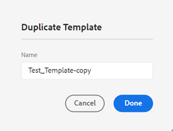

# PDF template

Using a template ensures consistency in content layout and structure. As templates are predefined, you can avoid rework on formatting issues that arise for every new project or updates. Templates enable you to design page layouts, style content, and apply various settings to customize your PDF.

While authors can use the PDF presets to generate output, developers can create their own templates. There are sample templates shipped out of the box, which can be further customized or duplicated by the developers as per their organizational requirements.

## Create a new PDF template {#create-pdf-template}

You can create custom PDF templates with specific page layouts and define formatting for page layout components (like TOC, index, glossary) or DITA components (like heading, paragraph, list) using stylesheets. You can create a new template from scratch or build it using a sample template.  

To create a new PDF template, follow the below steps:
1. In the Web Editor, go to the **Output** tab.
1. Expand the left sidebar and click on **Templates**.

1. In the **Templates** panel, click the **+** icon next to **Templates** and choose **PDF Template**.
1. Specify a name for the template in the **New Template** dialog.
1. Click **Done**. 
   
   The new template is created and added in the *Templates* panel. 

## Duplicate a PDF template
If you want to create a new template with the same page layouts and formatting as that of an existing template, you can create a copy. Once a template has been duplicated, you can further customize its components as needed.

To duplicate an existing PDF template, follow the below steps:
1. In the Web Editor, go to the **Output** tab.
1. Expand the left sidebar and click on **Templates**.
   
   This opens the Templates panel.
1. Hover over the template you want to duplicate and select the (*Options* icon) **...** and choose **Duplicate** from the context menu.

   This opens the Duplicate Template dialog.   
   
1. Specify a name for the teamplte.

   The **Name** field is pre-populated as a copy of the same name as the source template.

1. To specify a preferred name, remove the pre-populated name and specify a name.
1. Click **Done**.
   
   A duplicate template is created and added under Templates.

## Customize a PDF template
You can customize templates by tweaking the template components and applying style formats using stylesheets.

To customize a PDF template, follow the below steps:
1. In the Web Editor, go to the Output tab.
1. Expand the left sidebar and click on Templates.
   
   This opens the Templates panel.
1. To view a template’s components, do one of the following:

   * Click the > icon next to a template or double-click on the template name.
   * Hover over any template and click the ... (Options icon) and choose Edit from the context menu.
   
      By default, this opens the Settings panel in the templates editor.
   
   
   The various template components that you can customize are categorized under the following sections:
   * Page Layouts: A typical PDF contains different pages, such as a front cover or title page, TOC, chapter, index, and more. The Page Layouts section allows you to design the look-and-feel of different pages that would make up your PDF. In addition to the appearance, you can also define the arrangement of page elements such as the header, footer, and content areas on a page. To know more on customizing a page’s layout, see ***Create and customize page layouts***.
   * Stylesheets: The settings in the Stylesheets section allows you to customize the look and feel of the page layout components like the TOC, index, glossary and more. In addition, you can also customize the styles for the DITA content like headings, paragraphs, lists, and more. To know more on using the stylesheets, see ***Use Stylesheets to customize PDF***.
   * Resources: Store asset files that you would need to customize or design PDF templates. Assets such as logos, custom fonts, background images, and more are stored in the Resources. To know more on utilizing resources, see ***Work with resources***.
   * Settings: Configure the output settings for generating a PDF using the template. This section allows you to define template mapping for various pages in a PDF, chapter starting page, print markers, and more. For more information on applying settings, see ***Advanced PDF Settings***.
1. To customize a template component, double-click on a template component or click the > icon before it.
   
   For example, double-click on *Page Layouts* or click the *>* icon before *Page Layouts* to view the available
page layouts.
1. Once you have made the desired changes, click *Save All* (or `Ctrl+S`).

