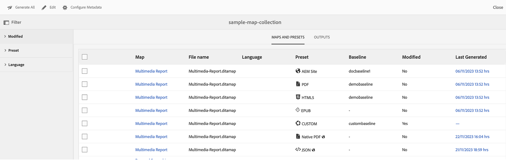

# Use Map Collection for output generation {#id1723F20G0HS}

In any organization, a product can have multiple types of documentation. As a publishing specialist, you would like to control what output you want to generate for which document. Also, there should be a way to batch publish multiple documents with a single click.

AEM Guides provides you the ability to organize your content for publishing by using a dashboard called Map Collection. A Map Collection allows you to assemble all different types of documents in a single unit. You can choose what type of output you want to generate for each document in your Map Collection. In addition, you can also generate output and see the output generation progress from the publishing dashboard.

Map Collection gives you an option to view if there is any change in any map from the last published output. You can view the details in the Maps and Presets tab of your Map Collection and then republish the output if required. For more information, see Adding a map to a map collection.

## Create a map collection and add DITA maps 

To create a Map Collection and add DITA maps to the collection, perform the following steps:

1.  On the Assets UI, click **Map Collections**.

    If the Map Collections link is not available, then select the **Navigation** option in the left rail, and then click **Map Collections**.

    {width="350" align="left"}

1.  Enter a Title for your map collection.
1.  Click **Create**.

    A Success message is displayed on creation of the map collection.

1.  Click **Close** on the Success message.

    The newly created map file is shown on the Map Collections page.

1.  Click the gray box in the tile of the collection that you want to edit.
1.  Click **Edit** and then click **Add Maps**.
1.  Locate and add the DITA maps that you want to add to the Map Collection.

    By default, all the presets and locales associated with the map gets added automatically.

1.  Select the desired output by turning the sliding button on or off.
1.  Click **Done**.

    The DITA map files are added to your Map Collection.

    {width="800" align="left"}

The following filtering options and map details are shown on the collection page:

-   **Filter:** The lest rail shows the following filters:
    -   **Modified**: You can select Yes or No. If you select yes, only the modified DITA maps will be shown in the Maps and Presets table.
    -   **Preset**: Select a preset for which you want to filter out the map files. For example, if you choose *AEM Site* preset, then only those maps are shown that have the *AEM Site* output preset configured on them.
    -   **Language**: You can select any of the available language codes and display only the selected language in the Maps and Presets table.
-   **Maps and Presets** table: The Maps and Presets table presents information in the following columns:
    - **Map**: Shows the title of the DITA map file.
    - **Filename**: Shows the filename of the DITA map.
    - **Language**: Shows the language of the DITA map.
    -  **Preset**: Shows the output preset type configured on the map file.
    - **Baseline**: Shows the baseline which is used by the output preset.  If no baseline is used, then it shows a hyphen '-' 
    - **Modified**: Indicates if the DITA map is updated after last publication. Based on this information, you can decide if you want to republish the output for this DITA map or not.
    - **Last Generated**: Shows the date and time of the last generated output.

## Configure and generate the output using a Map Collection 

To configure and generate the output using a Map Collection, perform the following steps:

1.  Open the Map Collection.You can view the various output presets like the AEM Site, PDF (including Native PDF),  HTML5, EPUB, and Custom presets. You can also view the global and folder profile presets created by your administrator. 

    The  icon indicates a folder profile level preset.  
1.  \(Optional\) Do any of the following based on your requirement:
    -   Apply Filters from the left rail to filter the modified maps, output preset, or language.
    -   If required, click **Edit** and change the desired output by turning the sliding button on or off.

        
 
        >[!NOTE] 
        >  
        > By default, any new preset is disabled. 
        
1.  You can enable the presets for a DITA map  in the following ways:

    - Enable any individual preset. 
    - Enable **All presets** for a DITA map to select all presets in one go. This option is disabled by default.
    - Enable **Folder profile presets** for a DITA map to select all the folder profile presets for it. This option is disabled by default.
   {width="800" align="left"}
        
    

1.  Do one of the following:

    -   To generate output of selected maps, select the map files and click **Generate Selected**.
    -   To generate output of all DITA maps with their configured presets, click **Generate All**.

    >[!IMPORTANT]
    >
    > If an output generation process for a preset or DITA map is either in the queue or in progress, you cannot initiate another output generation task for the same preset or map.

## Configure the metadata properties

In the map collection, you can configure the metadata properties in bulk for the DITA maps. Select **Configure Metadata**  to open the **Asset Metadata** page. On the **Asset Metadata** page, all the maps present in the collection are listed on the left. 

{width="800" align="left"}

Perform the following steps to configure the metadata properties:

1. You can choose the maps you wish to update the metadata for. By default, all the DITA maps present are selected. 

1. Once you select the DITA maps, you can view properties like metadata, schedule (de)activation, references, document state, and more.

1. Update the metadata properties.  

1. Click **Save & Close** on the top to save the updates.
1. (Optional) When you update the tags, you can also select Append in the **Save & Close** dropdown to append the new tags to the existing list.
1. Click **Submit** from the **Save & Close** dropdown.
The metadata properties are updated for the DITA maps you select in bulk from the map collection.

>[!NOTE]
> 
>For the **Document State** dropdown, you can select only those document states that are allowed in common for all the selected DITA maps. To learn more, view [**Document State**](./web-editor-document-states.md).

The metadata properties are in sync with the file properties. Once you update them, you can view them from the **File Properties** panel in the Web Editor. 

## Delete a Map collection or a DITA map from the Map Collection 

-  To delete a map collection, select a collection in the Map Collection page, and click **Delete**.
-  To delete a DITA map from a map collection, open the Map  Collection in Edit mode, select the DITA map file, and click **Remove From Collection**.

This will also remove any presets or locales associated with the DITA map from the Map Collection.

## Cancel an output generation task from a Map Collection 

Similar to the way of canceling an output generation task from the [DITA map console](generate-output-for-a-dita-map.md#id2061H100T5Z) or the [Publish Dashboard](generate-output-publish-dashboard.md#), you can cancel an output generation task from a Map Collection. Access the Outputs tab of a Map Collection, and go to the publish task that you want to cancel, and click the **Cancel This Job** icon to cancel the publish task.

{width="800" align="left"}

**Parent topic:**[Output generation](generate-output.md)
