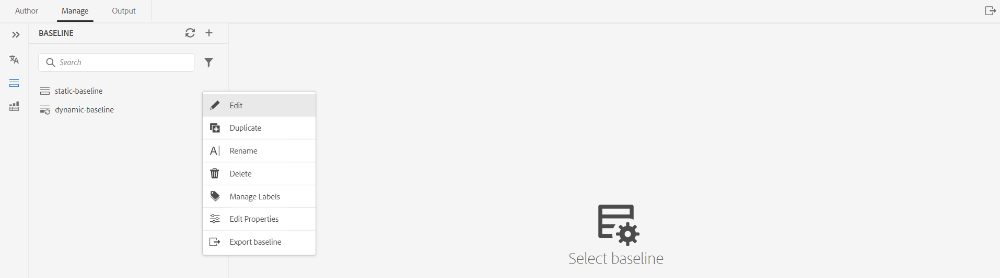

# Create and manage baselines from the Web Editor {#id223MB0ZF043}

>[!TIP]
>
> It is recommended to use this Baseline feature from the Web Editor if you have upgraded to AEM Guides as a Cloud Service March release or later.

AEM Guides provides the Baseline feature integrated inside the Web Editor that allows the users to create baselines and use them to publish or translate topics of different versions.

## Create a Baseline 

You can create a baseline from the Web Editor by performing the following steps:

1.  In the Repository panel, open the DITA map file in Map View.
1.  Click the **Manage** tab. The **Baseline** panel displays the baselines of the DITA map.

    

1.  On the **Baseline** panel, click + icon at the top-right. You can create a baseline with a specific version of the topics and referenced content available on a specific date and time, or with a label defined for a version of topics.
1.  Enter a name for the baseline in **Baseline Name**.
1.  In **Baseline Option**, you can either choose **Use file version** option or **Use labels** option:

    **Use file version**: You can create a static baseline with a specific version of the topics and referenced content available on a specific date and time, or with a label defined for a version of topics:

    -   In **Set the latest version based on,** select one of the following options:

        1.  **Date** <time stamp\>: Picks the topics' version as on the specified date and time.
        1.  **Label**: Select this option to pick the topics according to the label applied to them. If the topics have labels specified for them, the labels are listed in the dropdown. You can choose a label from the list. You can also add a label in the text box.       
       When you select **Label,** you can choose the direct and indirect references.
        -  For direct references within the DITA map, you are given an option to use the latest version of topics that do not have the specified label applied to them.

          >[!NOTE]
          >
          > If you enter a label that does not exist and select the option **Do not create a baseline** then the baseline creation fails and gives an error message near the baseline name in the Baseline panel.
        
        -  For indirect references within the DITA map, you are given an additional option to use the latest version of topics that do not have the specified label applied on them. You can also choose to **Pick Automatically** for the referenced content, and the system automatically picks the version of the referenced content corresponding to the version of the content in which it is referenced.
    
      Once you have selected a label or version as on date, then all referenced topics and media files within the map are selected accordingly. This selection of topics is not shown on the user interface, but it is saved in the backend.

    **Use Labels**: Select this option for baseline creation to pick the topics according to the label applied to them.

    Baselines based on labels are updated dynamically. If you generate a baseline, download a baseline, or create a translation project using a baseline, the files are picked dynamically based on the updated labels. For example, if you have used version 1.2 of a topic with Label Release 1.0 for the baseline and later updated version 1.5 with Label Release 1.0, the baseline will be updated dynamically, and version 1.5 will be used.

    

    -   **Select Labels**: If the topics have labels specified for them, the labels are listed in the **Select Labels** dropdown. You can choose the label\(s\) from the list. The labels selected first are given higher priority over the later ones.
1.  **Indirect References**: For indirect references within the DITA map, you are given the following options:
    
     -  **Pick automatically**: You can choose to **Pick Automatically** for the referenced content, and the system automatically picks the version of the referenced content corresponding to the version of the content in which it is referenced.
      
    -  **Use selected label**: You can create a baseline with the selected label defined for a version of topics.
     -  **Use the latest version or the working copy**: Use the latest version of topics that do not have the specified label applied on them, or if no version has been created, then use the working copy of the topics to create the baseline.
1. Click **Apply**.

The baseline is created. The baseline creation happens asynchronously, so you can continue working on other files in the Web Editor. Once the baseline is created, a pop-up message is displayed confirming that the baseline has been created, and you also receive an Inbox notification for the same.

## Manage baselines 

You can manage your existing baselines using the various features on the Baseline dashboard.

-   You can search for an existing baseline using the text box in the Baseline panel. Use the **Apply Filter** icon to show all baselines or list the baselines with the creation status as Successful, In-Progress, or Failed.
-   Use the **Refresh** icon in the Baseline panel to recheck for all baselines and display a fresh list of baselines for the DITA map that's opened in the Map View.
-   You can view or edit the contents of an existing baseline by double-clicking the baseline from the list in the Baseline panel. The baseline editing window in the center displays the DITA map file, map's contents or topics, and the referenced content.

You can also perform the following operations on the baseline from the Options menu:

-   **Edit**, **Duplicate,** or **Delete** an existing baseline.
-   Add, remove, or make changes to existing labels from the **Manage Labels** option. If your administrator has configured pre-defined labels, then you are shown those labels in the Add Label drop-down list. For more information about adding labels, see [Use labels](web-editor-use-label.md#).

    >[!NOTE]
    >
    > The process to add or remove labels happens asynchronously, so you can continue working on other files in the Web Editor. Once the label is added or removed, a pop-up message is displayed confirming that the label has been added or removed, and you also receive an Inbox notification for the same.

-   **Edit properties** of an existing baseline that you have set while creating the baseline.
-   Export the snapshot of a baseline in a CSV file with the **Export Baseline** option.

**Baseline filters**

Using the Filters icon in the **Baseline Filters** panel you can apply filters on the baseline opened in the baseline editing window:

-   Filter the files based on filenames, or file location.
-   Filter the files based on the values for different columns like File Type, Reference Type and so on.
-   Choose the columns to be displayed in the baseline editing window.

>[!NOTE]
>
> You can click a column heading and sort the files based on the columns in the baseline editing window.

**Save or Reset a Baseline**

Once you have edited the baseline, you can click the **Save** button on the top to save the changes to the baseline. You can click the **Reset** button if you don't want to save the change and reset the baseline. When you click the **Reset** button a warning is displayed that your unsaved changes would be lost.

**Parent topic:**[Work with the Web Editor](web-editor.md)

