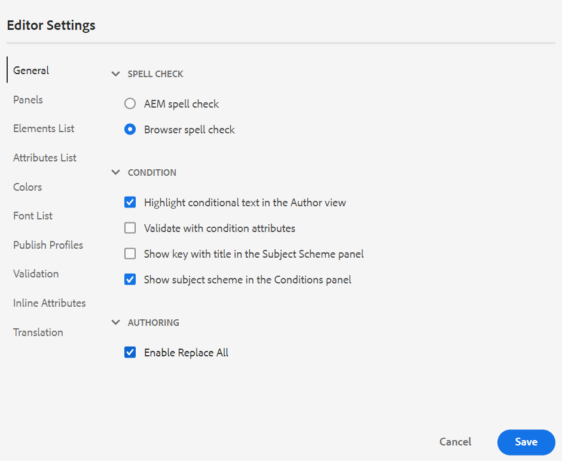
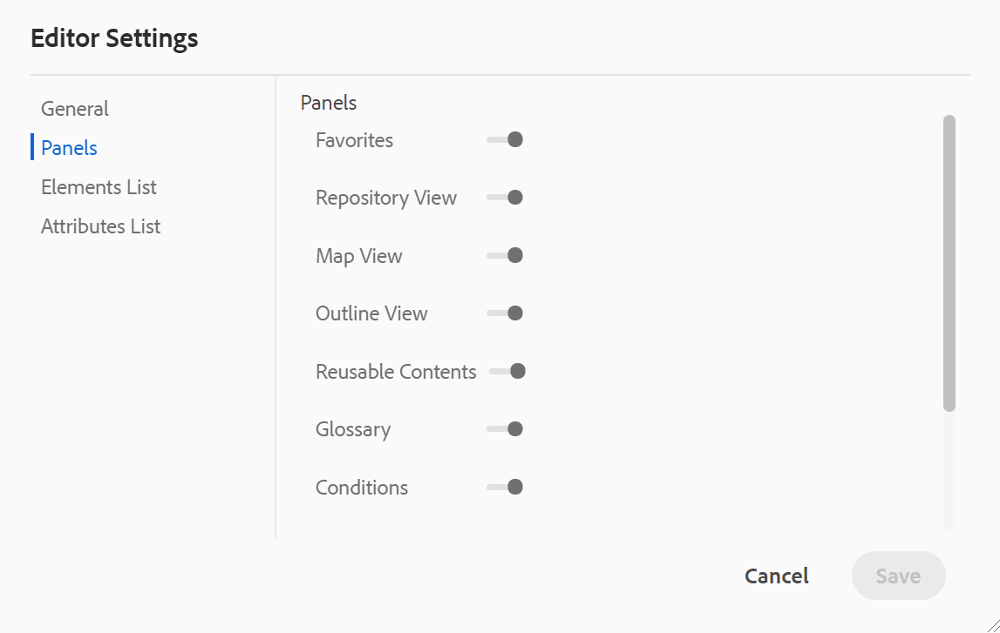
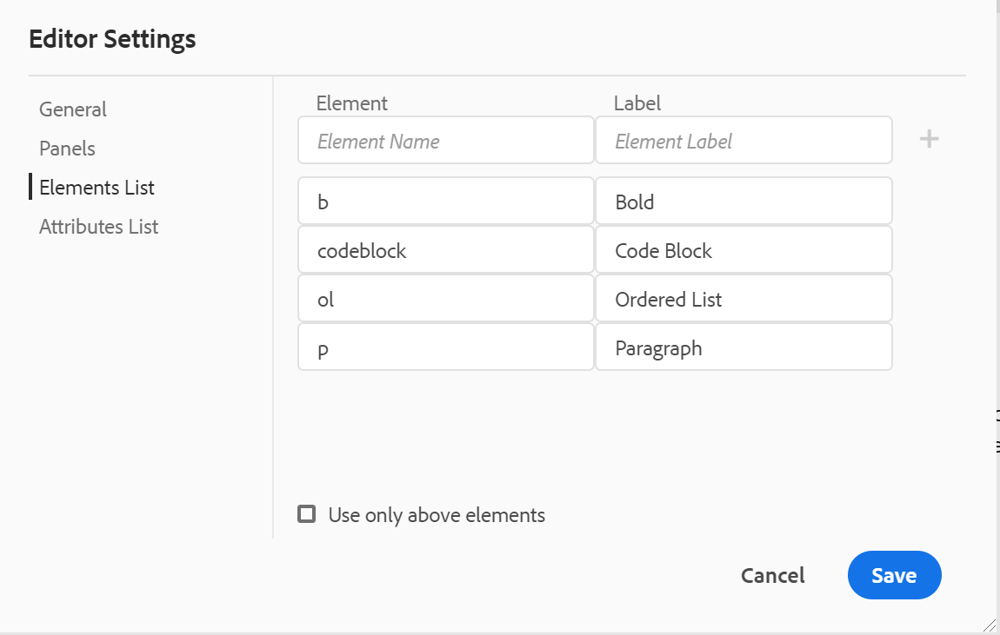
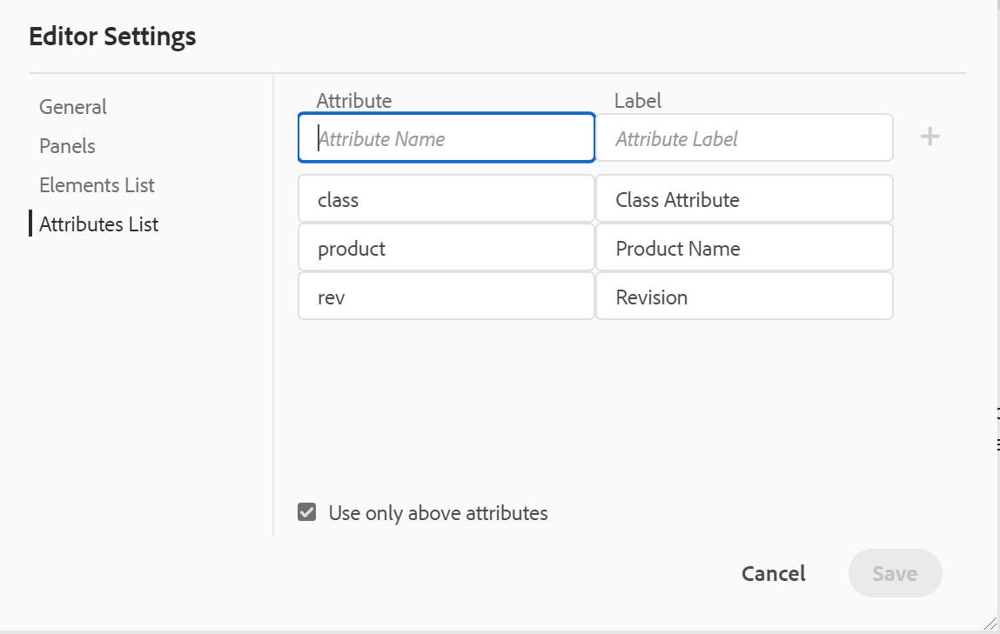
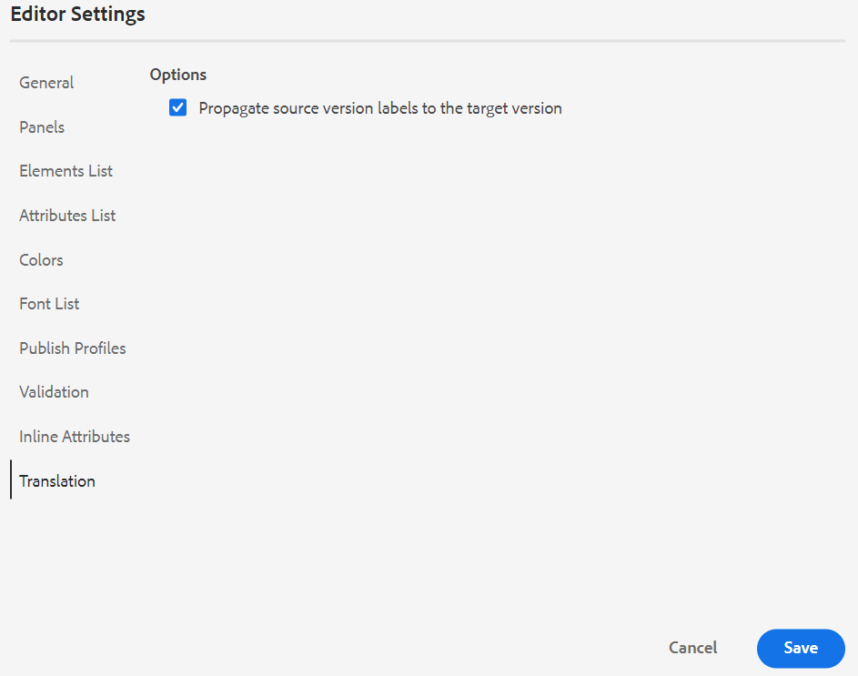
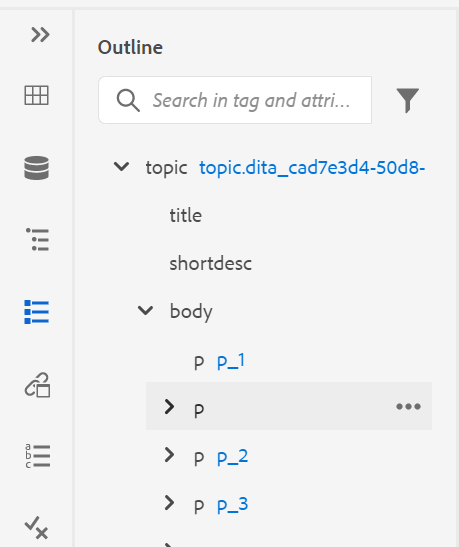
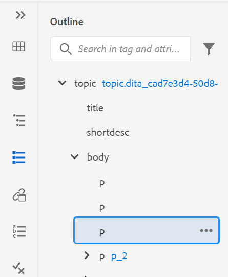
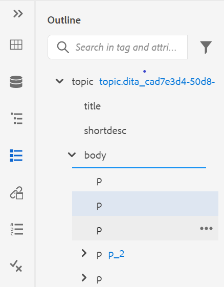
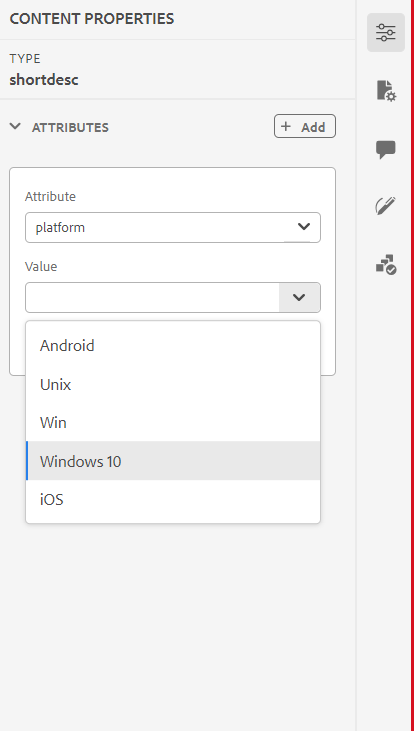
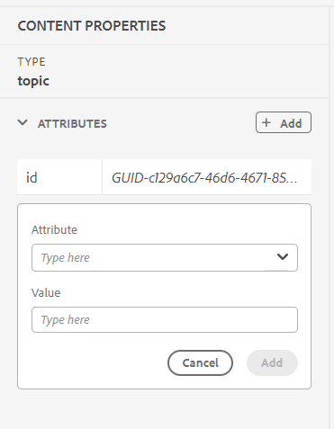

# Know the Web Editor features {#id176NC500V5Z}

This section walks you through the various features that are available in the Web Editor. We can divide the Web Editor into the following sections or areas:

-   [Main toolbar](#id2051EA0G05Z)
-   [Secondary toolbar](#id2051EA0J0Y4)
-   [Left panel](#id2051EA0M0HS)
-   [Content editing area](#id2051EB000UI)
-   [Right panel](#id2051EB003YK)

The following subsection cover in details the various sections of the Web Editor.

## Main toolbar {#id2051EA0G05Z}

The main toolbar is at the top of the Web Editor's interface and it provides file-level features and various authoring modes available in the Web Editor. Features available in the top toolbar are explained as follows:

**Save All** - 

Saves the changes you have made in all opened topics. If you have multiple topics opened in the Web Editor, clicking **Save All** or using the **Crtl**+**S** shortcut keys saves all documents in one click. You do not have to individually save each document.

>[!NOTE]
>
> The Save operation does not create a new version of your topics. To create a new version, choose Save As New Version.

**Save As New Version** - 

Saves the changes you have made in your topic and also creates a new version of your topic. If you are working on a newly created topic, the version information is shown as **none**.

{width="800" align="left"}

The version number changes with every new version that is created for the topic or map file.

When you choose to save a topic or map using **Save As New Version**, the following dialog appears:

{width="300" align="left"}

Enter comments and version labels to identify the changes and click **Save** to create a new version of your file.

When you choose the *Save As New Version*, the first version of the topic is created in DAM, which also becomes the currently active version of your topic. Later, if you revert to an older version of the topic, then that becomes your current active version of the topic.

If your administrator has pre-configured version labels, then you will see those labels in a drop-down list. You can choose a label from the list of available labels and save your document.

{width="300" align="left"}

At the time of saving a topic, you can add a comment specifying the changes that you have made in the topic. This comment is shown in the topic's Version History.

If your topic is under review, your reviewers will get a notification saying that a newer version of the topic is available. They can easily access the latest revision of your document and continue reviewing the latest version of your topic.

When you hover your pointer over a topic's title, you are shown the file path and the version number.

{width="800" align="left"}

>[!NOTE]
>
> Once a version of your topic is available, you can also add labels to your topic. These labels can then be used to create a baseline for publishing a specific version of your document. For more information about using labels in your topics, see [Use labels](web-editor-use-label.md#).

**Undo and Redo** -  / 

Undo or Redo the last action.

**Delete Element** - 

Deletes the currently selected element or the element where the cursor is placed.

**Find and Replace** - 

The Find and Replace feature is available in Author and Source view modes. The Find and Replace text bar appears at the bottom of the topic editing area. You can use the shortcut keys **CTRL**+**F** to invoke the Find and Replace bar.

{width="800" align="left"}

Using the settings icon \(\), you can toggle the **Ignore Case** and **Whole Word Only** search options. To perform the case-insensitive search, turn on \(or select\) the **Ignore Case** option. Else, if you want to perform the case-sensitive search, turn off \(or deselect\) the **Ignore Case** option. You can also choose to search a whole word.

The search is instantaneous, which means that as you type the search phrase or word in the **Find** field, the term is immediately searched and selected in the topic. Similarly, for replacing a text in your topic, enter the search term and its replacement in the respective fields and click the **Replace** or **Replace All** button.

In the Source view, the Find and Replace is extremely useful for searching for a specific element or attribute. For example, if you want to replace the value of the `@product` attribute, it can be easily done from the Source view. The Author view does not allow you to search on the basis of an attribute or element. However, you must use caution while using the **Replace All** feature, as it might overwrite the XML code.

**Editor Settings** - 

The Editor Settings are only available to administrative users. Using the preferences, an administrator can configure the following settings:

>[!NOTE]
>
> If you are updating any default settings, you should reopen documents for the changes to come into effect.

-   **General**: The General settings allow you to configure the dictionary to use with the Web Editor. This tab contains three sections: **Spell Check**, **Condition**, and **Authoring**.

    {width="650" align="left"}

    -   **Spell Check**: There are two options — **AEM Spell Check** and **Browser Spell Check**. By default, the editor uses the Browser Spell Check feature, wherein the spell-check is performed using the browser's in-build dictionary. You can switch to AEM Spell Check to use AEM's dictionary, which can also be customized to add your custom word list. For more information about customizing AEM dictionary, see *Customize AEM's default dictionary* section in the Install and configure Adobe Experience Manager Guides as a Cloud Service.
        

    -  **Condition**

        -   **Highlight Conditional Text in the Author View**: Select this to highlight the conditional text in the author view. The conditional content is highlighted using the color defined for the condition.

        -   **Validate with Condition Attributes**: Select this to allow the validation of the values defined for the attributes. This prevents you from adding any incorrect value.

        -  **Show the Key with the Title in the Subject Scheme Panel**: Select this to show the keys along with titles in the subject scheme. If you do not select this option only the titles are shown. For example, here the keys 'os', 'audience', and 'other' are also shown along with titles.

             {width="550" align="left"}

        -  **Show Subject Scheme in the Conditions Panel**: Select this to see a subject scheme in the conditions panel. If you deselect this, the defined conditions are shown in the conditions panel.

    -  **Authoring**

        -   **Enable Replace All**: Select this to see Replace All icon in the Find and Replace panel.
        

    -  **Citations**
       Change the style of citations. Choose the citation style from the drop-down you want to use in your project. For more details see [Change citation styles](./web-editor-apply-citations.md#change-citation-style).


**Panels**: This setting controls the panels that are shown in the left panel of the editor. You can toggle the switch to show or hide the desired panel.

{width="650" align="left"}

>[!NOTE]
>
> If a custom panel has been configured, then it also appears in the list of panels. You can toggle the switch to show or hide the custom panel. For more details on the configuration, see the *Configure a custom panel in the left panel* section in the Install and configure Adobe Experience Manager Guides as a Cloud Service.

-   **Elements List**: As an administrator, you can control the list of elements that an author can insert using the [Insert Element](#id204SG30105Z) pop-up, and also define the display name for the element. The Elements List setting allows you to specify the element's name as per DITA specifications and a label that you want to use instead of the DITA defined element name:

    {width="650" align="left"}

In the above screenshot, the `b` element has been given a label of Bold, `codeblock` is given a label of Code Block along with some other elements. If you select the **Use Only Above Elements** option, then only the valid elements \(at current insertion point\) from this list will be shown in the Insert Element pop-up.

In the following screenshot, only 3 out of 4 configured elements from the previous screenshot are shown at the current context:

{width="300" align="left"}

-   **Attributes List**: Similar to the Elements List, you can control the list of attributes and their display names to be displayed in the attributes list of an element. In the following screenshot, only 3 attributes have been configured to be shown in an element's attribute list:

    {width="650" align="left"}

    With this setting, when you try to add an attribute to an element, you only see the list of attributes configured in the list.

    {width="300" align="left"}

- **Publish Profile**: This contains the Publish Profiles that can be used to publish the knowledge base output. You can create a new profile for a selected consumer type. For example, Salesforce.

    - **Requirements to create a Salesforce Publish Profile**
        
        - Create a connected app for Salesforce. For more details see [Enable OAuth Settings for API Integration](https://help.salesforce.com/s/articleView?id=sf.connected_app_create_api_integration.htm&type=5).
        
        - While configuring the connected app ensure the following:

            - Specify the callback. 
            
              `URL: http://: <server name>:<port>/bin/dxml/thirdparty/callback/salesforce`

            - Select the following OAuth Scopes:
                - Full access (full)
                - Select Manage user data via APIs (api)

    Once the app is configured, Salesforce provides a **Consumer Key** and **Consumer Secret**.

    These can be used to create the Salesforce Publish Profile. 
{width="300" align="left"}

    

- To create a Publish Profile you can select a knowledge base like Salesforce from the **Server Type** dropdown. Enter a profile Name. In the **Site URL** enter the consumer site that you would use for publishing the output and then add the **Consumer Key** and **Consumer Secret** provided by the consumer site like Salesforce. Then login to the newly created Profile.

    >[!NOTE]
    >
    >To configure a proxy for Salesforce in Experience Manager Guides, use Apache HTTP Components Proxy Configuration in AEM. Learn how to [configure proxy for the AEM Link Checker](https://helpx.adobe.com/experience-manager/kb/How-to-configure-proxy-for-the-AEM-Link-Checker-AEM.html).


    After you login, you can select the Publish Profile in the output presets of a DITA Map and use to generate the output for selected articles. For more details, see [Article-based publishing from the Web Editor](../install-guide/configure-article-based-publishing.md) in the Installation and Configuration Guide.

- **Validation**: This tab contains options to configure the Schematron Validations in the Web editor. You can enable the following features:

    - **Run validation check before saving the file**: Select this to run Schematron validations using the selected Schematron file(s) before any save operation. You can add a Schematron file by clicking the + icon. The selected Schematron file(s) are listed.

        >[!NOTE]
        >The selected Schematron file(s) will persist for the selected folder profile.

        {width="300" align="left"}
        This prevents the users from saving any file which breaks a rule defined in the selected Schematron file(s). If this is not selected the file will not be validated before saving the changes.

    - **Allow all users to add schematron files in validation panel**: Select this to allow the users to add any Schematron file in the Validation panel of the Web Editor. This allows the users to add Schematron files and then validate the topics against the Schematron file. If this is not selected the **Add Schematron File** button is not available to the users in the **Validation panel** of the Web Editor.


-   **Display Attributes**: Like the Attributes List, you can control the list of  attributes to be displayed in the attributes list of an element. By default, four **Display Attributes** — audience, platform, product, and props have been configured to be shown in an element's attribute list. You can also add a display attribute using the **Add** icon on the top. You can also delete any of the display attributes using the **Delete** icon.

    The attributes defined for an element are displayed in the Layout and the Outline view.

    {width="550" align="left"}

-   **Translation**: This tab contains the option to propagate the source labels to the target version.

    -  **Propagate source version labels to the target version**: Select this option to pass the label of the source file version to the translated file. By default, this is disabled.

    {width="550" align="left"}


**User Preferences** - 

The User Preferences are available to all authors. Using the preferences, an author can configure the following settings:

{width="550" align="left"}

- **Use device theme**: Select this checkbox to allow AEM Guides automatically switch between light and dark themes based on the theme of your device. 

- **View files by**: Select the default way to view the files in the Web Editor. You can view the list of files by the titles or the filenames from the various panels in the **Author** view. 
    >[!NOTE]
    >
    > By default, the files are displayed by title in the Web Editor.

-   **Theme**: You can choose from the Light, Lightest, Dark, or Darkest themes for the editor. In case of Lightest theme, the toolbars and panels use more lighter gray color background. In case of Light theme, the toolbars and panels use light gray color background. In case of Darkest theme, the toolbars and panels use more darker black color background. In case of Dark theme, the toolbars and panels use black color background. In all themes, the content editing area is shown in white color background.

-   **Folder Profiles**: The Folder Profile controls various configurations related to conditional attributes, authoring templates, output presets and the Web Editor configurations. The Global Profile is shown by default. In addition, if your administrator has configured folder profiles in the system, then those folder profiles are also shown in the Folder Profiles list.

    The Web Editor's configurations that an administrator can define in the folder profile include: customizing user interface including the toolbar icons, Web Editor's layout, snippets, and root map. For more details, see *Configure global or folder-level profiles* in the Install and configure Adobe Experience Manager Guides as a Cloud Service.

    >[!NOTE]
    >
    > The name of the current Folder Profile is displayed as a label for the User Preferences icon in the main toolbar.

-   **Base Path**: By default, when you access the AEM repository from the Web Editor, you are shown assets from the /content/dam location. Your working folder would most likely be a few folders inside the /content/dam/ folder. It would take you a few clicks to reach the working folder every time. You can set the Base Path to your working folder and the Repository View then shows you the content from that location upfront. This reduces the time to access your working folder. Also, when you insert any reference or media file in your topic, the file browse location starts with the folder set in the Base Path.

-   **Select Root Map**: Select a DITA map file to resolve key references or glossary entries. The selected root map takes the highest precedence to resolve key references. For more details, see [Resolve key references](map-editor-other-features.md#id176GD01H05Z).


>[!NOTE]
>
> If you do not want to use any root map, then ensure that the **Select Root Map** field is blank.

**Author, Source, and Preview modes**

For details about the various authoring and document viewing modes, see [Web Editor views](web-editor-views.md#).

## Secondary toolbar {#id2051EA0J0Y4}

The secondary toolbar appears when you open a topic for editing in the Web Editor. Features available in the secondary toolbar are explained as follows:

**Insert Element** - 

Inserts a valid element at the current or next valid location. If you are working inside a block element like a `note`, then use the Insert Element icon to insert a new element after the `note` element. In the following screenshot a note element has been inserted inside the p \(paragraph\) element:

{width="800" align="left"}

If you press Enter in the note element, a new paragraph is created within the note element itself. To insert a new element outside note, click the p element \(highlighted in screenshot\) in the elements breadcrumb and click on the Insert Element icon or press ***Alt***+***Enter*** to open the Insert Element pop-up. Then, select the desired element and press Enter to insert the selected element after the note element.

You can also add an element between two elements when a blinking block cursor appears.

{width="300" align="left"}

For example, if you are working on a DITA topic, and the block cursor is blinking between the short description and the body, you can add `prolog` element and then add copyright, author, and other details.

Another way of entering new element is by using the context menu. Right-click at any place in your document to invoke the context menu. From this menu choose Insert Element to display the Insert Element dialog and choose the element that you want to insert.

{width="300" align="left"}

**Insert Paragraph** - 

Insert paragraph element at the current or next valid location.

**Insert/Remove Numbered List** - 

Creates a numbered list at the current or next valid location. If you are on a numbered list and click this icon, the item is converted into a normal paragraph.

**Insert/Remove Bulleted List** - 

Creates a bulleted list at the current or next valid location. If you are on a bulleted list and click this icon, the item is converted into a normal paragraph.

**Insert Table** - 

Inserts a table at the current or next valid location. Click the Insert Table icon to open the insert Table dialog:

{width="550" align="left"}

You can specify the number of rows and columns required in the table. If you want to keep the first row as table header, select the Set First Row As Header option. To add a title to your table, enter it in the Title field.

Once a table is inserted, you can modify table using the context menu.

{width="550" align="left"}

Using the table's context menu, you can:

-   Insert cells, rows, or columns

-   Merge cells in right and down directions

-   Split cells horizontally or vertically

-   Delete cells, rows, or columns

-   Create a snippet from the table

-   Generate IDs


You can also define attributes on multiple cells, entire row, or column of a table. For example, to align table cell, drag and select the required cell. In the Content Properties panel (on the right), the property **Type** changes to **Multiple Entry**.

1. In the **Attributes** section, click **+Add**. 
1. Select the `@valign` attribute from the **Attribute** dropdown list. 
1. From the value dropdown list, select the desired text alignment you want to apply on the selected table cells. 
1. Click **Add.**

{width="800" align="left"}

**Insert Image** - 

Inserts an image at the current or next valid location. Click the Insert Image icon to open the Insert Image dialog and then search and select the image you want to insert.

>[!NOTE]
>
> You can also add an image by dragging and dropping it from your local system on to your article. In this case, the image file is added using the **Upload Assets** workflow.  For more details, see the **Upload Assets** workflow in the [Left Panel](web-editor-features.md#id2051EA0M0HS) section. 


{width="650" align="left"}

You can add image/Figure Title and Alternate Text for the image in the Insert Image dialog.

You can search for the required image file by entering the file name in the Type to Search bar at the top and also filter the search results by Path \(to search in\), Collections, File Type, and Tags. Once you have found the required image file, select the file and click Select to insert the image in your document. You can insert various formats of image files, such as `.png`, `.svg`, `.gif`, `.jpg`, `.eps`, `.ai`, `.psd`, and more.

Once you have inserted an image, you can change the height, width, placement, and attributes from the Content Properties panel. Click on an image file and then make changes in the Content Properties panel in the right rail.

{width="800" align="left"}

The Source field displays the UUID of the inserted image file. You can find the complete path of the inserted image file by hovering the mouse pointer over the Source field. The path is displayed in the tooltip.

You can resize an image by providing either Height or Width value for the image file. The aspect ratio of the image is maintained automatically. If you want, you can also choose not to maintain the aspect ratio of the image file by clicking the lock icon \(of Maintain Aspect Ratio\) and providing Height and Width values.

You can also specify the Placement setting for the image as Inline or Break. In case you choose to use the Break placement option, you can then choose where to align the image (Left, Center, or Right).

You can also add other properties for an image file by selecting the required properties in the **Attributes** field.

>[!NOTE]
>
>You can also define clickable areas \(image map\) in your image. For more details, see the **Insert/Edit Image Map** feature description in the [Left Panel](web-editor-features.md#id2051EA0M0HS) section. 

**Context menu for image or media files**

You can also perform some common operations for images and media files using the context menu. Right-click at any place on your image to invoke the context menu.

The context menu provides options to cut, copy, or paste the image or media. You can insert an element before or after the selected element. You also have the option to rename or unwrap an element. You can locate the selected image or media in the repository or view the preview of the file in Assets UI.

The other options in the context menu allow you to copy path, edit an image map, create a snippet, or generate IDs for the selected element.

**Insert Multimedia** - 

Inserts different types of multimedia files. Click the Insert Multimedia icon and choose the type of file you want to insert. The supported multimedia formats are:

-   Audio File
-   Video File
-   YouTube
-   Vimeo

On selecting the Audio or Video file option, you are shown the repository view to browse and select the desired file. If you choose YouTube or Vimeo, then you get the Insert Multimedia dialog. Paste the link of the video file in the Web Link field and click Insert to add the video at the current or next valid location in your document.

>[!NOTE]
>
> While adding a YouTube video link, you need to replace the string `watch?v=` with `embed` in the URL. For example, to add a YouTube video link: `https://www.youtube.com/**watch?v**=WlIKQOrmZcs`, you need to add it as: `https://www.youtube.com/**embed/**WlIKQOrmZcs`. This change ensures that the video gets embedded in the AEM Site and PDF output.

You can also add the Audio or Video File from the Insert Multimedia dialog. Select the Audio/Video File option and click the browse icon to launch the repository view. Select the audio or video file from the repository and click Select to add the link of the file in the Audio/Video File field. In case you choose a video file, then a preview of the file is also shown in the Preview area. You can play the video file to see its preview.

{width="650" align="left"}

**Insert Cross Reference** - 

Insert references of type — Content Reference, Content Key Reference, Key Reference, File Reference, Web Link, or Email Link.

Click the **Select File** icon \(for Content Reference and File Reference\) or **Select Map** icon \(for Content Key Reference and Key Reference\) and select the desired file or content to link to.

{width="650" align="left"}

A link of the selected reference is added in the document. The context menu on the link gives you the options to:

-   **Insert Element**: Shows a list of valid elements that you can insert at the given context.
-   **Copy UUID**: Copies the UUID of the inserted reference.
-   **Copy Path**: Copies the complete path of the inserted reference.
-   **Create Snippet**: Creates a reusable snippet from the inserted reference.
-   **Generate IDs**: Generates unique ID for the inserted reference.

You can also search using the UUID of the file that you want to reference. For Content and Key Reference links, enter the UUID of the file that you want to link to, and the file is automatically searched and displayed in the Preview section. When you specify the UUID of the file, you need not explicitly mention the file extension for .xml files. The .xml extension is auto-appended to the UUID.

{width="650" align="left"}

If your administrator has enabled the UUIDs option in *XMLEditorConfig*, then you will see the UUID of the referenced content in the **Link** property.

{width="800" align="left"}

>[!NOTE]
>
> If the **Enable UUIDs** option is not enabled, then the relative path of the referenced content is shown.

>[!IMPORTANT]
>
> Even though the relative path of the referenced content is shown in the **Link** property, internally the link is created using the UUID of the referenced content.

>[!TIP]
>
> See the References section in the Best practices guide for best practices around referencing content.

**Filter Search**

You can search for some text in the files present on the selected path of the AEM repository. For example, 'general' is searched in the below given screenshot. You can also narrow down your search using enhanced filters. You can look for all DITA Files like DITA Topics and DITA Maps present on the selected path.

You can search for Non-DITA Files like the Image Files, Multimedia, and documents in the selected path. You can also search for specific values in the attributes of DITA elements. You can also look for files which are checked out by the specified user.

{width="650" align="left"}

>[!NOTE]
>
> Your system administrator can also configure the text filters and show or hide other filters. For more details see Configure text filters section in the Install and configure Adobe Experience Manager Guides as a Cloud Service.

The list of filtered files which contain the searched text is displayed. For example, in the above screenshot the files containing the text 'general' are listed. You can also preview the content of the file.

**Insert Reusable Content** - 

Reuse content that exists within any other document in your project. You can insert content by directly linking to the content in a file or by using a key reference, see [Resolve key references](map-editor-other-features.md#id176GD01H05Z). When you click the Insert Reusable Content icon, you get the Reuse Content dialog:

{width="650" align="left"}

In the Reuse Content dialog, select DITA file for file references or the DITA map file that contains the key references. Once selected, the topic or key references are shown in the dialog. You can select the ID/key of the topic that you want to insert and click Done to insert the content within your topic.

For inserting Content Reference, you can also enter the UUID of the file and the reusable content from that file is listed in the Preview section.

Based on the setting for inserting links, you could either see the UUID of the inserted content or the relative path in the Properties panel or the Source code view. The link is always created using the UUID of the referenced content. See Configure UUID-based links in the Install and configure Adobe Experience Manager Guides as a Cloud Service.

>[!NOTE]
>
> To add content before or after the referred content, use *Alt*+*Left* Arrow or Alt+*Right* Arrow keys to move the cursor to the desired location.

You can also embed the referred content within the topic by right-clicking on the referred content and choosing **Replace Reference With Content** from the context menu.

**Insert Special Characters** -  

Inserts special characters in your topic. Click the Insert Special Character icon to open the Insert Special Character dialog.

>[!NOTE]
>
> AEM Guides provides movable and resizable dialog boxes. Dialogs that have two cross lines at the bottom-right corner can be resized. The cross lines in the Special Character dialog are shown below.

{width="550" align="left"}

In the Insert Special Character dialog, you can search for a special character using its name. All special characters are stored under various categories. Use the Select Category drop-down list and select a category. The special characters available within the selected category are displayed. You can navigate the list of special character using the arrow keys or click on the desired character that you want to insert. The Name and Hex Code of the selected special character are displayed below the list. Click Insert to insert the selected character in your document.

**Insert Keyword** - 

Insert keyword defined in your DITA map. Click the Insert Keyword icon to open the Key Reference dialog.

{width="550" align="left"}

The keywords are listed in alphabetical order and you can also search keyword\(s\) by typing a search string in the Search box. The search result will return the keywords containing the string in ID or Value. The keywords defined in your DITA map are listed in this dialog. Choose the keyword that you want to insert and click **Insert**.

You can also change the attributes of the inserted keyword by right-clicking on the keyword and selecting the Attributes option. The Attributes for Keyword dialog opens:

{width="550" align="left"}

You can change the keyword's attributes or add a new attribute to the keyword.

**Insert Snippet** - 

Insert a snippet at the current or next valid location. For this feature to work, you must have snippets defined in your system. For more information about adding a snippet, see the **Snippet** feature description in the [Left Panel](web-editor-features.md#id2051EA0M0HS) section. 

When you click the Insert Snippet icon, you are shown the Insert Snippet catalog. The catalog is context-sensitive, which indicates that it will show the snippets only if they are allowed at the current location.

The following example shows two pre-configured snippets - Warning and Error that can be inserted at the current location in the document.

{width="300" align="left"}

When you choose a snippet from the list, it gets inserted at the current or next valid location in the document. The following screenshot shows the Error snippet inserted in the document:

{width="400" align="left"}

**Insert/Edit Image Map** - 

Inserts an image map on the selected image. An image with clickable areas that link to topics or web pages is called an image map.

Select an image in the current topic and click the Insert/Edit Image Map icon to open the insert Image Map dialog.

{width="650" align="left"}

Choose the preferred shape Rectangle , Circle , or Polygon  to define an area over an image that you want to use as a link. After defining an area, the Reference dialog appears wherein you need to specify the link to internal or external content:

{width="650" align="left"}

If areas overlap, you can bring the shape forward or send it backward by clicking on the respective icon in the toolbar. You can also remove an area by selecting it and clicking the Delete icon. Double-clicking on an area opens the Reference dialog wherein you can change the destination link. Once you have marked the required areas on your image, save the changes by clicking Done.

**Check out/Check in** - / 

Checks out or checks in the current file. Checking out a file gives the user exclusive write access to the file. When the file is checked-in, the changes are saved in the current version of the file.

If you are in the Map View and you expand the parent map, you can check out all files in the map with a single click. Simply expand the parent map file and select the parent file, which results in selecting all files within the map. Then you can select **Check out**   to get the lock on all files within the map.

>[!NOTE]
>
> When you check in a file that has any unsaved changes, it prompts you to save the changes. If you don't save your changes, then it only checks in the file.
 
The tooltip for Check in/Check out is determined by the title property in the `ui_config.json` file.

For more details, view [Configure the title for Check in and Check out icons](../install-guide/conf-checkin-checkout-title.md) in the On-premise Installation and configuration Guide.


**Toggle Tags View** - 

Tags are visual cues indicating an element's boundaries. An element boundary marks the beginning and end of an element. You can then use these boundaries as a visual cue to place the insertion point or select the text within a boundary. If you want to insert another element before or after an element in the document, you can place the insertion point before or after the opening or closing boundary of the element.

The following screenshot shows a document with Tags View on:

{width="650" align="left"}

The following operations can be performed in a document with Tags View on:

-   **Select an element**: Click on the opening or closing tag of an element to select its content.

-   **Expand or collapse tags**: Click on the + or - sign in a tag to expand or collapse it.

-   **Use the context menu**: The context menu provides options to cut, copy, or paste the selected element. You can also insert an element before or after the selected element. The other options allow you to Generate ID or open the Properties panel for the selected element.

-   **Drag-and-drop elements**: Select an element's tag and easily drag-and-drop it on your document. If the drop location is a valid location where the element is allowed, the element is placed at the dropped location.


>[!NOTE]
>
> If a user enables the Tags View from the Web Editor, it remains enabled even across the sessions. This means that you don't have to enable the Tags View again to access it later.The default value for Tags View for a new user's session is determined by the tagsView property in the ui\_config.json file. For more details, see the *Configure default value for Tags View* section in Install and configure Adobe Experience Manager Guides as a Cloud Service.

**Enable/Disable Track Changes** 

You can keep a track of all updates made on a document by enabling the Track Changes mode. After enabling the track changes, all insertions and deletions are captured in the document. All deleted content is highlighted using Strikethrough and all insertions are highlighted in green color text. In addition, you also get the change bars at the edge of the topic page. Again, a red bar is shown for deleted content and green bar is shown for added content. In case there is addition and deletion on the same line, then both green and red bars are shown.

The following screenshot highlights the deleted and inserted content along with the change bars:

{width="650" align="left"}

A typical use case for tracking changes in a document can be for doing peer review. You can enable track changes and share your document for review, the reviewer then makes changes with track changes ON. When you receive the document, you should then have a mechanism to view the suggested updates along with a convenient way to accept or reject changes.

AEM Guides provides the Tracked Changes feature that contains information about the updates made in the document. The Tracked Changes feature provides information about what updates were made, who made them, and at what time. Using the Tracked Changes feature, you can also easily accept or reject the suggested updates in the document.

To access the feature, click the Tracked Changes icon in the right panel.

{width="300" align="left"}

Clicking on a change selects the changed content in the document. You can accept a change by selecting the Accept Change icon or reject it by selecting the Reject Change.

If you want to accept or reject all changes with a single click, select **Accept All** or **Reject All**.

>[!NOTE]
>
> The Preview mode allows you to view the document with or without the changed content's markups. For more details, see the [Preview](web-editor-views.md#preview-mode-id19AAGL00163) mode.

**Merge** - 

When you work in a multi-author environment, it becomes difficult to track what changes the other authors have made in a topic or map. The Merge feature gives you more control over not only viewing the changes, but also what changes are retained in the latest version of the document.

**Merge topic files**

To merge changes in a topic, perform the following steps:

1.  Open a topic in the Web Editor.

1.  Click **Merge**.

    The Merge dialog appears.

    {width="550" align="left"}

1.  *\(Optional\)* You can also browse and select a new file from some other location in your repository.

1.  Select a version of the file with which you want to compare the current version of the file.

1.  From the Options, choose:

    -   **Track Changes From Selected Version**: This option shows all content updates in the form of track changes. You can then choose to accept or reject changes in the document one at a time or all in one go.

    -   **Revert to Selected Version**: This option reverts the current version of the document to the selected version. This option does not give you any control on what content is accepted or rejected.

1.  Click **Done**.

1.  If you selected the **Track Changed From Selected Version** option, then all changes from the selected version are shown in the Tracked Changes feature of the right panel.

    You can choose to accept or reject all comments from the Tracked Changes panel or accept or reject individual comment.


**Merge map files**

To merge changes in a map file, perform the following steps:

1.  Open a map in the Web Editor.

1.  Click **Merge**.

    The Merge dialog appears.

    {width="550" align="left"}

1.  *\(Optional\)* You can also browse and select a new file from some other location in your repository.

1.  Select a version of the file with which you want to compare the current version of the file.

1.  From the Options, choose:

    -   **Track Changes From Selected Version**: This option shows all content updates in the form of track changes. You can then choose to accept or reject changes in the document one at a time or all in one go.

    -   **Revert to Selected Version**: This option reverts the current version of the document to the selected version. This option does not give you any control on what content is accepted or rejected.

1.  Click **Done**.

    1.  If you selected the **Track Changed From Selected Version** option, then all changes from the selected version are shown in the Tracked Changespanel \(on the right\).

        You can choose to accept or reject all changes from the Tracked Changes panel or accept or reject individual change in the map file.


**Version History** - 

AEM Guides provides various ways to view the versions created for your topic files and also ways to revert to a specific version. However, most of these features are available outside the Web Editor.

The Version History feature in the Web Editor allows you to not only check the available versions and labels on your active topic, but also gives you the flexibility to revert to any version from the editor itself.

To access the version history and revert to a specific version of your topic, perform the following steps:

1.  Open a topic in the Web Editor.

1.  Click **Version History**.

    The Version History dialog appears.

    {width="550" align="left"}

1.  Choose a version of the topic that you want to revert to in the **Select Version** drop-down list.

    >[!NOTE]
    >
    > If a version has labels applied to it, they are also shown \(in brackets\) along with the version number.

    Once you choose a version from the drop-down list, the Revert to Selected Version option is made available. The preview window displays the differences between the current version and the selected version of the topic.

    {width="550" align="left"}

1.  Click **Revert to Selected Version** to revert your working copy with the selected version of the topic.

    The Revert Version dialog appears.

    {width="550" align="left"}

1.  \(*Optional*\) Provide a reason of reverting to an earlier version. You can also create a new version of the currently active working copy of your topic.

1.  Click **Confirm.**

    Your working copy of the file is reverted to the selected version. If you chose to create a new version of the currently active working copy, then a new version of the file is also created with all working changes.


When you revert to an earlier version, a visual cue is shown indicating that version you are currently working on is not the latest version.

{width="800" align="left"}

**Version Label Management** -  

Labels help you identify the stage in which a particular topic is in the DDLC \(Document Development Life Cycle\). For example, when you are working on a topic, you could set the label as "Approved". Once a topic is published and made available to customers, you can assign "Released" label to that topic.

AEM Guides allows you to specify labels in a free-form text format or use a set of predefined labels. The custom label would allow any author in the system to specify a label as per their choice. This gives flexibility; however, it introduces inconsistent labels in the system. To overcome this issue, administrators can configure a set of predefined labels. For more information about configuring predefined labels, see *Configure and customize the XML Web Editor* in the Install and configure Adobe Experience Manager Guides as a Cloud Service.

These labels are shown in the form of a drop-down list to authors wherever they need to specify a label. This ensures that only predefined, consistent labels are used in the system.

There are different methods through which you can apply labels to your topics - [Version History](web-editor-use-label.md#) panel in Assets UI, [Baselines](/help/tutorials/user-guide/generate-output-use-baseline-for-publishing.md#id184KD0T305Z) UI, and Web Editor. The Version Label feature in the Web Editor gives authors quick and easy way to assign labels to their topics.

To add labels to your topic from the Web Editor, perform the following steps:

1.  Open a topic in the Web Editor.

1.  Click **Version Label**.

    The Version Label Management dialog appears.

    {width="650" align="left"}

    The Version Label Management dialog is split into two parts — the left panel has a list of versions available for the topic along with label drop-down list \(or a text box to enter a label\) and the right panel with a preview of the topic.

1.  Select a version on which you want to apply labels.

    When you choose a different version of the topic from the version list, then the preview panel displays the changes in-between the current version and the selected version of the topic

    >[!NOTE]
    >
    > If a label is already applied on a version, it is displayed next to the version number in the drop-down list and below the Select Version list. You can remove an existing label by clicking the \(**x**\) icon next to the label.

1.  In case your administrator has defined a list of labels, then you are shown a drop-down list of the labels from where you can choose the labels that you want to apply. You can select multiple labels from the drop-down list.

    Else, you are shown a text box, wherein you can enter the labels that you want to add to your topic.

    >[!NOTE]
    >
    > You cannot apply the same label on multiple versions of a topic. If you try to associate an existing label, then you are given an option to remove it from the existing version and apply it on the selected version of the topic.

1.  Click **Add Label**.

1.  In the Apply Label confirmation message, select the **Move Label** option to move labels from an existing version to the selected version. If you do not select this option and there are labels that are assigned to a different version of the topic, then they are not moved to the selected topic's version. Such labels are ignored in the label application process.


**Create Review Task** -  

You can create a review task of the current topic or map file directly from the Web Editor. Open the file for which you want to create the review task and click Create Review Task to initiate the review creation process.

>[!NOTE]
>
> You can also create a review task from the Review panel \(on the right\).

Follow the instructions given in the [Review topics or maps](review.md#) for more details.

## Left panel {#id2051EA0M0HS}

The left panel is a persistent panel. You can expand or collapse it by clicking the Expand Sidebar icon \(\). In the expanded view, it displays the names of the icons which appear as tooltips in the collapsed view.

>[!NOTE]
>
> The left panel is resizable. To resize the panel, bring the cursor on the panel boundary, the cursor changes to a double-headed arrow, click and drag to resize the panel width.

The left panel gives you access to the following features:

**Favorites** -  

If you work on a set of files or folders, you can add them to your favorite list to access them quickly. The Favorite list shows the list of documents that you have added and other publicly accessible list of favorite documents from the other users.
By default, you can view the files by titles. As you hover over a file, you can view the file title and the file path as a tooltip.   
>[!NOTE]
>
> As an administrator, you can also choose to view the list of files by filenames in the Web Editor. Select the **File name** option of the **View files by** section in **User Preferences** .

To create a favorite list or collection, click the + icon next to Favorites panel to bring up the New Collection dia log:

{width="300" align="left"}

Enter a title and description for the favorite collection that you want to create. If you select **Public**, then this favorite is shown to other users as well.

To add a file to your favorite collection, use any of the following methods:

-   Navigate to the required file or folder in the Repository View, click the *Options* icon to open the context menu, and choose **Add to Favorites**. In the Add to Favorites dialog, you can choose to add the file/folder to an existing favorite or create a new one.

    {width="300" align="left"}

-   Right-click on a file's tab in the editor to open the context menu. Choose **Add To** > **Favorites** to add the file to your favorites list.

    {width="400" align="left"}

>[!NOTE]
>
> - To remove an item from the favorites list, select the Options icon next to the item in a Favorites collection and choose **Remove from Favorites**.
> - To preview the file without opening it, select a file and then select **Preview** from the Options menu. 


**Options menu for Favroties collection**  
You can also perform many actions using the Options menu available for a Favorites collection: 

{width="400" align="left"}
- **Rename**: Rename the selected collection. 
- **Delete**: Delete the selected collection.  
- **Refresh**: Get a fresh list of files and folders from the repository. 
- **View in Assets UI**: Show the file or folder contents in the Assets UI. 

>[!NOTE]
>
> You can also refresh the list using the Refresh icon on the top. 


**Repository View** - 

When you click the Repository View icon, you get a list of files and folders available in DAM. By default, you can view the files by titles. As you hover over a file, you can view the file title and the file name as a tooltip.   

>[!NOTE]
>
> As an administrator, you can also choose to view the list of files by filenames in the Web Editor. Select the **File name** option of the **View files by** section in **User Preferences** .


75 files are loaded at a time. Each time you click **Load more**… 75 files are loaded, and the button stops being displayed when all the files have been listed. This batch loading is efficient, and you can access the files faster in comparison to loading all the files existing in a folder.

You can easily navigate to the required file within DAM and open it in the Web Editor. If you have the required access to edit the file, then you can do so.

You can also click and play an audio or video file in the Web Editor. You can change the volume or
the view of the video. In the shortcut menu you also have the options to download, change playback
speed, or view picture in picture.


 Select a map and press Enter or double-click to open it in the **Map View**. For more details, see the **Map View** feature description in the [Left Panel](web-editor-features.md#id2051EA0M0HS) section. Select a topic and press Enter or double-click to open it in the [Content editing area](#id2051EB000UI). Being able to navigate and open a file directly from the Web Editor saves time and increases productivity. 

**Filter Search**

The Web Editor provides enhanced filters for searching text. Click the Filter Search \(\)icon to open the filters panel. You can search for a text in the files present on the selected path of the AEM repository. For example, 'general purpose' is searched in the below given screenshot.

{width="400" align="left"}

You also have the following options to filter the files and to narrow down your search in the AEM repository:

-   **DITA Files**: You can look for all **DITA Topics** and **DITA Maps** present on the selected path.
-   **Non-DITA Files**: You can search for **Image Files**, **Multimedia**, and **Documents** in the selected path.
-   **DITA Elements**: You can also search for specific values in the attributes of the specified DITA elements.
-   **Checked Out By**: You can look for files which are checked out by the specified user.
-   **Last Modified**: You can look for files that have been last modified after a selected date but before a selected date. You can also look for files that have been last modified in the last 2 hours, last week, last month, or last year.
-   **Tags**: You can look for files that have specific tags applied on them. You can either type the tag or select it from the dropdown list.

**Note:** Your system administrator can also configure the text filters and show or hide other filters. For more details see *Configure text filters* section in the Install and configure Adobe Experience Manager Guides as a Cloud Service.

The list of filtered files which contain the searched text is displayed. For example, in the above screenshot the files containing the text 'general purpose' are listed. You can select multiple files from the filtered list to drag and drop them in a map opened for editing.

**Options menu**

In addition to opening files from the left panel, you can also perform many actions using the Options menu available in the Repository View. You will see different options, depending on whether you choose a folder, topic file, or a media file.

**Options for a folder**

You can perform the following actions using the Options menu available for a *folder* in the Repository View:

{width="550" align="left"}


-   **Create**: Create a new DITA topic, DITA map, or a folder. For more details, see the  **Create topics from the Repository View** procedure in the [Left Panel](web-editor-features.md#id2051EA0M0HS) section.


-   **Upload Assets**: Upload a file from your local system to the selected folder in AEM repository. You can also drag-and-drop files from your local system onto your current working topic. This is very useful if you want to insert images from your local system into your topic.

    {width="550" align="left"}

    You can select a folder where you want to upload the file and a preview of the image is also shown. If you want to rename the file, you can do so in the file name text box. Click upload to complete the file upload process. If you have dragged and dropped an image file on a topic, then the image file is added in the article, and it is also uploaded.

    If your administrator has enabled the UUIDs option in *XMLEditorConfig*, then you will see the UUID of the uploaded image in the **Source** property.

    {width="800" align="left"}

-   **Find Files in Folder**: Shifts the focus to repository search wherein you can enter the search term. The search is performed under the selected folder in the repository. You can also apply a filter to return DITA Files, Image Files, or both.

    {width="400" align="left"}

    You can also search using the UUID of a file. In that case, the search results display the title of the DITA/XML file and in case of the file is an image file, then the UUID of the file is displayed. In the following search example, the UUID of an image file is searched and the search results display the UUID of the original image file and the topic title of the file where that image is referenced.

    {width="300" align="left"}

-   **Collapse All**: Collapse all open folders in the repository and show only the root-level folders.

    >[!NOTE]
    >
    > Use the **\>** icon next to a folder to expand it.

-   **Add to Favorites**: Adds the selected folder to favorites. You can choose to add it to an existing or new favorites collection.

-   **Refresh**: Get a fresh list of files and folders from the repository.
-   **View in Assets UI**: Show the folder contents in the Assets UI.

**Options for a file**

You will see different options in the Options menu depending on whether you select a media file or a DITA file. Some common options available for both media and DITA files are:

-   Duplicate
-   Checkout/Check In
-   Preview
-   Move to
-   Rename
-   Delete
-   Copy
-   Collapse All
-   Add to Favorites
-   Properties
-   View in Assets UI

{width="550" align="left"}

The various options in the Options menu are explained below:

-   **Edit**: Open the file for editing. In case of a .ditamap/.bookmap file, it is opened in the [Advanced Map Editor](map-editor-advanced-map-editor.md#) for editing.

-   **Duplicate**: Use this option to create a duplicate or a copy of the selected file. You also have the option to rename the duplicate file in the Duplicate Asset prompt. By default, the file is created with a suffix \(like filename\_1.extension\). The title of the file remains same as the source file and the new file begins with version 1.0. All references, tags, and metadata are copied while the baselines are not copied in the duplicate file.
-   **Check Out**: Get a lock on the selected file for editing. For a locked file, this option changes to **Check In**.

    >[!NOTE]
    >
    > - If a file is locked or checked out by a user, hovering the mouse pointer over the lock icon shows the user \(name\) who has locked the file.
    > - When you check in a file that has any unsaved changes, it prompts you to save the changes. If you don't save your changes, then it only checks in the file.
    
-   **Preview**: Get a quick preview of the file (.dita, .xml, audio, video, or image) without opening it. You can resize the preview pane. If the content contains any `<xref>` or `<conref>`, you can select it to open it in a new tab. The title of the file appears in the window. If no title is present, then the filename appears. To close the **Preview** pane, you can either select the close icon or click anywhere outside the pane.  

    {width="800" align="left"}

-  **Rename**: Use this option to rename the selected file. Enter the name of the new file in the **Rename Asset** dialog.  
    - You can rename a file of any type. 
    - You can’t change the extension of a file. 
    - Two files cannot have the same name. So, you cannot rename a file to a name that already exists. An error is displayed. 

-  **Move to**: Use this option to move the selected file to another folder.  
   - You can either type the name of the destination folder or choose **Select Path** to select the destination folder.    
   - You can move a file of any type to any destination within the Content folder. 
   - Two files cannot have the same name. So, you cannot move a file to a folder where a file with the same name already exists.  

    If you try to move a file to a folder where a file with the same name but a different title exists, the Rename and move file dialog is displayed, and you need to rename the file before moving it. The moved file in the destination folder has the new file name.  

    {width="550" align="left"}

    >[!NOTE]
    > You can also drag and drop a file to another destination folder. 

    **Exclusion scenarios**   

    AEM Guides doesn’t allow you to rename or move a file in the following scenarios: 

    - You cannot move or rename a file if it’s part of a review or a translation workflow. 

    - If any other user checks out the file, you cannot rename or move it, you will not see the Rename or Move to option for the file. 

    >[!NOTE] 
    > If your administrator has given you the permissions on a folder, only then the **Rename** or **Move to** options are displayed. 

    <details>
    <summary> Cloud Services </summary>

    Renaming or moving any file does not break any existing references from or to the file, as every file has a unique UUID. 
    </details>


-   **Delete**: Use this option to delete the selected file. A confirmation prompt is displayed before deleting the file.

    -   A confirmation prompt is displayed before deleting the file.
    -   If the file is not referenced from any other file, it is deleted, and a success message is displayed.
    -   If the file is checked out, you cannot delete it, and an error message is displayed.

        >[!NOTE]
        >
        > If your administrator has prevented the deletion of checked out files, only then the error message is displayed. For more details, see *Prevent deletion of checked out files* section in the Install and configure Adobe Experience Manager Guides as a Cloud Service.

    -   If the file is added to a favorites collection, the **Force Delete** dialog is displayed, and you can forcefully delete it.
    -   If the file is referenced from any other file then **Force Delete** dialog with the confirmation message is displayed, and you can forcefully delete the file:

        {width="550" align="left"}

        >[!NOTE]
        >
        > If your administrator has given the file delete permission, then **Force Delete** is enabled. Else, **Force Delete** is disabled and a message is displayed that you do not have permission to delete referenced files. For more details, see *Prevent deletion of referenced files* section in the Install and configure Adobe Experience Manager Guides as a Cloud Service.

    -   If you delete a referenced topic and you have opened the file containing references for edit, it will show the broken link for the referenced file.

    >[!NOTE]
    >
    > You can also delete the selected file similarly using the Delete key of the keyboard.

-   **Copy**: You can choose from the following options:

    -   **Copy UUID**: Copy the UUID of the selected file to Clipboard.

    -   **Copy Path**: Copy complete path of the selected file to Clipboard.

-   **Collapse All**: Collapse all files in the repository. Only the top-level folders in the repository are shown.
-   **Add To**: You can choose from the following options:
    -   **Favorites**: Adds the selected file to favorites. You can choose to add it to an existing or new favorites collection.

    -   **Reusable Contents**: Adds the selected file to the Reusable Contents list in the left panel.

-   **Properties**: Use this to open the properties page of the selected file. This properties page can also be accessed from the Assets UI by selecting a file and clicking on the Properties icon in the toolbar.

-   **Open Map Dashboard**: In case the selected file is a DITA map, then this option opens the map dashboard.

-  **Edit in Oxygen**: Select this option to edit the selected file in the Oxygen connector plugin. The file is opened for editing.

    >[!NOTE] 
    >
    >Contact your customer success team to get this feature enabled in the environment. This isn't enabled as a part of the out-of-the-box support. For more details, view the [Configure the option to edit in Oxygen ](../cs-install-guide/conf-edit-in-oxygen.md) section in the Installation and Configuration Guide.
 

-   **View in Assets UI**: Use this to show a preview of a .dita/.xml file in the Assets UI. In case of a .ditamap/.bookmap file, all topic files within the map are shown in a single unified page-by-page view.

-  **Download as PDF**: Use the option to generate the PDF output and download it.  

- **Publish As**:  Use the option to publish a topic or the elements within a topic to a content fragment.   

-   **Quick Generate**: Generate the output for the selected file. Output can be generated only for files that are a part of an output preset. For more details, see [Article-based publishing from the Web Editor](web-editor-article-publishing.md#id218CK0U019I).


**Create topics from the Repository View**

You can choose to create a new topic, map, or folder from + icon next to the Repository panel or from the context menu of a folder in the Repository View.

***Create a topic***

When you choose to *create a new topic* from the menu, you get the following dialog:

{width="300" align="left"}

In the **Create New Topic** dialog, provide the following details:

-   A template on which the topic will be based. For example, for an out-of-the-box setup, you can choose from the Blank, Concept, DITAVAL, Reference, Task, Topic, and Troubleshooting templates.

    If your folder has a Folder Profile configured on it, then you will see only those topic templates that are configured on the Folder Profile.

-   Path where you want to save the topic file. By default, the path of currently selected folder in the repository is shown in the Path field.
-   A Title for the topic.

-   *\(Optional\)* The file name for the topic. The file name is auto-suggested based on the topic Title.

    In case your administrator has enabled automatic file names based on UUID setting, then you will not see the Name field as shown in the following screenshot:

    {width="300" align="left"}


When you click **Create**, the topic is created at the specified path. Also, the topic is opened in the Web Editor for editing.

***Create a DITA map***

When you choose to *create a new DITA map*, you get the following dialog:

{width="300" align="left"}

In the **Create New Map** dialog, provide the following details:

-   A template on which the map will be based. For example, for an out-of-the-box setup, you can choose from the Bookmap or DITA map templates.

-   Path where you want to save the map file. By default, the path of currently selected folder in the repository is shown in the Path field.
-   A **Title** for the map.

-   *\(Optional\)* The file name for the map. The file name is auto-suggested based on the map Title.

    In case your administrator has enabled automatic file names based on UUID setting, then you will not see the Name field.


When you click **Create**, the map is created and added within the folder specified in the Path field. Also, the map is opened in the Map View. You can open the map file in the Map Editor and add topic to it. For more information about adding topics to a map file, see [Create a map](map-editor-create-map.md#).

***Create a folder***

When you choose to *create a new folder*, you get the **Create New Folder** dialog:

{width="300" align="left"}

Enter a **Title** for the folder, which is auto-converted into the folder name. Path is where you want to save the map file. By default, the path of currently selected folder in the repository is shown in the Path field. When you click **Create**, the folder is created and added within the folder from where the create folder option was executed.

**Map View** -  

When you click the Map View icon, you get a list of topics within the map file. If you have not opened any map file, then the Map View appears blank. Double-clicking on any map file opens the map file in this view. You can double-click on any file within the map to open it in the Web Editor.

By default, you can view the files by titles. As you hover over a file, you can view the file title and the file path as a tooltip.   
>[!NOTE] 
>
>As an administrator, you can also choose to view the filename of the parent map which is currently opened in the map view. Select the **File name** option of the **View files by** section in **User Preferences** .


When you open a map in the map view, the title of the current map is displayed in the centre of the main toolbar. If the title is too long, then an ellipsis is displayed and you can also hover over the title to see the full title in the tool tip. 

When you define key attributes for the topic or map references, you can view the title, the corresponding icon, and the key in the left panel. The key is displayed as `keys=<key-name>`. 

{width="300" align="left"}

If you have editing rights on the map files, you will be able to edit the files as well. For more information about opening and editing a topic through DITA map, see [Edit topics through DITA map](map-editor-advanced-map-editor.md#id17ACJ0F0FHS).


You can perform the following actions using the Options menu of the map file:

{width="550" align="left"}

-   **Edit**: Open the map file for editing in the Advanced Map Editor.

-   **Select All**: Select all files in the map.

-   **Clear Selection**: Deselect the selected files in the map.

-   **Checkout and Lock**: Checkout and get a lock on the selected files in the map.

-   **Cancel Checkout and Unlock**: Unlocks the map file and makes it available for editing. It does not revert the changes to earlier version.

-   **Save as New Version and Unlock**: Create a newer version and release the lock on the selected files in the map.

-   **Preview**: Open a preview of the map file. In this view, all topic files within the map are shown in a single unified page-by-page view.

-   **Copy**: You can choose from the following options:
    -   **Copy UUID**: Copy the UUID of the map file to Clipboard.
    -   **Copy Path**: Copy complete path of the map file to Clipboard.

-   **Locate in Repository**: Shows the location of the map file in the repository \(or DAM\).

-   **Add To**: You can choose from the following options:
    -   **Favorites**: Adds the map file to favorites. You can choose to add it to an existing or new favorites collection.

    -   **Reusable Contents**: Adds the map file to the Reusable Contents list in the left panel.

-   **Properties**: Use this to open the properties page of the map file. This properties page can also be accessed from the Assets UI by selecting a file and clicking on the Properties icon in the toolbar.

-   **Open Map Dashboard**: Open the map dashboard.

-   **View in Assets UI**: Use this to show a preview of the map file in the Assets UI. In this view, all topic files within the map are shown in a single unified page-by-page view.
- **Download Map**: Select this option to open the **Download Map** dialog. 
In the **Download Map** dialog, you can choose the following options:
    - **Use Baseline**: Select this option to get a list of Baselines created for the DITA map. If you want
    to download the map file and its contents based on a specific Baseline, select the Baseline
    from the drop-down list. For more details about working with Baselines, view [work with Baseline](./generate-output-use-baseline-for-publishing.md).
    - **Flatten File Hierarchy**: Select this option to save all referenced topics and media files in a single folder.
    
     You can also download the map file without selecting any option. In that case, the last persisted versions of the referenced topics and media files are downloaded.

    After you click the **Download** button, the map download request is queued. You receive the map download-ready notification if the map is ready to download. In case the download fails, you receive the notification that the map download failed

    You can access the download link from the AEM notification Inbox. Select the generated map notification in the Inbox to download the map in .zip format.

    >[!NOTE]
    >
    >  By default, the downloaded maps remain for five days in the AEM notification Inbox.

-   **Generate Output**: Generate the output for the selected map file. Output can be generated only for files that are a part of an output preset. For more details, see [Article-based publishing from the Web Editor](web-editor-article-publishing.md#id218CK0U019I).
-   **Close**: Closes the map file.


The following screenshot shows the Options menu for a file in the DITA Map View:

{width="550" align="left"}

You can perform the following actions using the Options menu:

-   **Edit**: Open the file for editing. In case of a .ditamap/.bookmap file, it is opened in the [Advanced Map Editor](map-editor-advanced-map-editor.md#) for editing.

-   **Check Out**: Check out the selected file. For a checked out file, this option changes to **Check In**.
    


    >[!NOTE]
    >
    > - If a file is locked or checked out by a user, hovering the mouse pointer over the lock icon shows the user \(name\) who has locked the file.
    > - When you check in a file, it prompts you to save the changes. If you don't save your changes, then it only checks in the file.

-   **Preview**: Get a quick preview of the file (.dita, .xml, audio, video, or image) without opening it. You can resize the preview pane. If the content contains any `<xref>` or `<conref>`, you can select it to open it in a new tab.  The title of the file appears in the window. If no title is present, then the filename appears. To close the **Preview** pane, you can either select the close icon or click anywhere outside the pane.  
-   **Copy**: You can choose from the following options:
    -   **Copy UUID**: Copy the UUID of the selected file to Clipboard.
    -   **Copy Path**: Copy complete path of the selected file to Clipboard.

    
-   **Locate in Repository**: Shows the location of the selected file in the repository \(or DAM\).
-   **Expand All**: Expand all topics in the map files.

-   **Collapse All**: Collapse all topics that are a part of the current map file.

-   **Add To**: You can choose from the following options:
    -   **Favorites**: Adds the selected file to favorites. You can choose to add it to an existing or new favorites collection.

    -   **Reusable Contents**: Adds the selected file to the Reusable Contents list in the left panel.

-   **Properties**: Use this to open the properties page of the selected file. This properties page can also be accessed from the Assets UI by selecting a file and clicking on the Properties icon in the toolbar.

-   **View in Assets UI**: Use this to show a preview of a .dita/.xml file in the Assets UI. In case of a .ditamap/.bookmap file, all topic files within the map are shown in a single unified page-by-page view.

-   **Quick Generate**: Generate the output for the selected file. Output can be generated only for files that are a part of an output preset. For more details, see [Article-based publishing from the Web Editor](web-editor-article-publishing.md#id218CK0U019I).

>[!NOTE]
>
> You can also open and edit the properties of selected topics in a DITA map from the **More Options** menu at the bottom of the Map View.

**Outline View** -  

When you click the Outline View icon, you get the hierarchical view of the elements used in the document.

{width="300" align="left"}

The Outline View offers the following features:

-   A tree view of all elements used in the document.

-    If an element has an ID, attribute, and text you can see them along with the element.

-   Access Outline View in both Author and Source views.

-   Use the filter drop-down list to show all elements or only the broken references:

-   Clicking on an element in the Outline View selects the element's content in the Author or Source view.The Outline view remains in sync with the Author and Source view. If you make any changes in any view, you can see them in the Outline view. For example, if you add a paragraph or update an element in the Author view, it is shown in the Outline view. 

    {width="650" align="left"}

-   Drag and drop elements. You can easily replace an element by dropping another element on it. If you drag and drop an element over another element and you see a square box around the element, it indicates that the element will get replaced. It replaces the element on which the element is dropped.

    {width="300" align="left"}

    If you drag and drop an element, a dashed rectangle indicates that the element can be placed at the current location. If the drag and drop is invalid, then an error message is shown to indicate that the operation is not allowed.

    {width="300" align="left"}

-   The **Options** menu in the *Outline View* allows you to perform generic operations such as Cut, Copy, Delete, Generate ID, Insert element before or after the current element, Rename or replace an element, Wrap an element, Unwrap an element, and create a snippet out of the selected element.

>[!NOTE]
>
>For more details on Generate ID, Insert element before or after the current element, and Unwrap an element, see [Other features in the Web Editor](web-editor-other-features.md#).

**View Options for the Outline View panel**

Using the View Options dropdown, you can choose to see the following, if the element has them:

-  **Show ID**: Shows the id of the element.
-  **Show Attribute**: Shows the attribute along with its value.
-  **Show Text**: Shows the text. If the text is longer than 20 characters, then an ellipsis is displayed.

If a block element has its own text, it is displayed along with that block element. If it does not have it's own text, the text of the first child element is displayed along with that block element. 

{width="550" align="left"}

If your administrator has created a profile for attributes, then you'll get those attributes along with their configured values. You can also assign display  attributes configured by your administrator under the **Display Attributes** tab in the editor settings. The attributes defined for an element are displayed in the Layout and the Outline view.


For more details, see the *Display Attributes* within the *Editor Settings* feature description in the [Left Panel](web-editor-features.md#id2051EA0M0HS) section.

**Search feature**
Using the search feature, you can search for an element by its name, id, text or attribute value. 

The search is case-insensitive and exactly matches the string. The search results are sorted on the basis of the element's postion in the document. 
 
You can search for a string in the element if it is shown in the Outline View panel. For example, if the string "Adobe" is present in the text of the element and is shown in the Outline View panel (as you have selected **Show Text** from the View Options dropdown), then the containing element is filtered. But if the text is not shown in the Outline View panel (as you have not selected **Show Text** from the the View Options dropdown), then the containing element is not filtered. Similarly, you will find the string in the ID or attributes if you have selected them.


**Reusable Contents** -  

One of the main features of DITA is the ability to reuse content. The Reusable Contents panel can store your DITA files from where you generally insert reusable content. Once added, the DITA files remain in the Reusable Contents panel across sessions. This means that you don't have to add your DITA files again to access them later.

You can simply drag-and-drop reusable content from the panel onto your current topic and it gets inserted easily and quickly. You can also get a preview of the content before inserting it in your document.

By default, you can view the files by titles. As you hover over a file, you can view the file title and the file path as a tooltip.   
>[!NOTE]
>
> As an administrator, you can also choose to view the list of files by filenames in the Web Editor. Select the **File name** option of the **View files by** section in **User Preferences** .

To add a DITA file to your Reusable Contents panel, use any of the following methods:

-   Click the + icon next to Reusable Contents to open the browse file dialog. Select the file that you want to add and click **Add** to complete the process.

    {width="650" align="left"}

-   In the Repository View, click the Options icon of the desired file and choose **Add to Reusable Contents** from the context menu.

-   Right-click on a file's tab in the editor to open the context menu and choose **Add to Reusable Contents**.


Once the file is added, you can see all reusable content elements from the file in the Reusable Content panel. Reusable content is shown with their IDs and element names.

When you add a file to the Reusable Contents list, the file's title is shown instead of the UUID of the file. To check the UUID of the file, mouse hover over the file's title and the UUID of the file is displayed in the tooltip.

{width="300" align="left"}

>[!NOTE]
>
> You can add multiple files to the reusable content list. Then you can insert the desired content from the Reusable Contents panel into your document.

**Refresh**: Rechecks for all reusable content and displays a fresh list of reusable contents.

To insert content from the Reusable Contents panel, use any of the following methods:

-   Hover the mouse pointer over an element that you want to insert, click on the Options icon, and choose **Insert Reusable Content**.

    {width="400" align="left"}

    >[!NOTE]
    >
    > Select a file and then select **Preview** from the **Options** menu to preview the file without opening it. You can also preview the references present in a topic. The reference ID appears in the window. 
    >
    > The **Preview** option is also available in the **Options** menu of an element, which gives you a quick preview of the element before inserting it.  

-   Drag-and-drop the reusable content item from the panel at the desired location in your document.


**Glossary** -  

AEM Guides allows you to easily create and use the glossary type documents. You can create glossary topic files and then include them in a common glossary map. Once this map is added as your root map, the glossary entries are then shown in the Glossary panel.

{width="650" align="left"}

To insert a term from the glossary, simply drag-and-drop the entry from the panel to the desired location in your topic. The Options menu of a glossary term allows you to get a quick **Preview** of the entry term, **Copy Path** of the entry term file, or locate the entry term file in the repository.

Perform the following steps to search text terms and replace them with glossary abbreviations:

1.  Open the DITA topic or map in which you wish to search and convert the text or terms.
1.  Select the glossary panel to view the glossary terms present in the root map. You can drag-and-drop these terms to add them to the open topic.
1.  Select the **Hotspot** tool \( \) in the Glossary panel to search and convert specific text terms to linked glossary abbreviations. Also, vice versa you can use it to search glossary abbreviations and convert them to text terms.

{width="300" align="left"}

You can configure the following settings of the Hotspot tool:

{width="300" align="left"}

-   **Glossary Keys**: Select the glossary keys from the DITA map you want to use for the search in the selected topic. The selected keys will be displayed below. You can remove a selected key by clicking the **Remove** icon.

-   **Topics**: Choose either the **Current Topic** opened in the Web Editor, all **Opened Topics** in the current map, or the **Current Map** being edited in the Map Editor to search the terms.
-   **Filter Topics by Status**: You can choose to limit the search to topics that have the selected document status. The topics can be in Draft, Edit, In-Review, Approved, Reviewed, Done status, or in any one of the state as configured by the organization.
-   **Action**: You can choose to either search the glossary keys **Manually for Each Topic** or **Automatically for All Topics**. If you choose **Manually for Each Topic**, it prompts you to confirm before converting each term in every topic. If you choose **Automatically for All Topics**, it converts all terms in all the topics automatically.
-   **Convert**: You can either convert a searched **Text to glossary term** or **Glossary term to text.**
-   **Options**: You can select from the following options:
    -   **Case-sensitive Match**: Searches for a term to find the match which has the same casing. For example, 'USB' will not match with 'usb'.
    -   **Convert Only the First Instance**: If multiple instances of the searched term are present in a topic, only the first instance is converted.
    -   **Check out File Before Conversion**: The searched file is checked out before the terms are converted.
    -   **Create a New Version After Conversion**: A new version of the topic is created after the conversion of terms has been completed.
-   **Next** button appears if you select **Manually for each topic** option. Click **Next** to convert the terms for each topic on the basis of the selected settings. It prompts for conversion of terms in each topic and moves to the next file. You can choose to convert a term or skip it and move to the next term.

    {width="300" align="left"}

-   **Convert** button appears if you select **Automatically for All Topics** option. Select **Convert** to convert all the terms found in the document to linked glossary abbreviations.

A list of the **Topics Updated** with the converted terms and **Topics with Error** is displayed. Hover over the \( \) icon near Topics with Error to see the details of the error.

{width="300" align="left"}

>[!NOTE]
>
> Refresh the topic to view the converted terms.

**Conditions** -  

The Conditions panel displays the conditional attributes defined by your administrator in the global or folder-level profile. You can add conditions to your content by simply dragging and dropping the desired condition onto your content. The conditional content is highlighted using the color defined for the condition for easy identification.

You can also apply multiple conditions on an element by dragging-and-dropping multiple conditions on an element. When you apply multiple conditions on an element, the Properties panel displays the applied conditions separated with a comma.

{width="800" align="left"}

However, in the Code view the conditions are separated using a space delimiter. When you add or edit a condition in Code view, ensure that multiple conditions are separated using a space.

>[!IMPORTANT]
>
> The following screenshot is of a user with administrative privileges. As a user with administrative privileges, you can add, edit, and delete conditions. Else, as a normal author, you will only get the option to apply conditions.

{width="800" align="left"}

To add or define a condition, click the + icon next to Conditions panel to bring up the Define Condition dialog:

{width="400" align="left"}

From the Attribute list, select the conditional attribute that you want to define, enter a value for the condition, then specify the label that is displayed in the Conditions panel. You can also define a color for the condition. This color is set as the background color of the content on which the condition is applied

To edit a condition, choose **Edit** from the Options menu. The Edit Condition dialog appears:

{width="400" align="left"}

Specify the details in the same way as configured while defining a new condition.

**Subject scheme** -  

Subject scheme maps are a specialized form of DITA maps that are used to define taxonomic subjects and controlled values. Depending upon your requirements, you can create a subject scheme map and reference it within your root map file. AEM Guides allows you to define the nested-level hierarchy of the subject definitions in your subject scheme.

You can easily create and then use the subject scheme in a subject scheme map. Once this map is added as your root map, the subject scheme is then shown in the Subject Scheme panel. The Subject Scheme panel displays the available subject scheme in a nested or hierarchical manner.

AEM Guides also supports nested level subject scheme maps, and you can have multiple subject schemes defined under the root subject scheme map.

The following example shows how to use subject scheme in AEM Guides.

1.  Create a subject scheme file in a tool of your choice. The following XML code creates subject scheme that binds values for the `platform` attribute.

    ```XML
    <?xml version="1.0" encoding="UTF-8"?>
    <!DOCTYPE subjectScheme PUBLIC "-//OASIS//DTD DITA Subject Scheme Map//EN" "subjectScheme.dtd">
    <subjectScheme id="GUID-4f942f63-9a20-4355-999f-eab7c6273270">
        <title>rw</title>
        <!-- Define new OS values that are merged with those in the unixOS scheme -->
        <subjectdef keys="os">
            <subjectdef keys="linux">    </subjectdef>
            <subjectdef keys="mswin">    </subjectdef>
            <subjectdef keys="zos">    </subjectdef>
        </subjectdef>
        <!-- Define application values -->
        <subjectdef keys="app" navtitle="Applications">
            <subjectdef keys="apacheserv">    </subjectdef>
            <subjectdef keys="mysql">    </subjectdef>
        </subjectdef>
        <!-- Define an enumeration of the platform attribute, equal to       each value in the OS subject. This makes the following values       valid for the platform attribute: linux, mswin, zos -->
        <enumerationdef>
            <attributedef name="platform">    </attributedef>
            <subjectdef keyref="os">    </subjectdef>
        </enumerationdef>
        <!-- Define an enumeration of the otherprops attribute, equal to       each value in the application subjects.       This makes the following values valid for the otherprops attribute:       apacheserv, mysql -->
        <enumerationdef>
            <attributedef name="otherprops">    </attributedef>
            <subjectdef keyref="app">    </subjectdef>
        </enumerationdef>
    </subjectScheme>
    ```

    {width="300" align="left"}

1.  Save the file with a.ditamap extension and upload it to any folder in DAM.

    >[!NOTE]
    >
    > You can add a reference to the subject scheme file in the parent DITA map.

    {width="550" align="left"}

1.  Set the parent map as the root map in the **User Preferences**. Once this map is added as your root map, the subject scheme is then shown in the Subject Scheme panel.

    {width="400" align="left"}

1.  In the Web Editor, open the file where you want to use the subject scheme definitions.
1.  Apply the subject scheme to your content by simply dragging and dropping the desired subject scheme onto your content. The content is then highlighted in the defined color.

    {width="650" align="left"}

**Handling hierarchical definitions of subject definitions and enumerations**

  Besides handling the enumerations and the subject definitions present in the same map, AEM Guides also provides the feature to define enumerations and subject definitions in two separate maps. You can define one or more subject definitions in a map and the enumeration definitions in another map and then add the map reference. For example, the following XML code creates subject definitions and enumeration definitions in two separate maps. 

   The subject definitions are defined in `subject_scheme_map_1.ditamap`   

 
```XML
  <?xml version="1.0" encoding="UTF-8"?> 
    <!DOCTYPE subjectScheme PUBLIC "-//OASIS//DTD DITA Subject Scheme Map//EN" "../dtd/libs/fmdita/dita_resources/DITA-1.3/dtd/subjectScheme/dtd/subjectScheme.dtd"> 
    <subjectScheme id="subject-scheme.ditamap_f0bfda58-377b-446f-bf49-e31bc87792b3"> 

    <title>subject_scheme_map_1</title> 
    
    <subjectdef keys="os" navtitle="Operating system">
        <subjectdef keys="linux" navtitle="Linux">
        <subjectdef keys="redhat" navtitle="RedHat Linux">
        </subjectdef>
        <subjectdef keys="suse" navtitle="SuSE Linux">
        </subjectdef>
        </subjectdef>
        <subjectdef keys="windows" navtitle="Windows">
        </subjectdef>
        <subjectdef keys="zos" navtitle="z/OS">
        </subjectdef>
        </subjectdef>
        <subjectdef keys="deliveryTargetValues">
        <subjectdef keys="print">
        </subjectdef>
        <subjectdef keys="online">
        </subjectdef>
    </subjectdef>
    <subjectdef keys="mobile" navtitle="Mobile">
        <subjectdef keys="android" navtitle="Android">
        </subjectdef>
        <subjectdef keys="ios" navtitle="iOS">
    </subjectdef>
    </subjectdef>
    <subjectdef keys="cloud" navtitle="Cloud">
        <subjectdef keys="aws" navtitle="Amazon Web Services">
        </subjectdef>
        <subjectdef keys="azure" navtitle="Microsoft Azure">
        </subjectdef>
        <subjectdef keys="gcp" navtitle="Google Cloud Platform">
        </subjectdef>
    </subjectdef>
    </subjectScheme>
```

The enumeration definition is present in    subject_scheme_map_2.ditamap. 

```XML
    ?xml version="1.0" encoding="UTF-8"?> 
        <!DOCTYPE subjectScheme PUBLIC "-//OASIS//DTD DITA Subject Scheme Map//EN" "../dtd/libs/fmdita/dita_resources/DITA-1.3/dtd/subjectScheme/dtd/subjectScheme.dtd"> 
        <subjectScheme id="subject-scheme.ditamap_17c433d9-0558-44d4-826e-3a3373a4c5ae"> 
        <title>subject_scheme_map_2</title> 
        <mapref format="ditamap" href="subject_scheme_map_1.ditamap" type="subjectScheme"> 
        </mapref> 
        <enumerationdef>
        <attributedef name="platform">
        </attributedef>
        <subjectdef keyref="mobile">
        </subjectdef>
        <subjectdef keyref="cloud">
        </subjectdef>
        </enumerationdef>
        </subjectScheme>
```

 Here subject definitions are defined in `subject_scheme_map_1.ditamap`  while the enumeration def is present in `subject_scheme_map_2.ditamap`. The reference to `subject_scheme_map_1.ditamap` is also added in `subject_scheme_map_2.ditamap`. 

>[!NOTE] 
>
> As the `subject_scheme_map_1.ditamap` and `subject_scheme_map_2.ditamap` are referenced with each other hence the subject schemes are getting resolved.  

The subject-enumeration references are resolved in the following order of priority: 

  1. Same map 
  1. Referenced map  

 
The references are not resolved if the enumeration is not found in the same map and the referenced map. 


**Restrict the values to a specific element**

You can also restrict the  conditions to some elements within a topic. Use the `<elementdef>` tag to define the element and the `<attributedef>` tag to define the condition that can be applied to the element.  If you don’t add the `<elementdef>` tag,  you can apply the conditions to all elements. 
For example, use the following enumeration to restrict the `@platform` attribute to the `<shortdesc>` element.  The other conditions are visible for all elements.

```XML
<enumerationdef>
    <elementdef name="shortdesc">
    </elementdef>
    <attributedef name="platform">
    </attributedef>
    <subjectdef keyref="deliveryTargetValues">
    </subjectdef>
    <subjectdef keyref="os">
    </subjectdef>
  </enumerationdef>
```

</details>


**Attributes drop-down**

You can also change the value of the subject scheme using the **Attributes** dropdown from the **Content Properties** panel in the **Author** view. 
    {width="200" align="left"}
Perform the following steps to change the value:

 1. Select an attribute from the **Attribute** dropdown. 
 1. Select **Edit** . 
 1. Select the required value from the **Value** dropdown.
 1. Click **Update**.   


You can also apply values for an attribute by selecting multiple values from the dropdown.

**Source View**

You can also change the values from the attribute's drop-down in the Source View. The Source View also prevents you from adding any incorrect value.

{width="550" align="left"}

**View and apply the subject scheme from the Conditions panel**

You can also view and apply the subject scheme from the Conditions panel.

To view the subject scheme from the Conditions panel, your system administrator must select the option **Show Subject Scheme in the Conditions panel** under the Condition tab in Editor Settings. For more details see, [Condtion tab](#id21BMNE0602V).

The Conditions panel displays the flat vertical structure of the subject definitions within the subject scheme.

{width="300" align="left"}

You can add conditions to your content by dragging and dropping the desired condition onto your content. The conditional content is highlighted using the color defined for the condition.

**Snippets** -  

Snippets are small content fragments that can be reused across various topics in your documentation project. The Snippets panel shows a collection of content snippets that you have created. To insert a snippet, drag-and-drop the snippet from the panel to the desired location in your topic. The Snippets panel allows you to add, edit, delete, preview, and insert a snippet.

>[!IMPORTANT]
>
> The following screenshot is of a user with administrative privileges. As a user with administrative privileges, you can add, edit, and delete snippets. Else, as a normal author, you will only get the options to preview and insert a snippet.

{width="400" align="left"}

To add a snippet, use any of the following methods:

-   Click the + icon next to Snippets to open the New Snippet dialog.

    {width="550" align="left"}

    In the New Snippet dialog, provide a title which appears in the Snippets panel, a description, and XML code of the snippet content that you want to create. Click **Create** to save and create the snippet.

-   In the content editing area, right-click on the element's breadcrumb that you want to use as a snippet and choose **Create Snippet** from the context menu. The New Snippet dialog appears with the XML code of the selected element populated in the **Content** field. Enter the **Title** and **Description** for the snippet and click **Create** to save the snippet.

-   In the content editing area, right-click anywhere on the content that you want to use as a snippet and choose **Create Snippet** from the context menu. The New Snippet dialog appears with the XML code of the selected element populated in the **Content** field. Enter the **Title** and **Description** for the snippet and click **Create** to save the snippet.

    The following screenshot highlights the breadcrumb and the content area from where you can invoke the context menu.

    {width="350" align="left"}


To insert a snippet, use any of the following methods:

-   Select a snippet from the Snippets panel and drag-and-drop it at the desired location in your topic.

-   Place the insertion point where you want to insert the snippet, from the Options menu of the required snippet, choose Insert Snippet.


>[!NOTE]
>
> From the context menu of a snippet entry, you can also choose to Edit, Delete, get a Preview, or Insert a Snippet.

**Templates** -  

The Templates panel is available to only administrators. Using this panel, and administrator can easily create and manage templates that can then be used by the authors. By default, the templates are categorized under *Map* and *Topic* type templates.

{width="550" align="left"}

By default, you can view the files by titles. As you hover over a template, you can view the file title and the file name as a tooltip.   

>[!NOTE]
>
> As an administrator, you can also choose to view the list of files in the Web Editor. Select the **File name** option of the **View files by** section in **User Preferences** .

To create a template, Click the + icon next to Templates and choose a template that you want to create. If you select **Topic Template**, the Create New Topic Template dialog appears:

{width="400" align="left"}

Choose the type of template that you want to create from the **Template** drop-down list. Provide the **Title**, which appears in the Templates panel. The **Name** of the template is auto suggested based on the title, however, you can provide a different file name.

>[!NOTE]
>
> In case your administrator has enabled automatic file names based on UUID setting, then you will not see the Name field.

Once the template is created, you need to add it to your global or folder-level profile. After the template is added, your authors will start seeing the new template in the topic/map creation process.

Using the Options menu on an existing template, you can choose to **Edit** or **Duplicate** it. In case of duplication, the template's structure and type \(of document\) is retained and you can reuse it to create another template from it.

**Review** -  

AEM Guides provides the feature to display all the review tasks in your projects. You can view all the review projects and the active review tasks within the review projects, that you're part of from the **Review** panel.  You can then open the review tasks to view the comments of the various reviewers. 
The review panel displays the review tasks. By default, you can view the files by titles. As you hover over a file, you can view the file title and the file path as a tooltip.   
>[!NOTE]
>
> As an administrator, you can also choose to view the list of files by filenames in the Web Editor. Select the **File name** option of the **View files by** section in **User Preferences** .

As an author, you can address the comments in a topic using the Web Editor. 


To view the review comments in the active review tasks that are present in your projects, perform the following steps:

1. Select Review    on the left panel. The **Review** panel opens.  All the review projects and the active review tasks within the review projects, that you're part of are displayed.

    {width="300" align="left"}
1. Select a review project and then select a review task from the list to open it. 
1. You can also filter your projects in the following ways:

    - Enter the search term or text you want to find in the title of the project. Then press Enter to perform the search. For example, you can search all projects with the term 'space' in the title.

    - Select   to open the **Filter** dialog. You can select all or only specific projects. The selected projects are listed in the **Review** panel.
    {width="300" align="left"}

       The **Tasks initiated by me** option is enabled by default. It allows you to view only the tasks that you’ve initiated. 

1. By default, in your review project you will view a flat list of topics that have comments associated with them. Apply the required filters from the left rail to filter the topics based on the review comments present in them:

    - **View all topics**: Lists all topics present in the projects.
    - **View topics with comments**: List only the topics containing review comments.
1. You can also enter the search term or text you want to find in the topic's title or file path. The topics which contain the term in the title or the file path are listed. 
1. Double-click any topic to open it in the author view. You can view the comments in the **Comments** panel.
{width="800" align="left"} 


    >[!NOTE]
    > 
    > The **Review** panel and the **Comments** panel are in sync at all times. In the Comments panel, the comments are loaded based on the review task loaded in the Review panel. 
    > For more information about how to address the comments, view [Address review comments](review-address-review-comments.md#).

**Find and Replace** -  

The Find and Replace icon is found at the bottom of the left panel. The Find and Replace panel allows you to search for and replace text across files in a map or a folder within your repository. You can find and replace in all topics of a map as well as topics present in the sub-maps within the map.

{width="800" align="left"}

By default, you can view the files by titles. As you hover over a file, you can view the file title and the file path as a tooltip.   
>[!NOTE]
>
> As an administrator, you can also choose to view the list of filenames in the Web Editor. Select the **File name** option of the **View files by** section in **User Preferences** .

To perform the global search and replace, perform the following steps:

1.  Open the global **Find and Replace** panel.
1.  Click the **Look into** dropdown select one of the following options to perform the search.
    -   **Current Map**: To search in the currently opened map

        >[!NOTE]
        >
        > This option appears if you have already opened a map for editing.

    -   **Path**: To search on the selected path
    -   **Select Map**: To search in the selected map

1.  You can click the **Options** dropdown and choose from the following options:

    -   **Checkout File Before Replace**: Select this option if you want to checkout a file automatically before replacing the search term. This setting is more relevant in case your administrator has enabled the configuration to checkout a file before editing. With the backend setting enabled, you should select this option. It will prevent the file checkout dialog from prompting you to checkout every file before making any change. If you do not select this option, then a prompt will appear before a file is opened for editing.
    -   **Whole Word Only**: Select this option if you want to search for the whole search string. For example, if you enter over in the search string, then the search result will return all files containing words like over and overview. If you want to restrict your search to return the exact term that is entered, then select this option.
    -   **Create New Version After Replace**: Select this option if you want to create a new version of the topic in which you choose to replace the text. You can also provide version comments which will be added with each updated file.

        If you don't select this option, then the changes are saved in the current version of the topic and no new version is created.

    -   **Include indirect reference**: Select this option if you want to search the string in the indirect references also within the DITA map. By default, this is disabled so the search is performed only on the direct references.

1.  Enter the search term or text that you want to find.
1.  Enter the text with which you want to replace the search term.
1.  Press Enter or select **Search** icon \( \) to perform the search.
1.  Select a file from the search result list. The file is opened in the content editing area with the searched term highlighted in the content.
1.  Open the global **Find and Replace** panel.
1.  Click the **Look into** dropdown select one of the following options to perform the search.

    -   **Current Map**: To search in the currently opened map

        >[!NOTE]
        >
        > This option appears if you have already opened a map for editing.

    -   **Path**: To search on the selected path
    -   **Select Map**: To search in the selected map

1.  You can click the **Options** dropdown and choose from the following options:

    -   **Checkout File Before Replace**: Select this option if you want to checkout a file automatically before replacing the search term. This setting is more relevant in case your administrator has enabled the configuration to checkout a file before editing. With the backend setting enabled, you should select this option. It will prevent the file checkout dialog from prompting you to checkout every file before making any change. If you do not select this option, then a prompt will appear before a file is opened for editing.

    -   **Whole Word Only**: Select this option if you want to search for the whole search string. For example, if you enter over in the search string, then the search result will return all files containing words like over and overview. If you want to restrict your search to return the exact term that is entered, then select this option.

    -   **Create New Version After Replace**: Select this option if you want to create a new version of the topic in which you choose to replace the text. You can also provide version comments which will be added with each updated file.

        If you don't select this option, then the changes are saved in the current version of the topic and no new version is created.

    -   **Include indirect reference**: Select this option if you want to search the string in the indirect references also within the DITA map. By default, this is disabled so the search is performed only on the direct references.

1.  Enter the search term or text that you want to find.

1.  Enter the text with which you want to replace the search term.

1.  Press Enter or select **Search** icon \( \) to perform the search.
1.  Select a file from the search result list. The file is opened in the content editing area with the searched term highlighted in the content.

1.  Click **Replace Single Occurrence** \( \) to replace the currently highlighted search term in the topic or click Next Match  or  Previous Match to move to the next or previous occurrence of the text.

1.  Click **Replace All in File** \( \)to replace all occurrences of the searched term in a single file with the replace term in a single click. You be shown a notification after replacing all the occurrences in the selected file.

    >[!NOTE]
    >
    > Hover over a file from the search result list to see Replace all in File icon on the right of it. You also get the Ignore File icon to remove the file from the search result. The files which you ignore are removed from the list and the searched term is not replaced in them.

1. Click **Replace All** \( \) on the right at the top of the list to replace all occurrences of the searched term in all the files with the replace term in a single click.

    >[!NOTE]
    >
    > To enable the **Replace all** icon, your system administrator must select the option **Enable Replace All** under the **General** tab in **Editor Settings**.


Only one replace all operation can be performed at a time in the whole system, and till the time operation is being performed you will see "Replace all in progress" status. You can also abort the replace all operation in between or see the log report. If you abort the operation, you will receive a notification about it in your Inbox. You will be shown a success notification after replacing all the occurrences in the selected file.

{width="400" align="left"}

You can also use the **Find in Map** option from the **Options** menu of a map to find and replace text in a map. This option appears for a map opened in the repository panel or in the map view.

{width="550" align="left"}

## Content editing area {#id2051EB000UI}

The content editing area is where the content of your topic or map is displayed. You make all content edits in this area. It gives a WYSIWYG view of the content you are editing. You can have multiple topics opened at the same time, which are displayed in their respective tabs.

By default, you can view the file titles in the tabs. As you hover over a file, you can view the file title and the file path as a tooltip.   
>[!NOTE]
>
> As an administrator, you can also choose to view the list of files by filenames in the tabs. Select the **File name** option of the **View files by** section in **User Preferences** .

 Below the file's tab, you have the breadcrumb of the element at current cursor location. On the top-right corner of the content editing area, the version number of the current topic is displayed.

{width="650" align="left"}

## Right panel {#id2051EB003YK}

The right panel is a persistent panel which contains information about the currently selected document.

>[!NOTE]
>
> The right panel is resizable. To resize the panel, bring the cursor on the panel boundary, the cursor changes to a double-headed arrow, click and drag to resize the panel width.

The right panel gives you access to the following features:

**Content Properties** -  

You can access the Content Properties feature by clicking the Content Properties icon in the right panel. The Content Properties panel contains information about the type of currently selected element in the document and its attributes. 
You can easily add, edit, or delete the attributes.

1. Click **+ Add**. 

    {width="300" align="left"}

1.  In the **Attribute** dropdown panel, select the attribute from the dropdown list and specify an attribute’s value.  Then click **Add**. 

    {width="300" align="left"}

1. To edit the attribute, hover over it and select **Edit** .
    {width="300" align="left"}

1. To delete the attribute, hover over it and select **Delete** . 


>[!NOTE]
>
> Even if your topic contains referenced content, you can add attributes on it using the properties panel.

If your administrator has created a profile for attributes, then you will get those attributes along with their configured values. Using the content properties panel, you can choose those attributes and assign them to relevant content in your topic. This way you can also create conditional content, which can then be used to create conditional output. For more information about generating output using conditional presets, see [Use condition presets](generate-output-use-condition-presets.md#).


**File Properties** -  

View the properties of the selected file by clicking the File Properties icon in the right panel. The File Properties has the following two sections:

**General**

The General section gives you access to the following features:

{width="300" align="left"}

-   **Name**: Displays the filename of the selected topic. The filename is hyperlinked to the properties page of the selected file.
-   **ID**: Displays the ID of the selected topic.
-   **Tags**: These are the metadata tags of the topic. They are set from the tags field in the properties page. You can type or select them from the dropdown.  The tags appear under the dropdown. To delete a tag, select the cross icon next to the tag. 
-  **Edit more properties**: You can edit more properties from the file properties page.  
-   **Language**: Shows the language of the topic. It is set from the language field in the properties page.
-   **Created On**: Displays date and time on which the topic was created.
-   **Checked Out By**: Shows the user who checked out the topic.
-   **Document State**: You can select and update the document state of the currently opened topic. For more details, See [Document State](web-editor-document-states.md#)*.*

**Note:** You can copy the attribute values of the various fields in the File properties to the clipboard.

**References**

The References section gives you access to the following features:

{width="300" align="left"}

-   **Used In**: The Used In references list the documents where the current file is being referred or used.
-   **Outgoing Links:** The Outgoing Links lists the documents that are referred to in the current document.

By default, you can view the files by titles. As you hover over a file, you can view the file title and the file path as a tooltip.   
>[!NOTE]
>
> As an administrator, you can also choose to view the list of files by filenames in the Web Editor. Select the **File name** option of the **View files by** section in **User Preferences** .

**Note:** All Used In and Outgoing references are hyperlinked to the documents. You can easily open and edit the linked documents.

In addition to opening files, you can also perform many actions using the **Options** menu in the References section. Some of the actions that you can perform include Edit, Preview, Copy UUID, Copy Path, Add to Favorites, Properties, and Open Map dashboard.

**Review** -  

Clicking the Review icon opens the review panel wherein you can create a review task for the currently opened document.

{width="300" align="left"}

If you have created multiple Review projects, you can select one from the drop-down and access the review comments.

Using the review panel, you can view and post replies to the comments given on the topic. You can accept or reject the comments one by one.

For more information, see [Address review comments](review-address-review-comments.md#).

**Tracked Changes** -  

Using the Tracked Changes feature of the right panel, you can view the information of all updates made in a document. You can also search for any specific updates made to the document.

>[!NOTE]
>
> Tracked Changes feature shows all updates that have been tracked using the Enable/Disable Track Changes feature of the main toolbar. For more details, see [Enable/Disable Track Changes](#id205DF0203Y4).

**Parent topic:**[Work with the Web Editor](web-editor.md)
